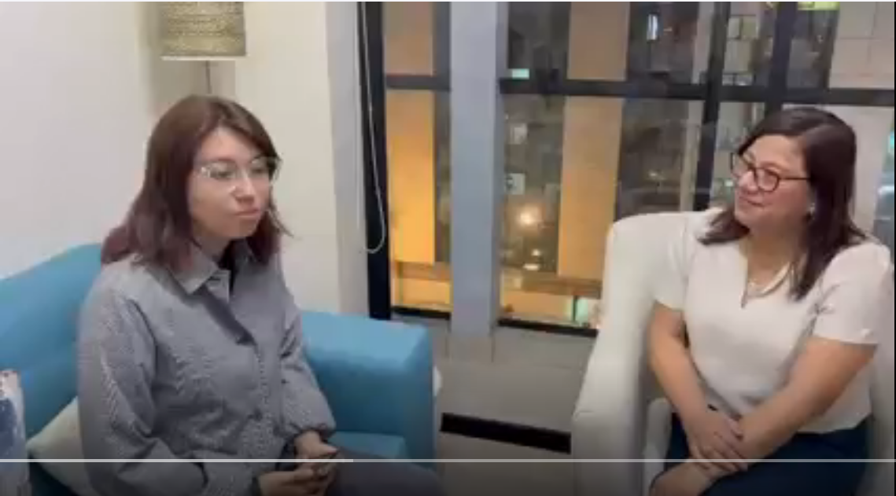
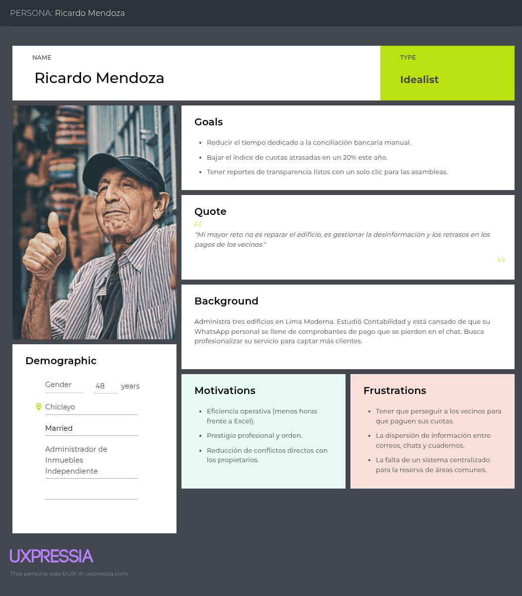
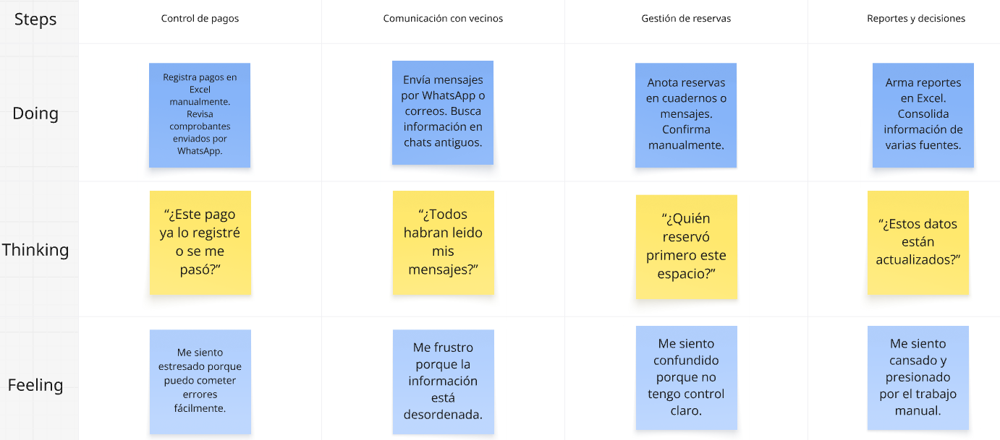
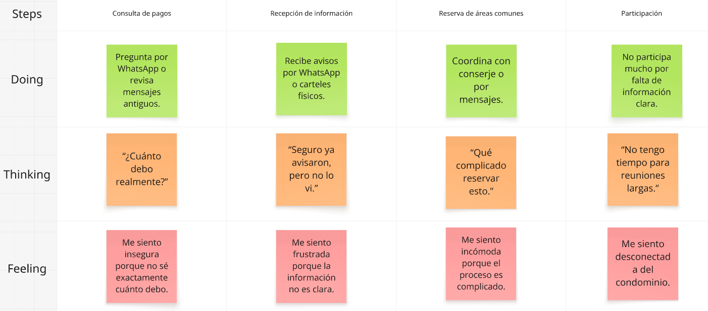
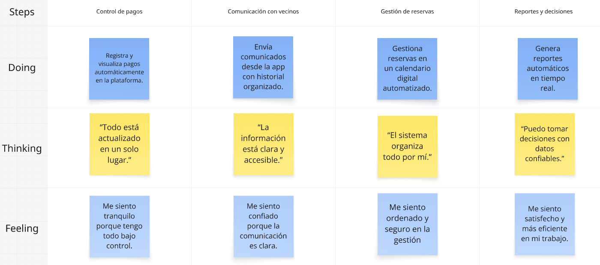
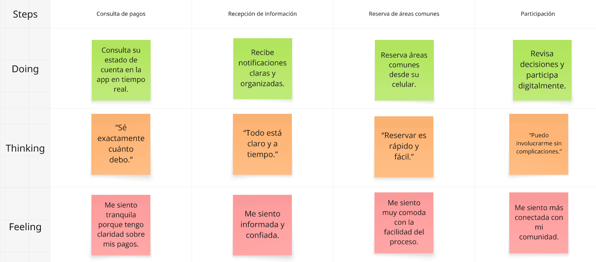
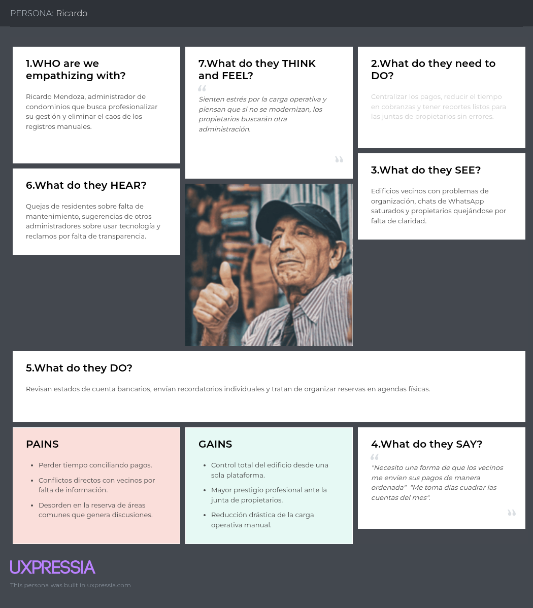

# Capítulo II: Requirements Elicitation & Analysis

## 2.1. Competidores

### 2.1.1. Análisis competitivo

| Competitive Analysis Landscape | | BuildSense (Nuestra Startup) | Schneider EcoStruxure Building | Siemens Building X | Johnson Controls OpenBlue |
|---|---|---|---|---|---|
| ¿Por qué llevar a cabo este análisis? | Objetivo del análisis | Identificar oportunidades de diferenciación en el mercado de Smart Buildings, evaluando soluciones líderes para diseñar una propuesta enfocada en edificios residenciales y condominios con tecnologías IoT accesibles. | | | |
| Perfil | Overview | Plataforma IoT para automatización, ahorro de recursos y seguridad en edificios y condominios. Integra iluminación inteligente, control de acceso, monitoreo de agua, riego automático y calidad del aire. | Plataforma de automatización y gestión energética para edificios inteligentes enfocada en eficiencia operativa y sostenibilidad. | Plataforma digital para edificios inteligentes basada en IoT, monitoreo en tiempo real y análisis de datos. | Ecosistema digital para optimización operativa, seguridad y mantenimiento inteligente de edificios. |
| | Ventaja competitiva | Solución especializada para condominios y edificios residenciales con implementación sencilla y bajo costo. | Amplia experiencia global en automatización y gestión energética. | Potentes capacidades analíticas y monitoreo avanzado. | Integración de múltiples sistemas de infraestructura y seguridad. |
| | ¿Qué valor ofrece a los clientes? | Reduce consumo de recursos, mejora la seguridad y automatiza tareas operativas mediante IoT. | Optimización energética y reducción de costos operativos. | Mayor eficiencia operativa mediante datos en tiempo real. | Mejor control de infraestructura y mantenimiento predictivo. |
| Perfil de Marketing | Mercado objetivo | Administradores de edificios, juntas de propietarios y condominios residenciales. | Corporaciones, industrias y grandes complejos empresariales. | Empresas, hospitales, campus y edificios corporativos. | Grandes edificios comerciales e infraestructura empresarial. |
| | Estrategias de marketing | Alianzas con constructoras, administradoras de condominios y campañas enfocadas en ahorro de recursos y seguridad. | Marketing centrado en sostenibilidad, eficiencia energética y transformación digital. | Estrategia basada en innovación tecnológica y digitalización empresarial. | Posicionamiento como solución integral para edificios inteligentes. |
| Perfil de Producto | Productos & Servicios | Iluminación inteligente, control de acceso, monitoreo de tanque de agua, detección de fugas, riego automático, monitoreo de calidad del aire y alertas en tiempo real. | Gestión energética, automatización de edificios y monitoreo de infraestructura. | Gestión de activos, monitoreo IoT, analítica avanzada y automatización. | Monitoreo inteligente, mantenimiento predictivo y seguridad integrada. |
| | Precios & Costos | Modelo SaaS con suscripción mensual accesible para condominios. | Costos elevados orientados a grandes organizaciones. | Licenciamiento empresarial y costos de infraestructura especializados. | Costos altos de implementación y mantenimiento. |
| | Canales de distribución (Web y/o Móvil) | Aplicación Web y Móvil. | Plataforma Web. | Plataforma Web. | Plataforma Web. |
| Análisis SWOT | Fortalezas | Especialización en condominios, bajo costo, facilidad de uso e integración de múltiples módulos IoT. | Marca consolidada y amplia presencia internacional. | Analítica avanzada y ecosistema tecnológico robusto. | Amplia integración con sistemas empresariales. |
| | Debilidades | Menor reconocimiento de marca y menor capacidad de expansión inicial. | Complejidad y alto costo para edificios pequeños. | Requiere infraestructura tecnológica avanzada. | Orientado principalmente a clientes corporativos. |
| | Oportunidades | Crecimiento del mercado Smart Building en Latinoamérica y mayor preocupación por la sostenibilidad. | Incremento de regulaciones sobre eficiencia energética. | Expansión de ciudades inteligentes y digitalización. | Crecimiento de la demanda de automatización y monitoreo. |
| | Amenazas | Ingreso de competidores tecnológicos con mayor capacidad financiera. | Aparición de soluciones IoT más económicas. | Competidores especializados en nichos específicos. | Innovación acelerada en tecnologías IoT y PropTech. |

### 2.1.2. Estrategias y tácticas frente a competidores

## Estrategias

### Estrategia 1: Especialización en condominios residenciales
Mientras que Schneider, Siemens y Johnson Controls se enfocan principalmente en grandes edificios corporativos e industriales, SmartCondo IoT se enfocará exclusivamente en condominios y edificios residenciales.

### Estrategia 2: Diferenciación mediante integración IoT
Ofrecer una única plataforma que integre iluminación inteligente, control de acceso, monitoreo de agua, detección de fugas, riego automático y calidad del aire.

### Estrategia 3: Accesibilidad económica
Reducir la barrera de entrada mediante un modelo SaaS de bajo costo orientado a administradores y juntas de propietarios.

### Estrategia 4: Facilidad de implementación
Implementar sensores y dispositivos IoT de rápida instalación sin necesidad de infraestructura compleja.

## Tácticas

### Táctica 1
Ofrecer un plan piloto gratuito para condominios durante los primeros meses de uso.

### Táctica 2
Generar reportes automáticos de ahorro energético y consumo de agua para demostrar el valor de la plataforma.

### Táctica 3
Establecer alianzas con constructoras y empresas administradoras de condominios para ampliar la adopción.

### Táctica 4
Desarrollar aplicaciones móviles para administradores y residentes con notificaciones en tiempo real.

### Táctica 5
Implementar dashboards intuitivos que permitan monitorear todos los dispositivos IoT desde una única interfaz.

### Táctica 6
Promover el sistema destacando beneficios tangibles:
- Reducción del consumo energético.
- Reducción del desperdicio de agua.
- Mayor seguridad en áreas comunes.
- Monitoreo remoto 24/7.
- Mejor calidad de vida para los residentes.

## 2.2. Entrevistas

La sección abarca el proceso de investigación de nuestros segmentos objetivos mediante la recolección de información en base a entrevistas.

### 2.2.1. Diseño de entrevistas

## 1. Segmento: Administradores de edificios y condominios

- ¿Cuántos edificios administran actualmente y cómo llevan hoy la gestión del día a día?
- ¿Qué herramientas o sistemas utilizan para gestionar los pagos y deudas de todos sus edificios?
- ¿Cómo coordinan las reservas de áreas comunes en los distintos edificios que administran?
- ¿De qué manera envían avisos oficiales a los residentes y cómo verifican que la información llegó a todos?
- ¿Cuál es el proceso más tedioso que quisieran eliminar de su operación diaria?
- ¿Qué tan seguido reciben quejas de residentes por falta de información o transparencia?
- ¿Han evaluado antes algún software de administración? Si es así, ¿qué fue lo que no les convenció?
- ¿Qué tan probable sería para su empresa migrar toda la gestión a una sola plataforma digital?
- ¿Qué tendría que tener una plataforma para que su empresa la adopte sin dudarlo?
- ¿Cuánto estarían dispuestos a pagar mensualmente por una herramienta que centralice toda su gestión?

## 2. Segmento: Propietarios e inquilinos

- ¿Cómo se entera hoy de sus saldos pendientes de mantenimiento y de las noticias de su edificio?
- ¿Qué tan fácil o difícil le resulta realizar el pago y enviar el comprobante de mantenimiento?
- ¿Dónde puede consultar su historial de pagos si necesita verificar un cobro antiguo?
- ¿Ha tenido problemas para reservar áreas comunes por falta de claridad en los horarios?
- ¿Siente que la administración es transparente con el uso del dinero y los gastos del edificio?
- ¿Qué tan rápido recibe respuesta cuando tiene una duda o necesita un comunicado importante?
- ¿Cuál es el canal de comunicación que más le molesta o le satura (ej. grupos de WhatsApp)?
- ¿Qué trámite del edificio le parece más anticuado o el que más le quita tiempo?
- ¿Estaría dispuesto a gestionar sus pagos y cuotas en una sola aplicación móvil?
- Si pudiera cambiar una sola cosa de la gestión de su condominio, ¿cuál sería?

### 2.2.2. Registro de entrevistas

> 📋 **Guía (Statement):** Para cada segmento se requiere de 3 a 5 entrevistas. Para cada una de las entrevistas se debe indicar la información de nombres, apellidos, edad, distrito, un screenshot de un cuadro de video y el URL del video subido en Microsoft Stream/Clipchamp (es un solo video editado para todas las entrevistas) incluyendo el timing donde inicia la entrevista y su duración. La entrevista debe ser registrada en video, que sirve de evidencia de entrevistas. Para cada entrevista debe redactarse en este informe un resumen, que explique de forma descriptiva las respuestas del entrevistado a las preguntas realizadas. Todas las características objetivas y subjetivas, incluyendo aspectos como personalidad, marcas e influencias, tecnología, canales de interacción, browser, dispositivos, etc. deben estar incluidas como parte de los resúmenes para cada entrevista. Debe ser evidente que cada característica de los arquetipos que se construirán en base a esta información provienen de datos recolectados. Ver [Anexo C. Indicaciones para secciones que incluyen Videos](../12-anexos/anexo-c-indicaciones-videos.md).

> ⚠️ **Pendiente:** el statement pide un solo video editado (Stream/Clipchamp) con el timing de cada entrevista. Falta consolidar las grabaciones individuales en ese único video con timing, ver [Anexo C](../12-anexos/anexo-c-indicaciones-videos.md).

**Segmento objetivo: Administradores de edificios y condominios**

| **ENTREVISTA 1** | |
|---|---|
| **Nombre entrevistado** | Cesar Villalobos |
| **Edad** | 51 |
| **Departamento** | Cercado de Lima |
| **Link del video** | *(pendiente — enlace del video consolidado)* |
| **Foto entrevista** |  |
| **Resumen** | César es administrador de edificios en GWM EIRL y actualmente gestiona 15 edificios usando Excel con macros como herramienta principal, apoyándose en WhatsApp para coordinar reservas y comunicaciones, y en las páginas de los bancos para pagos. El proceso más tedioso es la emisión de recibos, que aún se hace de forma física en varios edificios y que desea digitalizar al 100%. Ha evaluado entre 3 y 4 sistemas sin éxito, ya que todos presentaban exceso de información que generaba confusión en los propietarios y una percepción de desorden o falta de transparencia. Como empresa tiene el objetivo claro de migrar a una plataforma digital, y considera que una app o sistema web mejoraría significativamente la comunicación y la gestión, siempre que sea ágil, ordenada, fácil de entender y con información siempre actualizada. En cuanto al precio, conoce el mercado y sabe que el rango habitual oscila entre 2 y 5 dólares por unidad al mes. |

| **ENTREVISTA 2** | |
|---|---|
| **Nombre entrevistado** | Alejandro Galindo |
| **Edad** | 26 |
| **Departamento** | San Miguel |
| **Link del video** | https://upcedupe-my.sharepoint.com/:v:/g/personal/u202321281_upc_edu_pe/IQAW5DBOyn8xS6ZiZVZwufEIAU9yh_7P6mIIpJ_RzxJp6is?e=kLEW30&nav=eyJyZWZlcnJhbEluZm8iOnsicmVmZXJyYWxBcHAiOiJTdHJlYW1XZWJBcHAiLCJyZWZlcnJhbFZpZXciOiJTaGFyZURpYWxvZy1MaW5rIiwicmVmZXJyYWxBcHBQbGF0Zm9ybSI6IldlYiIsInJlZmVycmFsTW9kZSI6InZpZXcifX0%3D|
| **Foto entrevista** |  |
| **Resumen** | El administrador gestiona 4 edificios utilizando principalmente Excel, WhatsApp y registros manuales. Su principal problema es el seguimiento de pagos y la falta de confirmación sobre la recepción de comunicados. Considera viable adoptar una plataforma digital siempre que centralice pagos, comunicaciones y reservas, y tenga un costo accesible. |

| **ENTREVISTA 3** | |
|---|---|
| **Nombre entrevistado** |  |
| **Edad** |  |
| **Departamento** |  |
| **Link del video** |  |
| **Foto entrevista** |  |
| **Resumen** | |

**Segmento objetivo: Propietarios e Inquilinos**

| **ENTREVISTA 1** | |
|---|---|
| **Nombre entrevistado** |  |
| **Edad** |  |
| **Departamento** | San Miguel |
| **Link del video** |  |
| **Foto entrevista** |  |
| **Resumen** |  |

| **ENTREVISTA 2** | |
|---|---|
| **Nombre entrevistado** | Melina Lopez |
| **Edad** | 51 |
| **Departamento** | San Miguel |
| **Link del video** | *(pendiente — enlace del video consolidado)* |
| **Foto entrevista** |  |
| **Resumen** | Se entrevistó a Melina López, propietaria de un departamento, ella indica que no suele estar al tanto de las reuniones del edificio debido a la falta de tiempo. En cuanto a los pagos, envía los comprobantes por correo al administrador y mantiene un archivo físico como respaldo, ya que de lo contrario no tendría un historial accesible, asumiendo que la administración podría brindárselo si lo solicita. Señala que el proceso de reserva de espacios es el más tedioso, pues implica consultar disponibilidad, dejar garantía, realizar pagos y luego hacer seguimiento para su devolución, lo que la obliga a estar constantemente detrás de la administración. Además, le incomoda la gran cantidad de mensajes en el grupo de WhatsApp, donde se pierde información relevante. Finalmente, se muestra abierta al uso de una aplicación que centralice la información, considerando que actualmente los eventos y reuniones ya se comunican mediante un tablero. |

| **ENTREVISTA 3** | |
|---|---|
| **Nombre entrevistado** |  |
| **Edad** |  |
| **Departamento** | |
| **Link del video** |  |
| **Foto entrevista** |  |
| **Resumen** |  |

### 2.2.3. Análisis de entrevistas

> 📋 **Guía (Statement):** En esta sección se debe realizar un análisis por cada segmento objetivo, identificando con sustento estadístico (porcentajes) todas las características objetivas y subjetivas que representan los aspectos más comunes de cada segmento y que son necesarios para la construcción de los arquetipos. La fuente de información para este análisis proviene de las entrevistas registradas. Debe evidenciarse que cada característica tiene relación con las entrevistas registradas y los resúmenes realizados para las mismas.

**Segmento objetivo de administradores de edificios y condominios**

El segmento de administradores de edificios y condominios, representado por nuestros tres entrevistados, opera actualmente con herramientas no especializadas como Excel y WhatsApp, que si bien cubren las necesidades básicas, resultan insuficientes para gestionar de forma ordenada y eficiente múltiples edificios o unidades. Esta situación es reconocida por los propios administradores, lo que indica que la necesidad de digitalización es consciente y no requiere ser justificada.
El dolor más concreto se concentra en la gestión de pagos y emisión de recibos, un proceso que sigue siendo manual, disperso y en algunos casos físico, generando una carga operativa significativa. La comunicación con residentes también representa un punto crítico, al depender de canales informales sin trazabilidad ni orden centralizado.
Un hallazgo relevante es que ya existen soluciones en el mercado que han sido evaluadas y descartadas, no por falta de funcionalidades sino por exceso de información mal organizada, lo que genera confusión en los propietarios y una percepción de desorden. Esto señala que la oportunidad no está en ofrecer más funciones, sino en ofrecer una experiencia más clara, simple y bien presentada.
La disposición a migrar hacia una plataforma digital es alta en este segmento, lo que reduce la fricción comercial. Adicionalmente, existe conciencia sobre el modelo de precios del mercado, con un rango conocido de entre 2 y 5 dólares por unidad al mes.

**Segmento objetivo de propietarios e inquilinos**

El segmento de propietarios e inquilinos, representado por tres entrevistados, refleja una experiencia de vida en condominio marcada por la dependencia constante hacia la administración para acceder a información básica. En general, ninguno cuenta con un canal directo para consultar su historial de pagos, lo que los obliga a mantener respaldos personales o a solicitar la información cada vez que la necesitan.
El dolor más concreto se concentra en la reserva de áreas comunes, proceso que los entrevistados describen como tedioso y poco claro, con múltiples pasos manuales, falta de disponibilidad visible y seguimiento de garantías que recae completamente en el residente. Esta fricción acumulada genera una percepción negativa de la administración, aunque el problema de fondo es la ausencia de un proceso estructurado.
La comunicación representa otro punto crítico. WhatsApp, canal principal en la mayoría de casos, es percibido como ineficiente por el volumen de mensajes y la falta de respuestas oportunas. La información relevante se pierde con facilidad, generando desconexión entre los residentes y la gestión del edificio.
Un hallazgo importante es que los entrevistados ya reconocen la necesidad de una solución digital y se muestran abiertos a adoptarla sin necesidad de ser convencidos.

> ⚠️ **Pendiente:** falta el sustento estadístico (porcentajes) que pide el statement — el análisis es por ahora cualitativo/narrativo y no cuantifica los hallazgos comunes por segmento. Completar con porcentajes al ampliar la muestra de entrevistas.

## 2.3. Needfinding

### 2.3.1. User Personas

### Administrador de Condominio – Ricardo Mendoza

*Figura. User persona del administrador de condominio. Elaborado por el equipo utilizando UXPressia (UXPressia, s.f.).*

### Residente (Propietario/Inquilino) – Andrea Villacorta

*Figura. User persona del residente. Elaborado por el equipo utilizando UXPressia (UXPressia, s.f.).*

### 2.3.2. User Task Matrix

### Administrador de Condominio – Ricardo Mendoza

| Tarea | Frecuencia | Prioridad | Frustración |
|---|---|---|---|
| Conciliar pagos y validar transferencias | Diario | Muy Alta | Alta |
| Actualizar el estado de saldos pendientes | Diario | Alta | Alta |
| Enviar comunicados oficiales masivos | Semanal | Alta | Media |
| Gestionar y aprobar reservas de áreas comunes | Diario | Media | Media |
| Generar reportes financieros mensuales | Mensual | Muy Alta | Alta |
| Registrar gastos y facturas del edificio | Semanal | Alta | Media |
| Identificar deudores críticos para cobranza | Semanal | Alta | Media |

### Residente (Propietario/Inquilino) – Andrea Villacorta

| Tarea | Frecuencia | Prioridad | Frustración |
|---|---|---|---|
| Consultar monto exacto de cuota del mes | Mensual | Muy Alta | Media |
| Subir el comprobante de pago realizado | Mensual | Alta | Alta |
| Verificar disponibilidad de áreas comunes | Ocasional | Media | Alta |
| Realizar una reserva (parrilla, SUM, etc.) | Ocasional | Media | Media |
| Leer notificaciones de mantenimiento | Semanal | Alta | Media |
| Revisar el estado de cuenta histórico | Semanal | Media | Alta |
| Reportar una avería o incidencia | Ocasional | Alta | Alta |

Las tareas de mayor frecuencia y prioridad para el administrador giran en torno a la conciliación de pagos y los reportes financieros; para el residente, la consulta de cuotas y el pago mensual. Ambos personas coinciden en la fricción alrededor de la gestión de reservas de áreas comunes, aunque desde lados opuestos del proceso (aprobar vs. solicitar).

### 2.3.3. User Journey Mapping

**Segmento 1 — Administrador de Condominio (Ricardo Mendoza)**

El escenario actual del administrador de condominios refleja una gestión altamente manual y fragmentada. Ricardo depende de herramientas como Excel y WhatsApp para llevar el control de pagos, comunicarse con los vecinos y organizar la información. Esta dispersión genera errores, retrabajo y una alta carga operativa, dificultando la transparencia y la toma de decisiones dentro del condominio.

*Figura. Scenario Mapping (As-Is Segmento 1). Elaborado por el equipo utilizando Miro (Miro, s.f.).*

**Segmento 2 — Residente (Andrea Villacorta)**

Actualmente, los residentes como Andrea enfrentan una experiencia poco eficiente y desorganizada en la gestión del condominio. La información relevante se encuentra dispersa en múltiples canales, lo que dificulta el acceso a datos importantes como pagos, comunicados o reservas. Esto genera frustración, pérdida de tiempo y una baja participación en la comunidad.

*Figura. Scenario Mapping (As-Is Segmento 2). Elaborado por el equipo utilizando Miro (Miro, s.f.).*

> - Segmento 1:  — *el escenario futuro planteaba una transformación hacia una gestión digital centralizada, automatizando pagos, reportes y comunicación.*
> - Segmento 2:  — *el escenario ideal proponía una experiencia digital simple y centralizada desde el celular, con pagos, notificaciones y reservas intuitivas.*

### 2.3.4. Empathy Mapping

### Administrador de Condominio – Ricardo Mendoza

*Figura. Empathy mapping del administrador de condominio. Elaborado por el equipo utilizando UXPressia (UXPressia, s.f.).*

### Residente (Propietario/Inquilino) – Andrea Villacorta

*Figura. Empathy mapping del residente. Elaborado por el equipo utilizando UXPressia (UXPressia, s.f.).*

## 2.4. Big Picture EventStorming

> 📋 **Guía (Statement):** En esta sección el equipo introduce, resume el proceso realizado por el equipo y presenta capturas y explicaciones de las etapas del Big Picture Event Storming. En una sesión colaborativa, el equipo se enfoca en entender el dominio del negocio en general, plasmando los eventos significativos y sus relaciones. Es una primera aproximación visual de alto nivel que explora el landscape del negocio, identificando procesos clave, exponiendo potenciales problemas u oportunidades. Guía de referencia: <https://bit.ly/bpes-guide>.

_(pendiente)_

## 2.5. Ubiquitous Language

> 📋 **Guía (Statement):** En esta sección el equipo redacta un glosario de términos y conceptos con definiciones utilizadas en el business domain, sin ambigüedad, relacionados al área de especialidad o sector en el que se establecen el problema y la solución. Mantener un glosario de este tipo completo y actualizado, permite que se comuniquen claramente todos los miembros y stakeholders en el equipo. Solo debe incluirse términos del dominio, no términos técnicos del área de ingeniería de software. Los términos deben estar en inglés (puede incluirse adicionalmente el término equivalente en español entre paréntesis). La definición correspondiente al término puede estar en español.

| Término (inglés) | Término equivalente (español) | Definición |
|---|---|---|
| | | |
