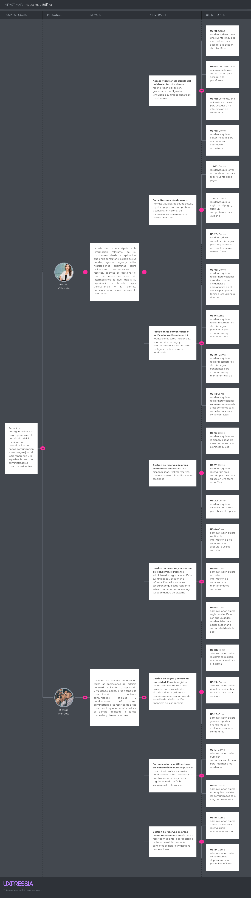

# Capítulo III: Requirements Specification

> 📋 **Guía (Statement):** Esta sección permite que el equipo realice en base al análisis de la información obtenida en las investigaciones, la especificación de los requisitos de los productos digitales. La sección inicia con una introducción e incluye secciones internas para los User Stories, Impact Map y Product Backlog.

**Estado:** ⬜ Pendiente

## 3.1. User Stories

> 📋 **Guía (Statement):** Requisitos definidos junto con el conjunto de User Stories y Epics para los requisitos identificados. Los User Stories incluyen Acceptance Criteria. En esta sección el equipo redacta una introducción y presenta un cuadro con la estructura especificada a continuación. Solo se elabora un cuadro para todo el conjunto de Epics/Stories. Debe dedicar una línea del cuadro a cada Epic / User Story.
>
> Es importante recordar que una User Story tiene varios criterios de aceptación. Los criterios de aceptación deben redactarse en tiempo presente, tercera persona, no hacer referencia a detalles de interfaz de usuario y deben ser comprobables. La estructura de criterios de aceptación debe seguir la estructura de Gherkin (Given-When-Then). Las únicas excepciones podrían ser reglas de negocio o restricciones que no dependan de condiciones.
>
> Debe también considerar User Stories para el sitio web estático (Landing Page), tomando como rol base *visitante* (o subconjuntos para cada segmento considerado cuando se requiera, como *visitante del segmento XXXX*) en la redacción de la descripción de la User Story. Recuerde que el sitio web estático tiene diversas secciones, con contenido dirigido a diversos segmentos, con características y comportamiento que permita su vínculo con la experiencia web.
>
> Adicionalmente, debe considerarse Technical Stories para los features de productos digitales que no tienen interacción directa con los usuarios finales, como por ejemplo los RESTful APIs. En ese caso, utilice el rol *Developer* en la redacción de la descripción de la User Story. Considere como Acceptance Criteria los posibles escenarios de interacción de request/response, siguiendo la estructura de Gherkin.

> ⚠️ **Migrado desde Edifika-report.** La tabla de User Stories se mantiene en HTML (no se convirtió a tabla Markdown) porque varias celdas de Criterios de Aceptación contienen múltiples escenarios Gherkin multilínea que perderían formato en una tabla de pipes.

**Epics:**

| Epic ID | Título | Descripción | User Stories Asociadas |
|---|---|---|---|
| EP01 | Autenticación y gestión de usuarios | Esta épica se enfoca en la creación, registro y administración de usuarios dentro de la plataforma, incluyendo residentes y administradores. Permite vincular cuentas a unidades específicas dentro del edificio, así como gestionar perfiles, validar información y controlar accesos. | US01, US02, US03, US04, US05, US06, US07, US34 |
| EP02 | Comunicación centralizada | Esta épica aborda la gestión de notificaciones y comunicados dentro del condominio, permitiendo mantener informados a los residentes sobre incidencias, pagos, reservas y anuncios importantes. Incluye la personalización de notificaciones y el seguimiento de visualización de comunicados. | US08, US10, US12, US13, US14, US15, US29, US31, US32, US36, US37 |
| EP03 | Gestión de áreas comunes | Esta épica se centra en la administración y uso eficiente de las áreas comunes del condominio. Permite a los residentes consultar disponibilidad, realizar y cancelar reservas, mientras que los administradores pueden aprobar solicitudes y evitar conflictos de horario. | US11, US16, US17, US18, US19, US20, US33, US35, US38, US39, US40 |
| EP04 | Gestión financiera y reportes | Esta épica se enfoca en la administración económica del condominio, permitiendo a los residentes consultar su deuda, registrar pagos y revisar su historial financiero. Los administradores pueden identificar morosos, generar y exportar reportes financieros. | US09, US21, US22, US23, US24, US25, US26, US27, US28, US30 |
| EP05 | Infraestructura, seguridad y arquitectura técnica | Esta épica abarca todos los aspectos técnicos necesarios para el correcto funcionamiento del sistema Edifika, incluyendo la configuración de microservicios, autenticación JWT, API Gateway, bases de datos independientes, documentación de APIs, comunicación entre servicios y despliegue en la nube. Su objetivo es garantizar que la plataforma sea segura, escalable y mantenible. | TS01, TS02, TS03, TS04, TS05, TS06, TS07, TS08, TS09, TS10, TS11, TS12, TS13, TS14, TS15 |
| EP06 | Landing Page e Interfaz Web | Esta épica cubre todas las funcionalidades visibles en la landing page pública de Edifika y la interfaz web de la aplicación. Incluye navegación, presentación de contenido y acceso a la plataforma, con el objetivo de atraer y convertir nuevos usuarios. | US41, US42, US43, US44, US45, US46, US47 |

**User Stories:**

<table>
  <thead>
    <tr>
      <th>Epic / US ID</th>
      <th>Título</th>
      <th>Descripción</th>
      <th>Criterios de Aceptación (Escenarios)</th>
      <th>Relacionado</th>
    </tr>
  </thead>
  <tbody>
    <tr>
      <td><strong>US01</strong></td>
      <td>Crear cuenta vinculada a unidad</td>
      <td>Como residente, deseo crear una cuenta vinculada a mi unidad para acceder a la gestión de mi edificio.</td>
      <td>
        <strong>Escenario 1: Registro exitoso.</strong> 
        Dado que el residente completa sus datos y selecciona torre/unidad, 
        cuando envía el formulario de registro, 
        entonces el sistema confirma el vínculo y crea la cuenta exitosamente.  
        <strong>Escenario 2: Unidad ya ocupada.</strong> 
        Dado que el residente selecciona una unidad con titular activo, 
        cuando intenta completar el registro, 
        entonces el sistema bloquea el registro y solicita adjuntar título de propiedad para validación manual.  
        <strong>Escenario 3: Error de red.</strong> 
        Dado que el residente está en proceso de vinculación, 
        cuando se pierde la conexión a internet, 
        entonces el sistema muestra "Error de sincronización" y permite reintentar sin rellenar todo el formulario.
      </td>
      <td>EP01</td>
    </tr>
    <tr>
      <td><strong>US02</strong></td>
      <td>Registro con correo</td>
      <td>Como usuario, quiero registrarme con mi correo para acceder a la plataforma.</td>
      <td>
        <strong>Escenario 1: Validación de formato.</strong> 
        Dado que el usuario está completando el formulario de registro, 
        cuando ingresa un correo sin "@", 
        entonces el sistema muestra instantáneamente "Formato de correo inválido".  
        <strong>Escenario 2: Correo duplicado.</strong> 
        Dado que el usuario intenta registrarse con un correo existente, 
        cuando envía el formulario, 
        entonces el sistema indica que la cuenta ya existe y ofrece la opción de recuperar contraseña.  
        <strong>Escenario 3: Timeout en verificación.</strong> 
        Dado que el usuario espera el código de verificación, 
        cuando el servicio de envío demora más de 30 segundos, 
        entonces el sistema muestra "Servicio temporalmente lento" y habilita el botón "Reenviar código".
      </td>
      <td>EP01</td>
    </tr>
    <tr>
      <td><strong>US03</strong></td>
      <td>Inicio de sesión</td>
      <td>Como usuario, quiero iniciar sesión para acceder a mi información.</td>
      <td>
        <strong>Escenario 1: Login exitoso.</strong> 
        Dado que el usuario tiene credenciales válidas, 
        cuando las ingresa y confirma el inicio de sesión, 
        entonces el sistema lo redirige al dashboard correspondiente según su rol (Admin/Residente).  
        <strong>Escenario 2: Bloqueo por intentos.</strong> 
        Dado que el usuario ha ingresado credenciales incorrectas, 
        cuando acumula 5 intentos fallidos, 
        entonces el sistema bloquea la cuenta por 15 minutos por razones de seguridad.  
        <strong>Escenario 3: Sesión expirada.</strong> 
        Dado que el token JWT del usuario ha caducado, 
        cuando intenta navegar dentro de la plataforma, 
        entonces el sistema lo redirige al login con el mensaje "Su sesión ha expirado".
      </td>
      <td>EP01</td>
    </tr>
    <tr>
      <td><strong>US04</strong></td>
      <td>Verificar información por torre y dpto.</td>
      <td>Como administrador, quiero verificar los datos de usuarios por ubicación para asegurar que el censo sea correcto.</td>
      <td>
        <strong>Escenario 1: Validación exitosa.</strong> 
        Dado que el admin filtra por "Torre B - 402", 
        cuando revisa el DNI adjunto y los datos coinciden, 
        entonces puede marcar el registro como "Verificado".  
        <strong>Escenario 2: Datos inconsistentes.</strong> 
        Dado que el admin revisa un registro con datos incorrectos, 
        cuando el nombre no coincide con el documento adjunto, 
        entonces el sistema permite marcar como "Pendiente de corrección" y notifica al residente el motivo específico.  
        <strong>Escenario 3: Error de carga de media.</strong> 
        Dado que el admin intenta abrir el documento adjunto, 
        cuando el servidor de archivos no responde, 
        entonces el sistema muestra "No se pudo cargar la imagen del DNI, reintente en unos minutos".
      </td>
      <td>EP01</td>
    </tr>
    <tr>
      <td><strong>US05</strong></td>
      <td>Actualizar información de usuarios</td>
      <td>Como administrador, quiero editar datos de usuarios para corregir errores.</td>
      <td>
        <strong>Escenario 1: Edición de contacto.</strong> 
        Dado que el admin accede al perfil de un residente, 
        cuando modifica el número de teléfono y guarda los cambios, 
        entonces el sistema almacena la información y registra en el log quién realizó el cambio.  
        <strong>Escenario 2: Cambio de rol inválido.</strong> 
        Dado que el admin es el único administrador activo del sistema, 
        cuando intenta quitarse sus propios permisos de administrador, 
        entonces el sistema lanza "Error: Debe existir al menos un administrador activo".  
        <strong>Escenario 3: Fallo de persistencia.</strong> 
        Dado que el admin intenta guardar cambios en un perfil, 
        cuando la base de datos se encuentra en mantenimiento, 
        entonces el sistema muestra "Error 500: No se pudieron guardar los cambios".
      </td>
      <td>EP01</td>
    </tr>
    <tr>
      <td><strong>US06</strong></td>
      <td>Editar perfil</td>
      <td>Como residente, quiero editar mi perfil para mantener mi contacto actualizado.</td>
      <td>
        <strong>Escenario 1: Actualización de foto.</strong> 
        Dado que el residente accede a la edición de su perfil, 
        cuando sube una nueva imagen de perfil, 
        entonces el sistema la procesa y actualiza en todos los módulos de la plataforma.  
        <strong>Escenario 2: Cancelación.</strong> 
        Dado que el usuario ha modificado campos de su perfil, 
        cuando pulsa el botón "Cancelar", 
        entonces el sistema descarta los cambios y vuelve al estado anterior sin alterar la base de datos.  
        <strong>Escenario 3: Formato no soportado.</strong> 
        Dado que el usuario intenta subir una imagen de perfil, 
        cuando selecciona un archivo en formato .gif, 
        entonces el sistema indica "Solo se permiten formatos JPG/PNG".
      </td>
      <td>EP01</td>
    </tr>
    <tr>
      <td><strong>US07</strong></td>
      <td>Registrar edificio y unidades</td>
      <td>Como administrador, quiero configurar la estructura del edificio (torres/unidades).</td>
      <td>
        <strong>Escenario 1: Configuración inicial.</strong> 
        Dado que el admin ingresa la configuración del edificio, 
        cuando registra 2 torres con 20 departamentos cada una, 
        entonces el sistema genera IDs únicos para cada unidad automáticamente.  
        <strong>Escenario 2: Unidades duplicadas.</strong> 
        Dado que el admin intenta registrar una unidad, 
        cuando el "Dpto 101" ya existe en la misma torre, 
        entonces el sistema arroja "Error: Identificador de unidad ya existe".  
        <strong>Escenario 3: Interrupción de carga masiva.</strong> 
        Dado que el admin está subiendo un Excel de unidades, 
        cuando el proceso se interrumpe inesperadamente, 
        entonces el sistema indica cuál fue la última fila procesada exitosamente.
      </td>
      <td>EP01</td>
    </tr>
    <tr>
      <td><strong>US08</strong></td>
      <td>Notificaciones de emergencias</td>
      <td>Como residente/admin, quiero gestionar avisos inmediatos de incidencias.</td>
      <td>
        <strong>Escenario 1: Alerta de incendio.</strong> 
        Dado que el admin activa una alerta de emergencia, 
        cuando confirma el envío, 
        entonces todos los residentes reciben push y SMS en menos de 5 segundos.  
        <strong>Escenario 2: Reporte de incidencia.</strong> 
        Dado que un residente detecta una fuga de gas, 
        cuando reporta la incidencia desde la app, 
        entonces el admin recibe una notificación con la ubicación exacta (Torre/Dpto).  
        <strong>Escenario 3: Fallo de Push Service.</strong> 
        Dado que se intenta enviar una notificación de emergencia, 
        cuando el servicio de Firebase no está disponible, 
        entonces el sistema registra el error y reintenta el envío automáticamente hasta 3 veces.
      </td>
      <td>EP02</td>
    </tr>
    <tr>
      <td><strong>US09</strong></td>
      <td>Recordatorios de pago</td>
      <td>Como residente, quiero recibir alertas de mis deudas próximas a vencer.</td>
      <td>
        <strong>Escenario 1: Aviso preventivo.</strong> 
        Dado que un pago de mantenimiento está próximo a vencer, 
        cuando faltan 3 días para la fecha límite, 
        entonces el sistema envía automáticamente un recordatorio al residente.  
        <strong>Escenario 2: Notificación de mora.</strong> 
        Dado que un residente no realizó su pago a tiempo, 
        cuando se cumple el primer día de retraso, 
        entonces el sistema alerta al residente sobre el recargo aplicado.  
        <strong>Escenario 3: Pago parcial.</strong> 
        Dado que el residente tiene una deuda de S/ 100, 
        cuando realiza un abono de S/ 50, 
        entonces el sistema notifica que aún queda un saldo pendiente de S/ 50.
      </td>
      <td>EP04</td>
    </tr>
    <tr>
      <td><strong>US10</strong></td>
      <td>Recepción de comunicados</td>
      <td>Como residente, quiero recibir información oficial del condominio.</td>
      <td>
        <strong>Escenario 1: Lectura de acta.</strong> 
        Dado que el admin publica el acta de una junta, 
        cuando el residente recibe el aviso, 
        entonces puede abrir y leer el PDF directamente desde la app.  
        <strong>Escenario 2: Filtro de relevancia.</strong> 
        Dado que el admin publica un aviso dirigido únicamente a "Torre A", 
        cuando el comunicado es enviado, 
        entonces los residentes de "Torre B" no reciben el mensaje.  
        <strong>Escenario 3: Notificaciones desactivadas.</strong> 
        Dado que el residente tiene las notificaciones push desactivadas, 
        cuando el admin publica un comunicado, 
        entonces el sistema no envía push pero marca el mensaje como "No leído" en el buzón interno.
      </td>
      <td>EP02</td>
    </tr>
    <tr>
      <td><strong>US11</strong></td>
      <td>Notificaciones de reservas</td>
      <td>Como residente, quiero avisos sobre mis turnos en áreas comunes.</td>
      <td>
        <strong>Escenario 1: Confirmación.</strong> 
        Dado que el residente completa una reserva en el gimnasio, 
        cuando el sistema procesa la solicitud, 
        entonces envía una notificación confirmando el día y la hora reservados.  
        <strong>Escenario 2: Recordatorio de uso.</strong> 
        Dado que el residente tiene una reserva activa, 
        cuando falta 1 hora para el inicio del turno, 
        entonces el sistema envía el aviso: "Tu turno en el área común inicia pronto".  
        <strong>Escenario 3: Cancelación forzada.</strong> 
        Dado que el admin cierra un área por mantenimiento, 
        cuando existen reservas activas para esa área, 
        entonces el sistema notifica al residente afectado y libera el cobro si correspondiera.
      </td>
      <td>EP03</td>
    </tr>
    <tr>
      <td><strong>US12</strong></td>
      <td>Configuración de notificaciones</td>
      <td>Como residente, quiero elegir qué avisos recibir.</td>
      <td>
        <strong>Escenario 1: Personalización.</strong> 
        Dado que el usuario accede a la configuración de notificaciones, 
        cuando desactiva "Comunicados" pero mantiene "Pagos" activo, 
        entonces el sistema guarda esa preferencia en su perfil.  
        <strong>Escenario 2: Error al guardar.</strong> 
        Dado que el usuario intenta guardar sus preferencias, 
        cuando el servicio de preferencias falla, 
        entonces el sistema muestra "No se pudo actualizar la configuración, intente más tarde".  
        <strong>Escenario 3: Reseteo de preferencias.</strong> 
        Dado que el usuario desea volver a la configuración original, 
        cuando pulsa el botón "Restablecer", 
        entonces el sistema activa todas las notificaciones con sus valores por defecto.
      </td>
      <td>EP02</td>
    </tr>
   <tr>
      <td><strong>US13</strong></td>
      <td>Publicar comunicados oficiales</td>
      <td>Como administrador, quiero difundir noticias a la comunidad.</td>
      <td>
        <strong>Escenario 1: Publicación con adjunto.</strong> 
        Dado que el admin redacta un comunicado con el presupuesto anual adjunto, 
        cuando lo publica, 
        entonces el sistema lo distribuye a todos los perfiles activos.  
        <strong>Escenario 2: Borrador de comunicado.</strong> 
        Dado que el admin está redactando un comunicado, 
        cuando lo guarda como borrador, 
        entonces el sistema lo mantiene oculto para los residentes hasta su publicación.  
        <strong>Escenario 3: Error de formato.</strong> 
        Dado que el admin intenta adjuntar un archivo al comunicado, 
        cuando el archivo supera los 10MB, 
        entonces el sistema indica "El archivo excede el límite permitido (10MB)".
      </td>
      <td>EP02</td>
    </tr>
    <tr>
      <td><strong>US14</strong></td>
      <td>Visualizar comunicados anteriores</td>
      <td>Como residente, quiero ver el historial de anuncios.</td>
      <td>
        <strong>Escenario 1: Búsqueda histórica.</strong> 
        Dado que el residente accede al historial de comunicados, 
        cuando filtra por "Enero 2024", 
        entonces el sistema lista los comunicados de ese período de forma cronológica.  
        <strong>Escenario 2: Lista vacía.</strong> 
        Dado que el residente aplica un filtro de búsqueda, 
        cuando no existen registros para ese período, 
        entonces el sistema muestra "No hay comunicados para este periodo".  
        <strong>Escenario 3: Error de carga de lista.</strong> 
        Dado que el residente solicita el historial de comunicados, 
        cuando el servicio de base de datos demora en responder, 
        entonces el sistema muestra un "Skeleton loader" mientras recupera los datos.
      </td>
      <td>EP02</td>
    </tr>
	  <tr>
  <td><strong>US15</strong></td>
  <td>Seguimiento de visualización de comunicados</td>
  <td>Como administrador, quiero saber quién ha visto los comunicados para asegurar su alcance.</td>
  <td>
    <strong>Escenario 1: Visualización del registro.</strong> 
    Dado que el admin accede a un comunicado publicado, 
    cuando revisa el panel de seguimiento, 
    entonces el sistema muestra la lista de residentes que lo han leído con fecha y hora de lectura.  
    <strong>Escenario 2: Residentes que no han leído.</strong> 
    Dado que el admin consulta el seguimiento de un comunicado, 
    cuando filtra por "No leído", 
    entonces el sistema lista los residentes que aún no han abierto el comunicado y permite reenviar la notificación.  
    <strong>Escenario 3: Error de carga del registro.</strong> 
    Dado que el admin intenta ver el seguimiento de visualizaciones, 
    cuando el servicio de base de datos tarda en responder, 
    entonces el sistema muestra un "Skeleton loader" mientras recupera los datos.
  </td>
  <td>EP02</td>
</tr>
    <tr>
      <td><strong>US16</strong></td>
      <td>Ver disponibilidad de áreas comunes</td>
      <td>Como residente/admin, quiero ver qué áreas están libres.</td>
      <td>
        <strong>Escenario 1: Consulta de calendario.</strong> 
        Dado que el usuario accede al área "Piscina", 
        cuando visualiza el calendario, 
        entonces puede ver los bloques de 1 hora disponibles y ocupados.  
        <strong>Escenario 2: Área fuera de servicio.</strong> 
        Dado que el admin marca el "Gimnasio" como inactivo, 
        cuando un residente consulta la disponibilidad, 
        entonces ve el área sombreada con el mensaje "Mantenimiento".  
        <strong>Escenario 3: Error de concurrencia.</strong> 
        Dado que dos usuarios consultan el mismo horario simultáneamente, 
        cuando uno de ellos completa una reserva, 
        entonces el sistema actualiza la disponibilidad en tiempo real para el otro usuario.
      </td>
      <td>EP03</td>
    </tr>
    <tr>
      <td><strong>US17</strong></td>
      <td>Reservar área común</td>
      <td>Como residente, quiero separar un espacio para uso personal.</td>
      <td>
        <strong>Escenario 1: Reserva exitosa.</strong> 
        Dado que el residente selecciona un horario disponible, 
        cuando confirma la reserva, 
        entonces el sistema genera un código QR de acceso para ese turno.  
        <strong>Escenario 2: Cruce de horarios.</strong> 
        Dado que el residente intenta reservar un área común, 
        cuando el horario seleccionado ya está tomado, 
        entonces el sistema indica "Horario no disponible, elija otro".  
        <strong>Escenario 3: Límite de reservas.</strong> 
        Dado que el residente ya alcanzó el máximo de reservas diarias, 
        cuando intenta realizar una quinta reserva en el mismo día, 
        entonces el sistema bloquea la acción indicando "Límite diario de reservas alcanzado".
      </td>
      <td>EP03</td>
    </tr>
	  <tr>
  <td><strong>US18</strong></td>
  <td>Aprobar o rechazar reservas</td>
  <td>Como administrador, quiero aprobar o rechazar reservas de áreas comunes para mantener el control sobre su uso.</td>
  <td>
    <strong>Escenario 1: Aprobación exitosa.</strong> 
    Dado que el admin recibe una solicitud de reserva pendiente, 
    cuando la aprueba desde el panel de administración, 
    entonces el sistema confirma la reserva y notifica al residente con el código QR de acceso.  
    <strong>Escenario 2: Rechazo con motivo.</strong> 
    Dado que el admin decide rechazar una solicitud de reserva, 
    cuando ingresa el motivo y confirma el rechazo, 
    entonces el sistema libera el horario y notifica al residente indicando el motivo del rechazo.  
    <strong>Escenario 3: Solicitud expirada.</strong> 
    Dado que el admin accede a una solicitud de reserva pendiente, 
    cuando la fecha y hora solicitada ya pasó sin ser procesada, 
    entonces el sistema la marca automáticamente como "Expirada" y la excluye de la lista de pendientes.
  </td>
  <td>EP03</td>
</tr>
	 <tr>
  <td><strong>US19</strong></td>
  <td>Evitar reservas duplicadas</td>
  <td>Como administrador, quiero que el sistema prevenga reservas duplicadas para evitar conflictos de horario en las áreas comunes.</td>
  <td>
    <strong>Escenario 1: Bloqueo de duplicado.</strong> 
    Dado que un residente intenta reservar un área en un horario ya ocupado, 
    cuando confirma la solicitud, 
    entonces el sistema bloquea la acción e indica "Este horario ya se encuentra reservado, elija otro".  
    <strong>Escenario 2: Detección en reserva simultánea.</strong> 
    Dado que dos residentes intentan reservar el mismo horario al mismo tiempo, 
    cuando ambos confirman la reserva simultáneamente, 
    entonces el sistema otorga la reserva al primero en confirmar y notifica al segundo que el horario ya no está disponible.  
    <strong>Escenario 3: Alerta al administrador.</strong> 
    Dado que el sistema detecta un intento de reserva duplicada, 
    cuando el conflicto es registrado, 
    entonces el admin recibe una notificación indicando el área, horario y los residentes involucrados.
  </td>
  <td>EP03</td>
</tr> 
    <tr>
      <td><strong>US20</strong></td>
      <td>Cancelar reserva</td>
      <td>Como residente, quiero liberar un espacio que ya no usaré.</td>
      <td>
        <strong>Escenario 1: Cancelación a tiempo.</strong> 
        Dado que el residente desea cancelar su reserva, 
        cuando lo hace con al menos 24 horas de anticipación, 
        entonces el sistema libera el cupo y notifica la disponibilidad a otros residentes.  
        <strong>Escenario 2: Cancelación tardía.</strong> 
        Dado que el residente intenta cancelar una reserva, 
        cuando lo hace faltando solo 5 minutos para el turno, 
        entonces el sistema indica "Plazo de cancelación vencido, se aplicará el cobro".  
        <strong>Escenario 3: Error de estado.</strong> 
        Dado que el residente intenta cancelar una reserva, 
        cuando esta ya fue cancelada previamente por el admin, 
        entonces el sistema muestra "Esta reserva ya no está activa".
      </td>
      <td>EP03</td>
    </tr>
    <tr>
      <td><strong>US21</strong></td>
      <td>Ver deuda actual</td>
      <td>Como residente, quiero saber cuánto debo pagar de mantenimiento.</td>
      <td>
        <strong>Escenario 1: Detalle de deuda.</strong> 
        Dado que el residente accede a la sección de pagos, 
        cuando consulta su deuda actual, 
        entonces el sistema muestra el desglose: mantenimiento + multas + servicios adicionales.  
        <strong>Escenario 2: Sin deuda.</strong> 
        Dado que el residente está al día con sus pagos, 
        cuando consulta su saldo, 
        entonces el sistema muestra "Saldo: S/ 0.00" y un botón para descargar la constancia de no adeudo.  
        <strong>Escenario 3: Error de sincronización bancaria.</strong> 
        Dado que el residente consulta su deuda, 
        cuando el sistema de pagos externos está caído, 
        entonces se muestra el aviso "Los montos podrían no estar actualizados".
      </td>
      <td>EP04</td>
    </tr>
    <tr>
      <td><strong>US22</strong></td>
      <td>Registrar pago con comprobante</td>
      <td>Como residente, quiero subir mi foto de voucher para validar mi pago.</td>
      <td>
        <strong>Escenario 1: Subida exitosa.</strong> 
        Dado que el residente realizó un pago, 
        cuando adjunta la foto del voucher en la plataforma, 
        entonces el sistema cambia el estado de la deuda a "En revisión".  
        <strong>Escenario 2: Voucher ilegible.</strong> 
        Dado que el admin revisa un comprobante enviado, 
        cuando la imagen no permite leer la información correctamente, 
        entonces el sistema notifica al residente que debe subir una imagen más clara.  
        <strong>Escenario 3: Archivo corrupto.</strong> 
        Dado que el residente intenta subir su comprobante, 
        cuando el archivo seleccionado está dañado, 
        entonces el sistema muestra "Error: No se pudo procesar el archivo, intente de nuevo".
      </td>
      <td>EP04</td>
    </tr>
	  <tr>
  <td><strong>US23</strong></td>
  <td>Registrar pagos en el sistema</td>
  <td>Como administrador, quiero registrar manualmente los pagos de los residentes para mantener el sistema actualizado.</td>
  <td>
    <strong>Escenario 1: Registro exitoso.</strong> 
    Dado que el admin accede al módulo de pagos de un residente, 
    cuando ingresa el monto, fecha y método de pago y confirma el registro, 
    entonces el sistema actualiza la deuda del residente y genera un comprobante de pago.  
    <strong>Escenario 2: Monto inválido.</strong> 
    Dado que el admin intenta registrar un pago, 
    cuando ingresa un monto de S/ 0 o un valor negativo, 
    entonces el sistema muestra "El monto ingresado no es válido, verifique los datos".  
    <strong>Escenario 3: Fallo de persistencia.</strong> 
    Dado que el admin intenta guardar el registro de un pago, 
    cuando la base de datos se encuentra en mantenimiento, 
    entonces el sistema muestra "Error 500: No se pudo registrar el pago, intente nuevamente".
  </td>
  <td>EP04</td>
</tr>
    <tr>
      <td><strong>US24</strong></td>
      <td>Visualizar residentes morosos</td>
      <td>Como administrador, quiero ver la lista de deudores.</td>
      <td>
        <strong>Escenario 1: Filtro de morosidad.</strong> 
        Dado que el admin accede al módulo de morosidad, 
        cuando aplica el filtro de más de 2 meses de deuda, 
        entonces el sistema lista los residentes en esa condición para aplicar restricciones.  
        <strong>Escenario 2: Exportar reporte.</strong> 
        Dado que el admin necesita el listado de morosos, 
        cuando solicita la descarga en PDF, 
        entonces el sistema genera el archivo con nombres, departamentos y montos totales.  
        <strong>Escenario 3: Error de datos masivos.</strong> 
        Dado que existen 500 residentes morosos registrados, 
        cuando el admin consulta la lista completa, 
        entonces el sistema implementa paginación para evitar que la app se cuelgue.
      </td>
      <td>EP04</td>
    </tr>
    <tr>
      <td><strong>US25</strong></td>
      <td>Generar reportes financieros</td>
      <td>Como administrador, quiero ver el balance de ingresos/egresos.</td>
      <td>
        <strong>Escenario 1: Reporte mensual.</strong> 
        Dado que el admin selecciona el mes "Mayo", 
        cuando solicita el reporte, 
        entonces el sistema suma los pagos validados versus los gastos registrados y muestra el neto.  
        <strong>Escenario 2: Rango inválido.</strong> 
        Dado que el admin configura el rango de fechas del reporte, 
        cuando la fecha de fin es anterior a la fecha de inicio, 
        entonces el sistema muestra "Rango de fechas incoherente".  
        <strong>Escenario 3: Timeout de cálculo.</strong> 
        Dado que el admin solicita un reporte anual, 
        cuando el procesamiento tarda demasiado, 
        entonces el sistema muestra una barra de progreso y permite descargar el resultado al finalizar.
      </td>
      <td>EP04</td>
    </tr>
    <tr>
      <td><strong>US26</strong></td>
      <td>Exportar reportes financieros</td>
      <td>Como administrador, quiero descargar balances en Excel/PDF.</td>
      <td>
        <strong>Escenario 1: Exportación exitosa.</strong> 
        Dado que el admin genera un reporte de ingresos, 
        cuando descarga el archivo Excel, 
        entonces el sistema aplica correctamente los formatos de moneda.  
        <strong>Escenario 2: Error de permisos.</strong> 
        Dado que un usuario sin rol de administrador accede al módulo de reportes, 
        cuando intenta exportar un balance, 
        entonces el sistema deniega el acceso con el mensaje "Permisos insuficientes".  
        <strong>Escenario 3: Fallo de generación.</strong> 
        Dado que el admin solicita exportar un reporte, 
        cuando no existen datos para el período seleccionado, 
        entonces el sistema exporta un documento indicando "Sin registros encontrados".
      </td>
      <td>EP04</td>
    </tr>
    <tr>
      <td><strong>US27</strong></td>
      <td>Ver resumen de gastos</td>
      <td>Como residente, quiero saber en qué se gasta el dinero del edificio.</td>
      <td>
        <strong>Escenario 1: Gráfico de gastos.</strong> 
        Dado que el residente accede al resumen financiero, 
        cuando consulta la distribución de gastos, 
        entonces el sistema muestra un gráfico de torta con categorías como: 40% Seguridad, 30% Limpieza, etc.  
        <strong>Escenario 2: Consulta de facturas.</strong> 
        Dado que el residente visualiza el resumen de gastos, 
        cuando selecciona un ítem específico, 
        entonces el sistema muestra la descripción del gasto (ej: Reparación de bomba de agua).  
        <strong>Escenario 3: Información no publicada.</strong> 
        Dado que el admin aún no ha cerrado el período mensual, 
        cuando el residente consulta el resumen, 
        entonces el sistema muestra "Información en proceso de cierre".
      </td>
      <td>EP04</td>
    </tr>
    <tr>
      <td><strong>US28</strong></td>
      <td>Consultar pagos pasados</td>
      <td>Como residente, quiero ver mi historial de transacciones.</td>
      <td>
        <strong>Escenario 1: Historial histórico.</strong> 
        Dado que el residente accede a su historial de pagos, 
        cuando consulta el período de los últimos 12 meses, 
        entonces el sistema lista todos sus pagos con sus respectivos comprobantes.  
        <strong>Escenario 2: Filtro por año.</strong> 
        Dado que el residente desea revisar pagos anteriores, 
        cuando selecciona el año "2023", 
        entonces el sistema recupera únicamente los pagos de ese ejercicio fiscal.  
        <strong>Escenario 3: Error de base de datos.</strong> 
        Dado que el residente consulta su historial, 
        cuando el servidor de archivos de vouchers antiguos falla, 
        entonces el sistema muestra "Detalles temporalmente no disponibles".
      </td>
      <td>EP04</td>
    </tr>
    <tr>
      <td><strong>US29</strong></td>
      <td>Publicar mensaje en la comunidad</td>
      <td>Como residente, quiero escribir en el muro comunitario.</td>
      <td>
        <strong>Escenario 1: Publicación exitosa.</strong> 
        Dado que el residente redacta un mensaje en el muro comunitario, 
        cuando lo publica, 
        entonces el sistema lo muestra en el feed de la comunidad.  
        <strong>Escenario 2: Límite diario.</strong> 
        Dado que el residente ya publicó un mensaje en el día, 
        cuando intenta publicar un segundo mensaje, 
        entonces el sistema bloquea la acción indicando "Máximo 1 post por día".  
        <strong>Escenario 3: Filtro de palabras.</strong> 
        Dado que el residente redacta un mensaje con contenido inapropiado, 
        cuando intenta publicarlo, 
        entonces el sistema detecta las palabras prohibidas y bloquea la publicación.
      </td>
      <td>EP02</td>
    </tr>
    <tr>
      <td><strong>US30</strong></td>
      <td>Pagar deuda en línea</td>
      <td>Como residente, quiero pagar con tarjeta de crédito/débito.</td>
      <td>
        <strong>Escenario 1: Pago aprobado.</strong> 
        Dado que el residente ingresa los datos de su tarjeta para pagar S/ 200, 
        cuando la pasarela de pago aprueba la transacción, 
        entonces la deuda se marca como "Pagado" de forma inmediata.  
        <strong>Escenario 2: Transacción rechazada.</strong> 
        Dado que el residente intenta pagar con su tarjeta, 
        cuando la tarjeta no tiene fondos suficientes, 
        entonces el sistema muestra el error del banco y permite cambiar de tarjeta.  
        <strong>Escenario 3: Pago parcial permitido.</strong> 
        Dado que el residente tiene una deuda de S/ 300, 
        cuando realiza un pago de S/ 100, 
        entonces el sistema actualiza el saldo restante a S/ 200 de forma inmediata.
      </td>
      <td>EP04</td>
    </tr>
    <tr>
      <td><strong>US31</strong></td>
      <td>Notificación por reserva (Admin)</td>
      <td>Como admin, quiero saber cuándo alguien reserva un área común.</td>
      <td>
        <strong>Escenario 1: Alerta inmediata.</strong> 
        Dado que un residente realiza una reserva en el área de parrillas, 
        cuando la reserva es confirmada, 
        entonces el admin recibe un push: "Reserva nueva en Área Parrillas - Dpto 501".  
        <strong>Escenario 2: Filtro de alertas.</strong> 
        Dado que el admin configura sus preferencias de notificación, 
        cuando desactiva alertas para áreas de bajo impacto, 
        entonces el sistema solo le notifica las reservas de áreas críticas.  
        <strong>Escenario 3: Sobrecarga de avisos.</strong> 
        Dado que se registran 50 reservas en 1 minuto, 
        cuando el sistema procesa todas las notificaciones, 
        entonces las agrupa en un resumen para no saturar al administrador.
      </td>
      <td>EP02</td>
    </tr>
    <tr>
      <td><strong>US32</strong></td>
      <td>Consultar Leyes y Manuales</td>
      <td>Como administrador, quiero ver la normativa legal y del edificio.</td>
      <td>
        <strong>Escenario 1: Lectura de PDF.</strong> 
        Dado que el admin accede a la sección de documentos legales, 
        cuando abre el "Reglamento de Convivencia", 
        entonces el sistema permite hacer zoom y buscar palabras clave dentro del documento.  
        <strong>Escenario 2: Actualización de leyes.</strong> 
        Dado que existe una actualización en la normativa legal, 
        cuando el admin consulta la sección correspondiente, 
        entonces el sistema muestra un enlace a la última ley de propiedad horizontal accesible vía webview.  
        <strong>Escenario 3: Archivo no disponible.</strong> 
        Dado que el admin intenta abrir un manual del edificio, 
        cuando el archivo fue eliminado accidentalmente, 
        entonces el sistema muestra "Documento no encontrado, contacte a soporte".
      </td>
      <td>EP02</td>
    </tr>
    <tr>
      <td><strong>US33</strong></td>
      <td>Ver disponibilidad global (Admin)</td>
      <td>Como admin, quiero ver el mapa de ocupación de todo el edificio.</td>
      <td>
        <strong>Escenario 1: Vista de calendario total.</strong> 
        Dado que el admin accede al panel de disponibilidad global, 
        cuando consulta el día actual, 
        entonces puede ver qué áreas están ocupadas para coordinar el personal de limpieza.  
        <strong>Escenario 2: Bloqueo de fechas.</strong> 
        Dado que el admin necesita reservar la piscina para mantenimiento el domingo, 
        cuando bloquea esa fecha en el calendario, 
        entonces los residentes ya no pueden realizar reservas para ese día.  
        <strong>Escenario 3: Error de refresco.</strong> 
        Dado que el admin visualiza el calendario de ocupación, 
        cuando los datos no se actualizan correctamente, 
        entonces el sistema ofrece un botón de "Forzar actualización".
      </td>
      <td>EP03</td>
    </tr>
    <tr>
      <td><strong>US34</strong></td>
      <td>Activar/Desactivar cuentas</td>
      <td>Como administrador, quiero controlar quién tiene acceso a la app.</td>
      <td>
        <strong>Escenario 1: Desactivación por mudanza.</strong> 
        Dado que un residente se ha mudado del edificio, 
        cuando el admin inactiva su cuenta, 
        entonces las credenciales del residente dejan de funcionar al instante.  
        <strong>Escenario 2: Reactivación.</strong> 
        Dado que el admin habilita una cuenta suspendida, 
        cuando confirma la reactivación, 
        entonces el sistema envía automáticamente un correo: "Tu cuenta ha sido reactivada".  
        <strong>Escenario 3: Error al desactivar Admin.</strong> 
        Dado que el sistema tiene un único super-administrador activo, 
        cuando se intenta desactivar esa cuenta, 
        entonces el sistema impide la acción por razones de seguridad.
      </td>
      <td>EP01</td>
    </tr>
    <tr>
      <td><strong>US35</strong></td>
      <td>Cancelar reserva (Admin)</td>
      <td>Como administrador, quiero anular una reserva de un residente.</td>
      <td>
        <strong>Escenario 1: Anulación por emergencia.</strong> 
        Dado que ocurre una rotura de tubería en el SUM, 
        cuando el admin cancela las reservas activas de esa área, 
        entonces el sistema notifica a cada residente afectado con el motivo de la cancelación.  
        <strong>Escenario 2: Anulación por deuda.</strong> 
        Dado que un residente con reserva activa entra en mora, 
        cuando el admin cancela su reserva, 
        entonces el sistema la anula y bloquea futuras reservas para ese residente.  
        <strong>Escenario 3: Error de red.</strong> 
        Dado que el admin intenta cancelar una reserva, 
        cuando el sistema falla durante el proceso, 
        entonces se muestra "No se pudo cancelar, verifique su conexión e intente de nuevo".
      </td>
      <td>EP03</td>
    </tr>
 <tr>
      <td><strong>US36</strong></td>
      <td>Crear encuestas o votaciones para la comunidad</td>
      <td>Como administrador, quiero crear encuestas o votaciones para conocer la opinión de los residentes sobre temas del condominio.</td>
      <td>
        <strong>Escenario 1: Creación exitosa.</strong> 
        Dado que el admin completa el formulario de encuesta con pregunta y opciones, 
        cuando la publica, 
        entonces todos los residentes activos reciben una notificación y pueden votar desde la app.  
        <strong>Escenario 2: Encuesta con fecha límite.</strong> 
        Dado que el admin configura una fecha de cierre para la encuesta, 
        cuando se cumple el plazo, 
        entonces el sistema cierra automáticamente la votación y muestra los resultados finales.  
        <strong>Escenario 3: Voto duplicado.</strong> 
        Dado que un residente ya emitió su voto, 
        cuando intenta votar nuevamente, 
        entonces el sistema bloquea la acción indicando "Ya has registrado tu voto en esta encuesta".
      </td>
      <td>EP02</td>
    </tr>
    <tr>
      <td><strong>US37</strong></td>
      <td>Moderar mensajes del muro comunitario</td>
      <td>Como administrador, quiero revisar y eliminar mensajes inapropiados del muro para mantener un ambiente respetuoso.</td>
      <td>
        <strong>Escenario 1: Eliminación exitosa.</strong> 
        Dado que el admin detecta un mensaje con contenido inapropiado, 
        cuando lo elimina desde el panel de moderación, 
        entonces el mensaje desaparece del feed y el residente recibe una notificación indicando el motivo.  
        <strong>Escenario 2: Advertencia al residente.</strong> 
        Dado que un residente publica contenido que infringe las normas por primera vez, 
        cuando el admin aplica una advertencia, 
        entonces el sistema registra el aviso en el perfil del residente y lo notifica.  
        <strong>Escenario 3: Bloqueo por reincidencia.</strong> 
        Dado que un residente acumula 3 advertencias, 
        cuando el admin confirma el bloqueo, 
        entonces el residente queda inhabilitado para publicar en el muro comunitario.
      </td>
      <td>EP02</td>
    </tr>
    <tr>
      <td><strong>US38</strong></td>
      <td>Habilitar o deshabilitar área común</td>
      <td>Como administrador, quiero activar o desactivar áreas comunes para reflejar su disponibilidad real según mantenimiento o restricciones.</td>
      <td>
        <strong>Escenario 1: Deshabilitación exitosa.</strong> 
        Dado que el admin deshabilita el "Gimnasio" por mantenimiento, 
        cuando confirma la acción, 
        entonces el área aparece como no disponible y los residentes no pueden realizar nuevas reservas.  
        <strong>Escenario 2: Notificación a reservas activas.</strong> 
        Dado que existen reservas vigentes en el área deshabilitada, 
        cuando el admin la desactiva, 
        entonces el sistema cancela esas reservas automáticamente y notifica a los residentes afectados.  
        <strong>Escenario 3: Rehabilitación del área.</strong> 
        Dado que el admin reactiva un área previamente deshabilitada, 
        cuando confirma la acción, 
        entonces el área vuelve a aparecer disponible para reservas y el sistema notifica a los residentes.
      </td>
      <td>EP03</td>
    </tr>
    <tr>
      <td><strong>US39</strong></td>
      <td>Configurar reglas de área común</td>
      <td>Como administrador, quiero definir las reglas, horarios y límites de cada área común para regular su uso correctamente.</td>
      <td>
        <strong>Escenario 1: Configuración exitosa.</strong> 
        Dado que el admin accede a la configuración de un área, 
        cuando establece el aforo máximo, horario de apertura/cierre y duración máxima de reserva, 
        entonces el sistema aplica esas reglas en todas las nuevas reservas.  
        <strong>Escenario 2: Conflicto con reservas existentes.</strong> 
        Dado que el admin reduce el horario de un área con reservas ya registradas fuera del nuevo rango, 
        cuando guarda los cambios, 
        entonces el sistema alerta "Existen reservas que superan el nuevo horario, serán canceladas" y solicita confirmación.  
        <strong>Escenario 3: Validación de datos inválidos.</strong> 
        Dado que el admin ingresa un aforo de 0 personas o un horario de cierre anterior al de apertura, 
        cuando intenta guardar, 
        entonces el sistema muestra "Configuración inválida, verifique los datos ingresados".
      </td>
      <td>EP03</td>
    </tr>
    <tr>
      <td><strong>US40</strong></td>
      <td>Ver historial de uso de áreas comunes</td>
      <td>Como administrador, quiero consultar el historial completo de uso de las áreas comunes con estadísticas para tomar mejores decisiones de gestión.</td>
      <td>
        <strong>Escenario 1: Consulta de historial.</strong> 
        Dado que el admin accede al historial de un área, 
        cuando selecciona un rango de fechas, 
        entonces el sistema lista todas las reservas realizadas con residente, fecha, hora y estado (completada/cancelada).  
        <strong>Escenario 2: Estadísticas de uso.</strong> 
        Dado que el admin consulta las estadísticas globales, 
        cuando visualiza el resumen, 
        entonces el sistema muestra el área más usada, el horario pico y el porcentaje de cancelaciones del período.  
        <strong>Escenario 3: Exportar historial.</strong> 
        Dado que el admin necesita el historial para un informe, 
        cuando solicita la exportación, 
        entonces el sistema genera un archivo Excel con todos los registros del período seleccionado.
      </td>
      <td>EP03</td>
    </tr>
	<tr>
  <td><strong>US41</strong></td>
  <td>Visualizar sección Hero de la Landing Page</td>
  <td>Como visitante, quiero ver una sección principal con el mensaje de valor de Edifika para entender rápidamente de qué trata el producto.</td>
  <td>
    <strong>Escenario 1: Carga correcta.</strong> 
    Dado que el visitante accede a la landing page, 
    cuando la página termina de cargar, 
    entonces visualiza el título principal, subtítulo descriptivo, botones CTA ("Solicitar demo gratis" y "Ver funciones") y el mockup del producto.  
    <strong>Escenario 2: Responsividad.</strong> 
    Dado que el visitante accede desde un dispositivo móvil, 
    cuando carga la sección Hero, 
    entonces el contenido se adapta correctamente sin desbordamiento ni elementos superpuestos.  
    <strong>Escenario 3: Navegación por CTA.</strong> 
    Dado que el visitante hace clic en "Ver funciones", 
    cuando el sistema procesa la acción, 
    entonces la página realiza scroll suave hacia la sección de funcionalidades.
  </td>
  <td>EP06</td>
</tr>

<tr>
  <td><strong>US42</strong></td>
  <td>Navegar entre secciones de la Landing Page</td>
  <td>Como visitante, quiero usar la barra de navegación para desplazarme entre las secciones de la landing page para hacerlo de forma rápida.</td>
  <td>
    <strong>Escenario 1: Navegación exitosa.</strong> 
    Dado que el visitante hace clic en "Planes" desde el navbar, 
    cuando el sistema procesa la acción, 
    entonces la página realiza scroll automático hasta la sección de planes.  
    <strong>Escenario 2: Sección activa resaltada.</strong> 
    Dado que el visitante hace scroll por la página, 
    cuando pasa por una sección específica, 
    entonces el ítem correspondiente en el navbar se resalta visualmente con el color primario.  
    <strong>Escenario 3: Navbar fijo en scroll.</strong> 
    Dado que el visitante hace scroll hacia abajo, 
    cuando supera los primeros 100px de la página, 
    entonces el navbar permanece visible y fijo en la parte superior de la pantalla.
  </td>
  <td>EP06</td>
</tr>

<tr>
  <td><strong>US43</strong></td>
  <td>Cambiar idioma de la Landing Page</td>
  <td>Como visitante internacional, quiero cambiar el idioma entre español e inglés para entender el contenido en mi idioma preferido.</td>
  <td>
    <strong>Escenario 1: Cambio a inglés.</strong> 
    Dado que el visitante hace clic en "EN" en el selector de idioma, 
    cuando el sistema procesa el cambio, 
    entonces todo el contenido visible de la página se actualiza al inglés sin recargar la página.  
    <strong>Escenario 2: Persistencia de idioma.</strong> 
    Dado que el visitante seleccionó inglés previamente, 
    cuando navega a otra sección o recarga la página, 
    entonces el sistema mantiene el idioma previamente seleccionado.  
    <strong>Escenario 3: Idioma por defecto.</strong> 
    Dado que el visitante accede a la landing por primera vez, 
    cuando no ha configurado preferencia de idioma alguna, 
    entonces el sistema muestra el contenido en español por defecto.
  </td>
  <td>EP06</td>
</tr>

<tr>
  <td><strong>US44</strong></td>
  <td>Cambiar tema visual (claro/oscuro)</td>
  <td>Como visitante, quiero alternar entre el modo claro y oscuro de la landing page para mejorar mi experiencia visual.</td>
  <td>
    <strong>Escenario 1: Activar modo claro.</strong> 
    Dado que la página está en modo oscuro, 
    cuando el visitante hace clic en el ícono de sol, 
    entonces la interfaz cambia al tema claro con todos sus colores adaptados correctamente.  
    <strong>Escenario 2: Persistencia del tema.</strong> 
    Dado que el visitante activó el modo claro, 
    cuando recarga la página, 
    entonces el sistema conserva la preferencia guardada localmente.  
    <strong>Escenario 3: Preferencia del sistema operativo.</strong> 
    Dado que el visitante tiene configurado modo oscuro en su sistema operativo, 
    cuando accede a la landing por primera vez sin preferencia guardada, 
    entonces la página adopta automáticamente el tema oscuro.
  </td>
  <td>EP06</td>
</tr>

<tr>
  <td><strong>US45</strong></td>
  <td>Visualizar sección de funcionalidades</td>
  <td>Como visitante, quiero ver las funcionalidades principales de Edifika para evaluar si la plataforma se adapta a mis necesidades.</td>
  <td>
    <strong>Escenario 1: Visualización de módulos.</strong> 
    Dado que el visitante accede a la sección "Funciones", 
    cuando la sección carga correctamente, 
    entonces se muestran los tres módulos clave: Gestión de Pagos y Deudas, Reserva de Áreas Comunes y Comunicados, cada uno con su descripción e ícono.  
    <strong>Escenario 2: Listado de características.</strong> 
    Dado que el visitante revisa cada tarjeta de módulo, 
    cuando lee su contenido, 
    entonces puede ver el listado de características con íconos de verificación para cada funcionalidad incluida.  
    <strong>Escenario 3: Etiqueta de módulo destacado.</strong> 
    Dado que el visitante visualiza las tarjetas de funcionalidades, 
    cuando observa la tarjeta de Gestión de Pagos y Deudas, 
    entonces aparece visible la etiqueta "Más popular" para orientar la decisión del visitante.
  </td>
  <td>EP06</td>
</tr>

<tr>
  <td><strong>US46</strong></td>
  <td>Visualizar sección del equipo</td>
  <td>Como visitante, quiero conocer al equipo detrás de Edifika para generar confianza antes de contratar el servicio.</td>
  <td>
    <strong>Escenario 1: Tarjetas del equipo visibles.</strong> 
    Dado que el visitante accede a la sección "Equipo", 
    cuando la sección carga correctamente, 
    entonces se muestran las tarjetas con foto y nombre de cada uno de los cinco integrantes del equipo.  
    <strong>Escenario 2: Carga exitosa de imágenes de perfil.</strong> 
    Dado que el visitante navega por la sección del equipo, 
    cuando las imágenes de perfil están disponibles en el servidor, 
    entonces cada tarjeta muestra la fotografía del integrante con su nombre completo visible debajo.  
    <strong>Escenario 3: Fallback por fallo en carga de imagen.</strong> 
    Dado que una imagen de perfil no puede ser cargada por fallo del servidor, 
    cuando el navegador no puede renderizarla, 
    entonces el sistema muestra un avatar con las iniciales del integrante como imagen alternativa.
  </td>
  <td>EP06</td>
</tr>

<tr>
  <td><strong>US47</strong></td>
  <td>Acceder a la app web desde la Landing Page</td>
  <td>Como usuario registrado, quiero acceder a la aplicación web directamente desde la landing page para iniciar sesión sin pasos adicionales.</td>
  <td>
    <strong>Escenario 1: Redirección al login.</strong> 
    Dado que el visitante hace clic en "Empieza gratis" desde el navbar, 
    cuando el sistema procesa la acción, 
    entonces es redirigido a la pantalla de registro o login de la aplicación web.  
    <strong>Escenario 2: Usuario con sesión activa.</strong> 
    Dado que el usuario ya tiene una sesión activa en la plataforma, 
    cuando accede a la landing y hace clic en "Empieza gratis", 
    entonces es redirigido directamente a su dashboard sin pasar por el formulario de login.  
    <strong>Escenario 3: Acceso desde dispositivo móvil.</strong> 
    Dado que el visitante accede desde un smartphone, 
    cuando hace clic en el CTA principal, 
    entonces el sistema lo redirige a la tienda de aplicaciones correspondiente (App Store o Google Play) según su sistema operativo.
	
  </td>
  <td>EP06</td>
</tr>
  </tbody>
</table>

**Technical Stories**

<table>
  <thead>
    <tr>
      <th>Epic / User Story ID</th>
      <th>Título</th>
      <th>Descripción</th>
      <th>Criterios de Aceptación</th>
      <th>Relacionado con (Epic ID)</th>
    </tr>
  </thead>
  <tbody>
    <tr>
      <td>TS01</td>
      <td>Configuración de autenticación y autorización con JWT</td>
      <td>Como desarrollador, quiero implementar autenticación y autorización basada en JWT en el microservicio IAM, para que solo los administradores autorizados puedan acceder a los endpoints protegidos del sistema.</td>
      <td>
        <strong>Escenario 1: Generación de token JWT exitosa</strong> 
        Dado que un administrador envía credenciales válidas al endpoint de sign-in 
        Cuando el sistema valida el email y contraseña correctamente 
        Entonces genera un token JWT firmado con HMAC-SHA256 que incluye email, userId y rol, con expiración de 7 días y tiempo de respuesta menor a 300ms.  
        <strong>Escenario 2: Acceso con token inválido o expirado</strong> 
        Dado que un cliente intenta acceder a un endpoint protegido con un token inválido o expirado 
        Cuando el filtro BearerAuthorizationRequestFilter evalúa la solicitud 
        Entonces el sistema retorna un error 401 en menos de 100ms con el mensaje correspondiente al tipo de fallo.  
        <strong>Escenario 3: Acceso sin token a endpoint protegido</strong> 
        Dado que un cliente intenta acceder a un endpoint protegido sin enviar token en el header Authorization 
        Cuando el filtro de seguridad procesa la solicitud 
        Entonces el sistema retorna un error 401 con el mensaje "Token Bearer requerido" sin llegar al microservicio destino.
      </td>
      <td>EP05</td>
    </tr>
    <tr>
      <td>TS02</td>
      <td>Implementación de endpoints de registro e inicio de sesión con validaciones</td>
      <td>Como desarrollador, quiero implementar los endpoints de registro e inicio de sesión del microservicio IAM con validaciones estrictas de datos, para garantizar que solo administradores con información válida puedan crear cuentas en el sistema.</td>
      <td>
        <strong>Escenario 1: Registro exitoso de administrador</strong> 
        Dado que se envía un POST a /api/v1/authentication/sign-up con datos válidos incluyendo rol ADMIN, email con formato correcto, contraseña con mayúscula y símbolo, DNI de 8 dígitos y teléfono de 9 dígitos comenzando con 9 
        Cuando el sistema procesa el SignUpCommand 
        Entonces crea el usuario en PostgreSQL con la contraseña encriptada en BCrypt y retorna 201 con los datos del usuario en menos de 500ms.  
        <strong>Escenario 2: Registro rechazado por email duplicado</strong> 
        Dado que ya existe un usuario registrado con el mismo email en la base de datos 
        Cuando se intenta registrar otro usuario con ese email 
        Entonces el sistema retorna 400 con el mensaje "El email ya está registrado" sin crear ningún registro.  
        <strong>Escenario 3: Registro rechazado por rol no permitido</strong> 
        Dado que se intenta registrar un usuario con rol OWNER o TENANT en el microservicio IAM 
        Cuando el sistema valida el rol en el SignUpCommand 
        Entonces retorna 400 con el mensaje "En este sistema solo se pueden registrar administradores".  
        <strong>Escenario 4: Inicio de sesión exitoso con retorno de token</strong> 
        Dado que un administrador registrado envía sus credenciales correctas al endpoint de sign-in 
        Cuando el sistema valida el email y contraseña con BCrypt 
        Entonces retorna 200 con el token JWT, el id y el email del usuario autenticado.
      </td>
      <td>EP05</td>
    </tr>
	  <tr>
	  <td>TS03</td>
	  <td>Implementación de endpoints de gestión de usuarios</td>
	  <td>Como desarrollador, quiero implementar los endpoints CRUD de gestión de usuarios y consulta de roles en el microservicio IAM, para que los administradores puedan consultar, actualizar y eliminar usuarios del 				sistema.</td>
	  <td>
	    <strong>Escenario 1: Consulta exitosa de usuario por id</strong> 
	    Dado que se envía un GET a /api/v1/users/{id} con token válido 
	    Cuando el sistema encuentra al usuario 
	    Entonces retorna 200 con los datos completos del usuario incluyendo fullName, email, phone, status, documentType, documentNumber y roles asignados en menos de 300ms.  
	    <strong>Escenario 2: Actualización exitosa de datos de usuario</strong> 
	    Dado que se envía un PUT a /api/v1/users/{id} con datos válidos y token válido 
	    Cuando el sistema procesa la solicitud 
	    Entonces actualiza los datos del usuario en PostgreSQL y retorna 200 con la información actualizada.  
	    <strong>Escenario 3: Eliminación exitosa de usuario</strong> 
	    Dado que se envía un DELETE a /api/v1/users/{id} con token válido 
	    Cuando el sistema procesa la solicitud 
	    Entonces elimina al usuario de la base de datos y retorna 200 confirmando la operación.  
	    <strong>Escenario 4: Listado completo de usuarios registrados</strong> 
	    Dado que se envía un GET a /api/v1/users con token válido 
	    Cuando el sistema procesa la solicitud 
	    Entonces retorna 200 con la lista de todos los usuarios incluyendo sus roles asignados.  
	    <strong>Escenario 5: Consulta de roles disponibles del sistema</strong> 
	    Dado que se envía un GET a /api/v1/roles con token válido 
	    Cuando el sistema procesa la solicitud 
	    Entonces retorna 200 con la lista de roles configurados en el sistema.
	  </td>
	  <td>EP05</td>
	</tr>
    <tr>
      <td>TS04</td>
      <td>Configuración del API Gateway como punto de entrada centralizado</td>
      <td>Como desarrollador, quiero configurar un API Gateway que centralice todas las solicitudes de la aplicación móvil hacia los microservicios de Edifika, para gestionar el enrutamiento, validación de tokens JWT y políticas de seguridad en un único punto de acceso.</td>
      <td>
        <strong>Escenario 1: Enrutamiento exitoso con token válido</strong> 
        Dado que la aplicación móvil envía una solicitud al API Gateway con un token JWT válido en el header Authorization 
        Cuando el gateway valida el token y determina el microservicio destino según la ruta 
        Entonces redirige la solicitud correctamente y el microservicio responde en menos de 200ms adicionales al tiempo de procesamiento propio.  
        <strong>Escenario 2: Bloqueo de solicitud sin token antes de llegar al microservicio</strong> 
        Dado que la aplicación móvil envía una solicitud a cualquier endpoint protegido sin token 
        Cuando el API Gateway intercepta la solicitud 
        Entonces retorna 401 en menos de 100ms sin reenviar la solicitud a ningún microservicio.  
        <strong>Escenario 3: Respuesta controlada ante microservicio no disponible</strong> 
        Dado que el API Gateway recibe una solicitud válida hacia un microservicio que no está disponible 
        Cuando intenta redirigir la solicitud 
        Entonces retorna un error 503 con un mensaje claro sin afectar el funcionamiento de los demás microservicios.
      </td>
      <td>EP05</td>
    </tr>
    <tr>
      <td>TS05</td>
      <td>Configuración de base de datos PostgreSQL independiente por microservicio</td>
      <td>Como desarrollador, quiero configurar una base de datos PostgreSQL independiente para cada microservicio de Edifika, para garantizar el aislamiento de datos, la autonomía operativa y la consistencia referencial dentro de cada dominio.</td>
      <td>
        <strong>Escenario 1: Creación automática de esquema de tablas al iniciar</strong> 
        Dado que un microservicio arranca por primera vez con la configuración de PostgreSQL correcta 
        Cuando Hibernate inicializa el contexto de persistencia con ddl-auto en update 
        Entonces crea automáticamente las tablas del dominio correspondiente en su propia base de datos en menos de 5 segundos.  
        <strong>Escenario 2: Aislamiento de fallos entre microservicios</strong> 
        Dado que la base de datos de un microservicio específico falla o se desconecta 
        Cuando ocurre el error de conexión 
        Entonces únicamente ese microservicio retorna errores 500 mientras los demás continúan respondiendo con normalidad.  
        <strong>Escenario 3: Persistencia correcta de datos del microservicio IAM</strong> 
        Dado que se registra un nuevo administrador en el microservicio IAM 
        Cuando el sistema guarda el usuario en PostgreSQL 
        Entonces las tablas users, roles y user_roles reflejan los datos correctos con sus relaciones y constraints en menos de 300ms.
      </td>
      <td>EP05</td>
    </tr>
    <tr>
      <td>TS06</td>
      <td>Configuración base del microservicio Residential Management</td>
      <td>Como desarrollador, quiero crear el microservicio de gestión residencial para administrar edificios, unidades y la vinculación de residentes con sus unidades, de forma independiente y desacoplada del microservicio IAM.</td>
      <td>
        <strong>Escenario 1: Registro exitoso de edificio con unidades</strong> 
        Dado que el administrador envía un POST con los datos del edificio y sus unidades al microservicio Residential Management con token válido 
        Cuando el microservicio procesa la solicitud 
        Entonces guarda el edificio y sus unidades en su base de datos PostgreSQL y retorna 201 con los datos registrados.  
        <strong>Escenario 2: Vinculación de residente a unidad mediante userId del IAM</strong> 
        Dado que el administrador vincula un residente a una unidad enviando el userId generado por el microservicio IAM 
        Cuando el Residential Management procesa la solicitud 
        Entonces registra la relación usuario-unidad en su base de datos y retorna 201 sin duplicar la vinculación.  
        <strong>Escenario 3: Consulta de residentes por edificio con datos completos</strong> 
        Dado que el administrador consulta los residentes de un edificio específico con token válido 
        Cuando el microservicio procesa la solicitud 
        Entonces retorna 200 con la lista de residentes vinculados incluyendo userId, número de unidad y fecha de vinculación en menos de 400ms.
      </td>
      <td>EP05</td>
    </tr>
    <tr>
      <td>TS07</td>
      <td>Configuración base del microservicio Payment Service con integración Culqi</td>
      <td>Como desarrollador, quiero crear el microservicio de pagos para gestionar deudas, cuotas y transacciones del condominio integrándose con Culqi, garantizando consistencia en el estado de cada pago ante cualquier escenario de fallo.</td>
      <td>
        <strong>Escenario 1: Registro de deuda para una unidad residencial</strong> 
        Dado que el administrador registra una deuda para una unidad con monto, descripción y fecha de vencimiento 
        Cuando el Payment Service procesa la solicitud con token válido 
        Entonces crea el registro de deuda vinculado a la unidad con estado PENDIENTE y retorna 201 en menos de 300ms.  
        <strong>Escenario 2: Actualización de estado tras confirmación de Culqi</strong> 
        Dado que un residente completa un pago en línea y Culqi envía la confirmación de transacción aprobada 
        Cuando el Payment Service recibe el webhook de confirmación 
        Entonces actualiza el estado de la deuda a PAGADO, registra el comprobante y retorna 200 garantizando consistencia entre Culqi y la base de datos interna.  
        <strong>Escenario 3: Manejo controlado de fallo en Culqi sin afectar la deuda</strong> 
        Dado que Culqi no responde durante un intento de pago 
        Cuando el microservicio detecta el timeout o error de conexión 
        Entonces mantiene el estado de la deuda como PENDIENTE, registra el intento fallido y retorna un error 502 sin modificar ningún dato financiero.
      </td>
      <td>EP05</td>
    </tr>
    <tr>
      <td>TS08</td>
      <td>Configuración base del microservicio Reservation Service</td>
      <td>Como desarrollador, quiero crear el microservicio de reservas para gestionar la disponibilidad y uso de áreas comunes del condominio, garantizando que no existan conflictos ni reservas duplicadas en el sistema.</td>
      <td>
        <strong>Escenario 1: Consulta de disponibilidad de área común con calendario</strong> 
        Dado que un residente consulta la disponibilidad de un área común con fecha y horario 
        Cuando el Reservation Service procesa la solicitud 
        Entonces retorna 200 con los horarios disponibles del área seleccionada en menos de 300ms.  
        <strong>Escenario 2: Bloqueo de reserva duplicada en el mismo horario</strong> 
        Dado que ya existe una reserva aprobada para un área común en un horario específico 
        Cuando otro residente intenta reservar el mismo espacio en el mismo horario 
        Entonces el sistema retorna 409 con el mensaje "El horario seleccionado ya está reservado" sin crear el registro.  
        <strong>Escenario 3: Notificación automática al aprobar reserva</strong> 
        Dado que el administrador aprueba una reserva pendiente 
        Cuando el microservicio actualiza el estado a APROBADO 
        Entonces notifica al Notification Service con el userId y datos de la reserva para que envíe la alerta push al residente en menos de 500ms.
      </td>
      <td>EP05</td>
    </tr>
    <tr>
      <td>TS09</td>
      <td>Configuración base del microservicio Communication Service</td>
      <td>Como desarrollador, quiero crear el microservicio de comunicados para que los administradores puedan publicar avisos oficiales y tener trazabilidad de quiénes los han leído dentro del condominio.</td>
      <td>
        <strong>Escenario 1: Publicación de comunicado con notificación a residentes</strong> 
        Dado que el administrador publica un comunicado oficial con título, descripción y prioridad 
        Cuando el Communication Service procesa la solicitud 
        Entonces guarda el comunicado en la base de datos, notifica al Notification Service y retorna 201 en menos de 400ms.  
        <strong>Escenario 2: Registro trazable de lectura por residente</strong> 
        Dado que un residente abre un comunicado en la aplicación 
        Cuando el microservicio registra la acción 
        Entonces guarda el userId, el id del comunicado y la fecha exacta de visualización en la tabla announcement_read.  
        <strong>Escenario 3: Consulta de métricas de lectura con porcentaje de alcance</strong> 
        Dado que el administrador consulta las métricas de un comunicado específico 
        Cuando el microservicio procesa la solicitud 
        Entonces retorna 200 con la cantidad total de residentes, cuántos lo leyeron y el porcentaje de alcance del comunicado.
      </td>
      <td>EP05</td>
    </tr>
    <tr>
      <td>TS10</td>
      <td>Configuración base del microservicio Notification Service con Firebase</td>
      <td>Como desarrollador, quiero crear el microservicio de notificaciones integrado con Firebase Cloud Messaging para enviar alertas push a los dispositivos móviles de los usuarios ante eventos relevantes del sistema.</td>
      <td>
        <strong>Escenario 1: Envío exitoso de notificación push por evento del sistema</strong> 
        Dado que otro microservicio notifica al Notification Service un evento relevante como pago aprobado o reserva confirmada 
        Cuando el Notification Service procesa el evento y lo envía a Firebase 
        Entonces Firebase entrega la notificación push al dispositivo del usuario en menos de 2 segundos.  
        <strong>Escenario 2: Registro de fallo ante indisponibilidad de Firebase</strong> 
        Dado que el Notification Service intenta enviar una notificación y Firebase no responde 
        Cuando se detecta el timeout o error de conexión 
        Entonces el microservicio registra el evento fallido en la base de datos con estado FALLIDO sin afectar el flujo principal del sistema que originó la notificación.  
        <strong>Escenario 3: Manejo de token de dispositivo inválido o expirado</strong> 
        Dado que Firebase retorna un error indicando que el token del dispositivo de un residente es inválido o expirado 
        Cuando el Notification Service recibe la respuesta de error 
        Entonces elimina o actualiza el token inválido en la base de datos sin reintentar el envío y registra el incidente.
      </td>
      <td>EP05</td>
    </tr>
    <tr>
      <td>TS11</td>
      <td>Configuración base del microservicio Report Service</td>
      <td>Como desarrollador, quiero crear el microservicio de reportes para que los administradores puedan generar y exportar reportes financieros y de actividad del condominio consultando datos de otros microservicios.</td>
      <td>
        <strong>Escenario 1: Generación de reporte financiero por período con datos consolidados</strong> 
        Dado que el administrador solicita un reporte financiero indicando fecha de inicio y fin 
        Cuando el Report Service consulta los datos al Payment Service mediante REST 
        Entonces genera el resumen con total de ingresos, egresos, deudas pendientes y lista de morosos, retornando 200 en menos de 1 segundo.  
        <strong>Escenario 2: Exportación de reporte financiero en formato PDF</strong> 
        Dado que el administrador solicita exportar un reporte generado 
        Cuando el microservicio procesa la solicitud de exportación 
        Entonces genera el archivo PDF con los datos del reporte y lo retorna para descarga con el header Content-Type application/pdf.  
        <strong>Escenario 3: Rechazo de solicitud con rango de fechas inválido</strong> 
        Dado que el administrador envía una fecha de inicio posterior a la fecha de fin en la solicitud 
        Cuando el microservicio valida los parámetros 
        Entonces retorna 400 con el mensaje "El rango de fechas no es válido" sin realizar ninguna consulta a otros microservicios.
      </td>
      <td>EP05</td>
    </tr>
    <tr>
      <td>TS12</td>
      <td>Configuración base del microservicio Messaging Forum Service</td>
      <td>Como desarrollador, quiero crear el microservicio de foro comunitario para que los residentes puedan publicar mensajes en el canal de su edificio con un límite de una publicación diaria por usuario.</td>
      <td>
        <strong>Escenario 1: Publicación exitosa de mensaje en el foro del edificio</strong> 
        Dado que un residente que no ha publicado mensajes en el día envía un POST con su mensaje al foro de su edificio 
        Cuando el Messaging Forum Service valida el límite diario y procesa la solicitud 
        Entonces guarda la publicación vinculada al edificio y al userId, notifica al Notification Service y retorna 201.  
        <strong>Escenario 2: Bloqueo de publicación por límite diario alcanzado</strong> 
        Dado que un residente ya realizó una publicación en el foro durante el día en curso 
        Cuando intenta publicar otro mensaje en el mismo día 
        Entonces el microservicio retorna 429 con el mensaje "Has alcanzado el límite de una publicación diaria" sin crear ningún registro.  
        <strong>Escenario 3: Consulta de publicaciones del foro por edificio</strong> 
        Dado que un residente o administrador consulta las publicaciones del foro de un edificio 
        Cuando el microservicio procesa la solicitud con token válido 
        Entonces retorna 200 con la lista de publicaciones ordenadas por fecha descendente incluyendo autor, contenido e imagen si aplica.
      </td>
      <td>EP05</td>
    </tr>
    <tr>
      <td>TS13</td>
      <td>Implementación de comunicación entre microservicios mediante REST con manejo de fallos</td>
      <td>Como desarrollador, quiero implementar la comunicación entre microservicios de Edifika mediante llamadas REST con manejo controlado de errores, para que los servicios intercambien información de forma desacoplada sin generar fallos en cascada.</td>
      <td>
        <strong>Escenario 1: Consulta exitosa entre microservicios con token válido</strong> 
        Dado que el Report Service necesita datos del Payment Service para generar un reporte 
        Cuando realiza la llamada REST con el token JWT en el header Authorization 
        Entonces obtiene la respuesta con los datos financieros en menos de 500ms y continúa el procesamiento.  
        <strong>Escenario 2: Respuesta controlada ante microservicio destino no disponible</strong> 
        Dado que un microservicio intenta comunicarse con otro que no está disponible 
        Cuando se produce un timeout o error de conexión en la llamada REST 
        Entonces el microservicio solicitante retorna un error descriptivo al cliente sin colapsar su propio servicio y registra el fallo en sus logs.
      </td>
      <td>EP05</td>
    </tr>
    <tr>
      <td>TS14</td>
      <td>Documentación de API con Swagger y autenticación JWT en cada microservicio</td>
      <td>Como desarrollador, quiero integrar Swagger con soporte de autenticación JWT en cada microservicio de Edifika, para que los endpoints estén documentados con sus esquemas de request y response y puedan ser probados desde una interfaz gráfica.</td>
      <td>
        <strong>Escenario 1: Visualización completa de endpoints en Swagger</strong> 
        Dado que un desarrollador accede a la URL de Swagger de cualquier microservicio 
        Cuando la interfaz carga correctamente 
        Entonces muestra todos los endpoints disponibles agrupados por controlador con sus métodos HTTP, parámetros y esquemas de request y response.  
        <strong>Escenario 2: Prueba exitosa de endpoint protegido con token JWT desde Swagger</strong> 
        Dado que un desarrollador ingresa un token JWT válido en el campo Authorize de Swagger 
        Cuando ejecuta una petición a un endpoint protegido usando el botón Try it out 
        Entonces el sistema procesa la solicitud correctamente y muestra la respuesta con el código HTTP correspondiente en pantalla.
      </td>
      <td>EP05</td>
    </tr>
    <tr>
      <td>TS15</td>
      <td>Configuración de CORS en el API Gateway para comunicación con clientes</td>
      <td>Como desarrollador, quiero configurar las políticas de CORS en el API Gateway para permitir que la aplicación móvil y el frontend de Edifika se comuniquen correctamente con el backend en entornos de desarrollo y producción.</td>
      <td>
        <strong>Escenario 1: Comunicación permitida desde origen autorizado</strong> 
        Dado que la aplicación móvil o el frontend realiza una solicitud desde un dominio registrado en la lista de orígenes permitidos del API Gateway 
        Cuando el gateway procesa la solicitud 
        Entonces responde con los headers Access-Control-Allow-Origin y Access-Control-Allow-Methods correctos permitiendo la comunicación.  
        <strong>Escenario 2: Bloqueo de solicitud desde origen no autorizado</strong> 
        Dado que una aplicación externa intenta consumir un endpoint del sistema desde un dominio no registrado en la configuración de CORS 
        Cuando realiza la petición al API Gateway 
        Entonces el gateway retorna un error de política CORS sin procesar la solicitud ni reenviarla a ningún microservicio.
      </td>
      <td>EP05</td>
    </tr>
  </tbody>
</table>

### Justificación y Trazabilidad de las Historias de Usuario

> Migrado desde Edifika-report.

La siguiente tabla establece la trazabilidad entre las Historias de Usuario y los hallazgos obtenidos durante la fase de investigacion de usuarios.

| Historias de Usuario | User Persona | Necesidad / Pain Identificado | Justificacion |
|---------------------|--------------|-------------------------------|---------------|
| US01, US02, US03, US06 | Andrea Villacorta (Residente) | Necesidad de acceder a la información de forma rápida y gestionar sus datos desde una plataforma digital. | Estas historias permiten a los residentes registrarse, iniciar sesión y administrar su perfil sin depender de procesos presenciales o manuales. |
| US04, US05, US07, US34 | Ricardo Mendoza (Administrador) | Carga operativa elevada debido a registros manuales y falta de organización de la información de residentes y unidades. | Estas historias facilitan la administración centralizada de usuarios, edificios y permisos de acceso, reduciendo el trabajo administrativo manual. |
| US08, US10, US13, US14 | Ricardo Mendoza y Andrea Villacorta | Falta de comunicación eficiente, pérdida de información y ausencia de transparencia en los comunicados. | Estas historias permiten centralizar los comunicados y garantizar que la información relevante llegue oportunamente a los residentes. |
| US09, US21, US22, US28, US30 | Andrea Villacorta (Residente) | Incertidumbre sobre el estado de sus pagos, deudas y comprobantes registrados. | Estas historias brindan visibilidad sobre las obligaciones financieras y facilitan el registro y consulta de pagos realizados. |
| US24, US25, US26, US27 | Ricardo Mendoza (Administrador) | Dificultad para controlar ingresos, egresos y elaborar reportes financieros de forma eficiente. | Estas historias proporcionan herramientas para monitorear la situación financiera del condominio y generar reportes de manera automatizada. |
| US16, US17, US20 | Andrea Villacorta (Residente) | Problemas para conocer la disponibilidad de áreas comunes y realizar reservas de forma organizada. | Estas historias permiten consultar disponibilidad, reservar espacios y cancelar reservas desde una única plataforma. |
| US33, US35, US38, US39, US40 | Ricardo Mendoza (Administrador) | Necesidad de controlar el uso de áreas comunes, evitar conflictos y optimizar la gestión de espacios compartidos. | Estas historias brindan mecanismos de supervisión, configuración y análisis de las áreas comunes del condominio. |
| US29, US36, US37 | Ricardo Mendoza y Andrea Villacorta | Necesidad de fomentar la participación de la comunidad y mantener una convivencia organizada. | Estas historias permiten la interacción entre residentes mediante publicaciones, encuestas y mecanismos de moderación. |
| US41, US42, US43, US44, US45, US46, US47 | Visitantes y potenciales clientes | Necesidad de comprender la propuesta de valor de Edifika y acceder fácilmente a la plataforma. | Estas historias permiten presentar las funcionalidades del producto, mejorar la experiencia de navegación y facilitar la conversión de visitantes en usuarios. |

## 3.2. Impact Mapping

> 📋 **Guía (Statement):** En esta sección el equipo explica y presenta capturas del Impact Mapping para el modelo de negocio digital, elaborado en la herramienta indicada (UXPressia). Para esto debe haber elaborado previamente en la herramienta las fichas para cada User Persona. La elaboración incluye la identificación de los *Business Goals* (los business goals deben cumplir con los criterios SMART). Debe considerar varios *Business Goals*. Debe incluir como *Actors/Personas* a los User Personas previamente identificados, según relaciones con los Business Goals. La columna *Impact* debe incluir los enunciados de cómo desea que los User Persona cambien o se comporten. La columna *Deliverables* debe incluir los elementos que respondan qué puede hacer el negocio digital para provocar esos Impacts. La columna User Stories debe incluir la descripción de los User Stories (formato "Como... deseo... para...") que ayudarán a producir los Deliverables identificados.

> ⚠️ Migrado desde Edifika-report. Nota: falta el detalle explícito de Business Goals en formato SMART en la captura original — verificar/completar contra la ficha en UXPressia.

El Impact Map muestra la relación entre el objetivo de negocio y los cambios de comportamiento esperados en los usuarios clave: administradores y residentes. A partir de este análisis se definen los impactos principales que la solución busca generar en cada tipo de usuario y los entregables necesarios para lograrlo, vinculados a las historias de usuario planteadas.

*Figura. Impact Map. Elaborado por el equipo utilizando UXPressia (UXPressia, s.f.).*

## 3.3. Product Backlog

> 📋 **Guía (Statement):** Los User Stories deben incluir su estimación y priorización en el Product Backlog. Debe utilizar la herramienta indicada para el Product Backlog. Adicionalmente debe elaborar en este documento una tabla con la siguiente estructura, incluir una captura y una referencia de URL del enlace público. Recuerde que en el Product Backlog, el orden lo determina el valor para el negocio. Elaborar un product backlog colocando al inicio User Stories ligados a la seguridad o autenticación se considera incorrecto. Los User Stories relacionados con el sitio web estático (Landing Page) requieren considerarse desde el primer sprint.

> ⚠️ Migrado desde Edifika-report.

**URL público del Product Backlog:** _(pendiente — Edifika no documentó la URL pública de su backlog en el README)_

| # Orden | User Story Id | Título | Descripción | Epic ID | Story Points (1/2/3/5/8) | MoSCoW |
|---|---|---|---|---|---|---|
| 1 | US04 | Verificar información de usuarios | Como administrador, quiero verificar la información de los usuarios para asegurar que sea correcta. | EP01 | 3 | Must Have |
| 2 | US05 | Actualizar información de usuarios | Como administrador, quiero actualizar información de usuarios para mantener datos correctos. | EP01 | 2 | Must Have |
| 3 | US07 | Registrar edificio y unidades | Como administrador, quiero registrar el edificio con sus unidades residenciales para gestionar la comunidad. | EP01 | 8 | Must Have |
| 4 | US13 | Publicar comunicados oficiales | Como administrador, quiero publicar comunicados oficiales para informar a los residentes. | EP02 | 3 | Must Have |
| 5 | US15 | Seguimiento de visualización | Como administrador, quiero saber quién ha visto los comunicados para asegurar su alcance. | EP02 | 5 | Should Have |
| 6 | US18 | Aprobar o rechazar reservas | Como administrador, quiero aprobar o rechazar reservas para mantener el control. | EP03 | 3 | Should Have |
| 7 | US19 | Evitar reservas duplicadas | Como administrador, quiero evitar reservas duplicadas para prevenir conflictos. | EP03 | 5 | Must Have |
| 8 | US23 | Registrar pagos en el sistema | Como administrador, quiero registrar pagos para mantener actualizado el sistema. | EP04 | 3 | Must Have |
| 9 | US24 | Visualizar residentes morosos | Como administrador, quiero visualizar residentes morosos para tomar acciones. | EP04 | 5 | Must Have |
| 10 | US25 | Generar reportes financieros | Como administrador, quiero generar reportes financieros para evaluar el estado del condominio. | EP04 | 8 | Should Have |
| 11 | US26 | Exportar reportes financieros | Como administrador, quiero exportar reportes para compartirlos con la comunidad. | EP04 | 3 | Should Have |
| 12 | US31 | Notificación por reserva (Admin) | Como administrador, quiero saber cuándo alguien reserva un área común. | EP03 | 3 | Should Have |
| 13 | US32 | Consultar Leyes y Manuales | Como administrador, quiero ver la normativa legal y del edificio. | EP05 | 3 | Could Have |
| 14 | US33 | Ver disponibilidad global (Admin) | Como administrador, quiero ver el mapa de ocupación de todo el edificio. | EP03 | 5 | Should Have |
| 15 | US34 | Activar/Desactivar cuentas | Como administrador, quiero controlar quién tiene acceso a la app. | EP01 | 3 | Must Have |
| 16 | US35 | Cancelar reserva (Admin) | Como administrador, quiero anular una reserva de un residente. | EP03 | 3 | Should Have |
| 17 | US36 | Crear encuestas o votaciones para la comunidad | Como administrador, quiero crear encuestas o votaciones sobre temas del condominio. | EP05 | 5 | Could Have |
| 18 | US37 | Moderar mensajes del muro comunitario | Como administrador, quiero revisar y eliminar mensajes inapropiados del muro. | EP05 | 3 | Could Have |
| 19 | US38 | Habilitar o deshabilitar área común | Como administrador, quiero activar o desactivar áreas comunes según mantenimiento o restricciones. | EP03 | 3 | Must Have |
| 20 | US39 | Configurar reglas de área común | Como administrador, quiero definir las reglas, horarios y límites de cada área común. | EP03 | 5 | Should Have |
| 21 | US40 | Ver historial de uso de áreas comunes | Como administrador, quiero consultar el historial completo de uso de las áreas comunes con estadísticas. | EP03 | 5 | Could Have |
| 22 | TS01 | Autenticación y autorización con JWT | Como desarrollador, quiero implementar autenticación y autorización basada en JWT en el microservicio IAM. | EP-TS | 5 | Must Have |
| 23 | TS02 | Endpoints de registro e inicio de sesión con validaciones | Como desarrollador, quiero implementar los endpoints de registro e inicio de sesión del microservicio IAM con validaciones estrictas. | EP-TS | 5 | Must Have |
| 24 | TS03 | Endpoints de gestión de usuarios | Como desarrollador, quiero implementar los endpoints CRUD de gestión de usuarios y consulta de roles en el microservicio IAM. | EP-TS | 8 | Must Have |
| 25 | TS04 | API Gateway como punto de entrada centralizado | Como desarrollador, quiero configurar un API Gateway que centralice todas las solicitudes hacia los microservicios. | EP-TS | 5 | Must Have |
| 26 | TS05 | Base de datos independiente por microservicio | Como desarrollador, quiero configurar una base de datos PostgreSQL independiente para cada microservicio. | EP-TS | 8 | Must Have |
| 27 | TS06 | Microservicio Residential Management | Como desarrollador, quiero crear el microservicio de gestión residencial para administrar edificios, unidades y la vinculación de residentes con sus unidades. | EP-TS | 5 | Must Have |
| 28 | TS07 | Microservicio Payment Service con integración Culqi | Como desarrollador, quiero crear el microservicio de pagos para gestionar deudas, cuotas y transacciones integrándose con Culqi. | EP-TS | 5 | Must Have |
| 29 | TS08 | Microservicio Reservation Service | Como desarrollador, quiero crear el microservicio de reservas para gestionar la disponibilidad y uso de áreas comunes. | EP-TS | 5 | Must Have |
| 30 | TS09 | Microservicio Communication Service | Como desarrollador, quiero crear el microservicio de comunicados para que los administradores publiquen avisos oficiales. | EP-TS | 5 | Must Have |
| 31 | TS10 | Microservicio Notification Service con Firebase | Como desarrollador, quiero crear el microservicio de notificaciones integrado con Firebase Cloud Messaging. | EP-TS | 5 | Must Have |
| 32 | TS11 | Microservicio Report Service | Como desarrollador, quiero crear el microservicio de reportes para generar y exportar reportes financieros y de actividad. | EP-TS | 8 | Should Have |
| 33 | TS12 | Microservicio Messaging Forum Service | Como desarrollador, quiero crear el microservicio de foro comunitario para que los residentes publiquen mensajes en el canal de su edificio. | EP-TS | 5 | Could Have |
| 34 | TS13 | Comunicación entre microservicios mediante REST | Como desarrollador, quiero implementar la comunicación entre microservicios mediante llamadas REST con manejo controlado de errores. | EP-TS | 5 | Must Have |
| 35 | TS14 | Documentación de API con Swagger y JWT | Como desarrollador, quiero integrar Swagger con soporte de autenticación JWT en cada microservicio. | EP-TS | 3 | Should Have |
| 36 | TS15 | Configuración de CORS en el API Gateway | Como desarrollador, quiero configurar las políticas de CORS en el API Gateway para permitir la comunicación entre frontend y backend. | EP-TS | 3 | Must Have |
