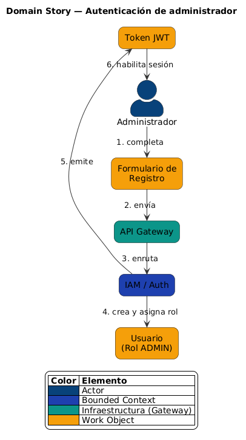
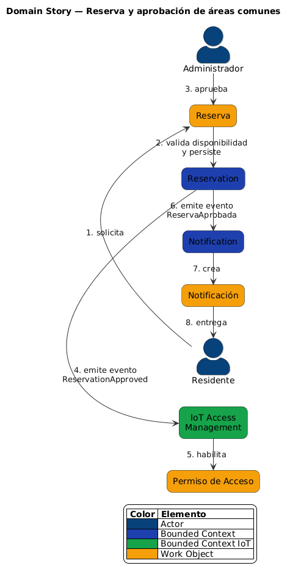
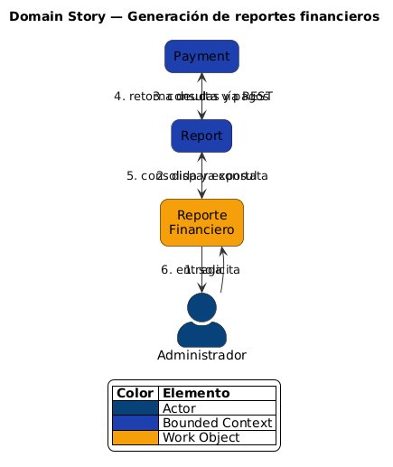
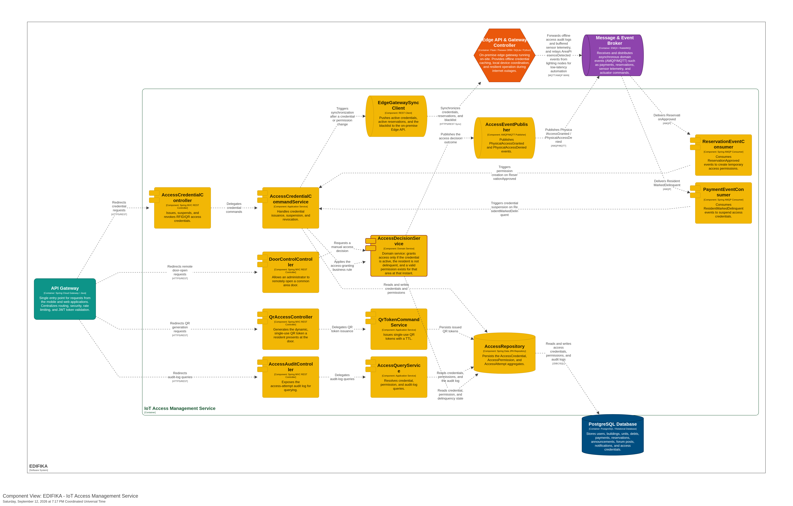
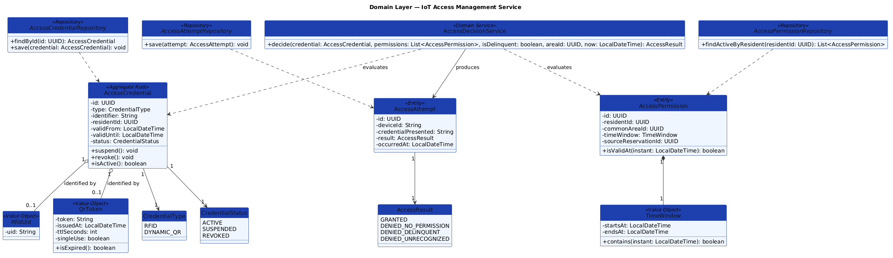
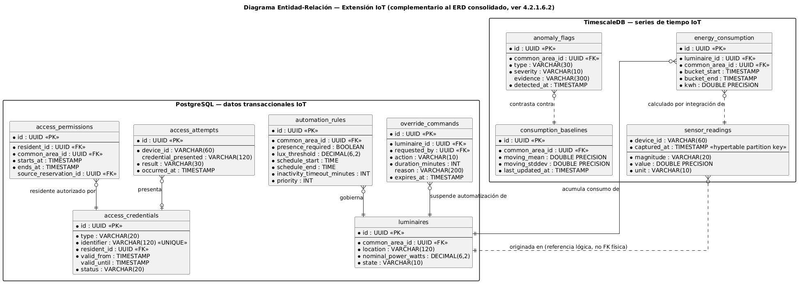
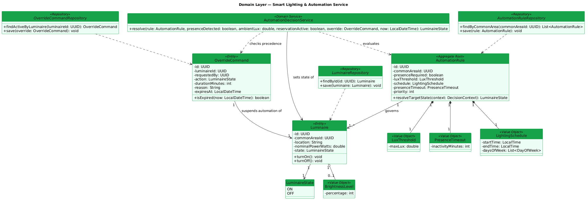
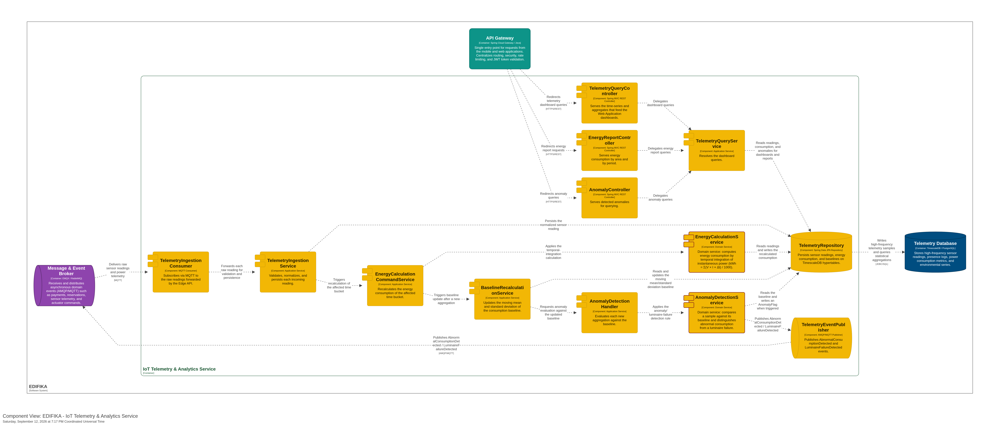

# Capítulo IV: Solution Software Design

**Estado:** ⬜ Pendiente

## 4.1. Strategic-Level Domain-Driven Design

> 📋 **Guía (Statement):** En esta sección el equipo introduce y explica el proceso realizado para las decisiones de nivel estratégico aplicando Domain-Driven Design.
>
> **Bounded Contexts:** En esta sección el equipo explica y evidencia el proceso para descomponer el sistema en subconjuntos con límites naturales o Bounded Contexts. Para ello debe aplicar las herramientas de EventStorming y Bounded Context Canvas.

### 4.1.1. Design-Level EventStorming

> 📋 **Guía (Statement):** En esta sección el equipo explica y evidencia el proceso de Design-Level EventStorming, con el fin de plantear una primera aproximación revisada y mejorada al modelado de nivel general para el dominio del problema, buscando a partir de ahí identificar el mayor nivel de detalle posible. Es recomendable que el equipo organice la sesión de Design-Level EventStorming con una duración entre 1 – 2 horas, a fin de concentrar esfuerzos y no extender el proceso de forma innecesaria. La sección inicia con una introducción y explicación de las actividades realizadas en la sesión de EventStorming, e incluye capturas de lo elaborado en la herramienta indicada. Guía de referencia: <https://bit.ly/dles-guide>.

El equipo realizó la sesión de Design-Level EventStorming en **Miro**, siguiendo la progresión estándar de la técnica en cuatro pasos, cada uno construido sobre el anterior en el mismo tablero:

1. **Storm your events** — volcado libre de todos los eventos de dominio identificados (notas naranjas), sin orden ni filtro, cubriendo tanto la gestión administrativa del condominio como las ideas de nivel IoT.
2. **Organize your events** — reordenamiento de esos eventos en timelines/swimlanes por proceso de negocio, agrupando lo que ocurre en secuencia.
3. **Add commands** — para cada evento, se agregó el *Command* (nota azul) que lo origina y el *Actor* (nota pequeña adjunta: Residente, Administrador o Sistema) que lo dispara.
4. **Add read models, policies and system commands** — se incorporaron los *Read Models* (vistas que consultan los usuarios), las *Policies* (reglas "cuando ocurre X, entonces Y") que conectan eventos entre procesos distintos, y los *System Commands* que el propio sistema dispara de forma automática al cumplirse una policy.

*Figura. Tablero de Design-Level EventStorming en Miro, en sus cuatro etapas (de izquierda a derecha: Storm, Organize, Commands, Read Models/Policies/System Commands). El export completo de las notas del tablero se conserva en [`assets/data/eventstorming-miro-export.csv`](../assets/data/eventstorming-miro-export.csv) para trazabilidad.*

Un resultado relevante del paso *Storm your events* es que el dominio explorado fue deliberadamente más amplio que el alcance final de la solución: junto con los eventos que terminaron mapeados a los 11 bounded contexts candidatos (ver 4.1.1.1), el equipo volcó también una rama completa de riego automático, monitoreo de tanque de agua y detección de fugas (`Riego fue activado automáticamente`, `Nivel crítico fue detectado`, `Fuga fue detectada`, entre otros), heredada de la exploración de mercado de Smart Buildings del Capítulo II. Esa rama no se promovió más allá del paso 2 del EventStorm — la decisión de descartarla como bounded context se explica en 4.1.1.1 — y por eso no vuelve a aparecer ni en el Capítulo III (requisitos) ni en el resto del Capítulo IV.

#### 4.1.1.1. Candidate Context Discovery

> 📋 **Guía (Statement):** En esta sección el equipo, a partir del dominio modelado como EventStorm, explica y evidencia el proceso realizado para la sesión de Candidate Context Discovery, en la que se busca identificar los bounded contexts. Puede aplicar las técnicas de *start-with-value* (Identificar las partes core del dominio que tienen el mayor valor para el negocio), *start-with-simple* (Crear modelos simples, pero con propósito, descomponiendo el timeline en steps secuenciales), ó *look-for-pivotal-events* (Buscar eventos clave del negocio que indiquen cambios de estado entre diferentes partes del proceso de negocio). La sesión de Candidate Context Discovery no debería durar más de 2 horas. Complemente la explicación con capturas en imagen de los cambios progresivos del EventStorm.

Tomando como insumo el EventStorm de 4.1.1, el equipo aplicó las tres técnicas de Candidate Context Discovery en conjunto — no de forma excluyente — sobre el tablero ya organizado en commands, policies y read models:

- **Look-for-pivotal-events:** se buscaron los eventos que marcan un cambio de estado entre procesos de negocio distintos, es decir, los puntos donde un flujo termina y dispara (vía policy) el inicio de otro. `Reserva aceptada` es pivotal porque dispara la habilitación de acceso físico; `Pago fue registrado` / `Deuda marcada como pagada` es pivotal porque libera al residente de una suspensión de acceso; `Residente moroso fue detectado` es pivotal porque cruza de Payment hacia el control de acceso. Estos pivotes son los que terminaron materializándose como los eventos de integración entre contextos documentados en 4.1.1.2 y 4.1.2.
- **Start-with-value:** se identificaron las partes del dominio con mayor valor diferencial para el negocio, usando como referencia directa el análisis competitivo del Capítulo II (Estrategia 2: "Diferenciación mediante integración IoT"). De las capacidades IoT exploradas en el storm — iluminación inteligente, control de acceso, monitoreo de tanque de agua, detección de fugas, riego automático — el equipo priorizó **acceso físico** y **iluminación/energía** por ser las de mayor valor demostrable dentro del alcance de un proyecto académico con hardware real (ESP32), y descartó riego y monitoreo de agua por requerir sensores/actuadores adicionales (electroválvulas, sensores de humedad de suelo, sensores de nivel) sin un actor de negocio que los reclamara como prioridad en el Capítulo III.
- **Start-with-simple:** el timeline ya organizado en el paso 2 de EventStorming se descompuso en sub-timelines secuenciales por proceso (autenticación → gestión residencial → reservas → pagos → comunicación/foro → reportes, y luego los tres sub-timelines IoT), cada uno lo bastante simple como para sostener un propósito de negocio propio — ese es, en esencia, el criterio de corte que produjo los 11 candidatos de la tabla siguiente.

La tabla resume, por cada proceso de negocio que sí se mantuvo en el alcance, el *Command* y *Actor* que lo origina, los *Domain Events* producidos, y las *Policies* / *Read Models* agregados en el paso 4 — es decir, el nivel de detalle sobre el que se hizo el corte de bounded contexts:

| Proceso de negocio | Command (Actor) | Domain Events clave | Policy | Read Model |
|---|---|---|---|---|
| Autenticación (IAM/Auth) | Completar formulario de registro (Residente/Administrador) · Iniciar sesión | Usuario registrado, Rol asignado a usuario, Usuario autenticado, Credenciales rechazadas, Sesión cerrada | Un residente desactivado no puede iniciar sesión | — |
| Gestión residencial | Registrar edificio y unidades (Administrador) | Edificio registrado, Unidad registrada, Residente vinculado a unidad | Rol de usuario debe ser administrador | Directorio de unidades y residentes |
| Reservas | Registrar área común (Administrador) · Solicitar/Cancelar reserva (Residente) | Área común registrada, Reglas de área común registradas, Reserva solicitada, Reserva aceptada/rechazada, Reserva cancelada | — | Calendario de reservas |
| Pagos y deudas | Registrar pago (Residente) | Deuda generada, Pago fue registrado, Pago rechazado, Deuda marcada como pagada, Recordatorio de deuda enviado | Si el pago es rechazado, la deuda permanece pendiente | Estado de cuenta del residente |
| Comunicados y foro | Publicar anuncio (Administrador) · Agregar comentario / Crear encuesta / Votar (Residente) | Anuncio publicado, Comentario agregado, Encuesta creada, Voto registrado, Encuesta finalizada | — | Muro de anuncios, Resultados de la encuesta |
| Reportes | Generar reporte financiero (Administrador) | Reporte financiero generado, Reporte financiero exportado | — | Dashboard financiero |
| Notificaciones (transversal) | *(Sistema, automático)* | Notificación enviada, Notificación leída, Notificación de deuda fue enviada, Notificación enviada a usuario/administrador | — | — |
| Acceso físico (IoT) | Escanear tarjeta (Residente) | Tarjeta RFID/NFC fue escaneada, Residente fue validado, Acceso fue concedido/rechazado/denegado, Puerta fue abierta, Tarjeta no reconocida, Residente moroso fue detectado | Si el residente es moroso, denegar el acceso | — |
| Iluminación inteligente (IoT) | Activar interruptor manual (Residente/Administrador) | Movimiento detectado/no detectado en área común, Luces encendidas/apagadas automáticamente, Temporizador de inactividad iniciado, Fallo de conexión en sensor detectado, Luces permanecieron en modo seguro | Si no hay movimiento por 3 minutos, apagar luces | — |
| *Riego y monitoreo de agua (descartado — ver start-with-value)* | *Activar riego manual* | *Riego activado/detenido automáticamente, Humedad del suelo medida, Fuga detectada, Nivel de agua medido, Fallo en válvula detectado* | *Si la humedad es suficiente, omitir el riego · Si el nivel es crítico o hay fuga, enviar alerta inmediata* | *Historial de riego, Panel de nivel de tanque de agua* |

A partir de este corte por proceso de negocio, y de la incorporación del nivel IoT priorizado, se identificaron **11 bounded contexts candidatos**, cada uno implementado como un microservicio independiente (más el API Gateway y el Edge API como componentes de infraestructura transversal, no bounded contexts de dominio). Los ocho primeros cubren la gestión administrativa del condominio; los tres últimos son los que sobrevivieron el filtro start-with-value dentro del nivel IoT:

| Bounded Context candidato | Responsabilidad principal |
|---|---|
| IAM / Auth | Registro, autenticación (JWT) y gestión de usuarios y roles (administradores/residentes). |
| Residential Management | Registro de edificios, unidades y vinculación de residentes a sus unidades. |
| Reservation | Disponibilidad, reserva y aprobación de uso de áreas comunes. |
| Payment | Registro de deudas, pagos, comprobantes e integración con la pasarela Culqi. |
| Communication | Publicación de comunicados oficiales y encuestas a la comunidad. |
| Notification | Envío de notificaciones push (Firebase Cloud Messaging) originadas por eventos de otros contextos. |
| Report | Generación y exportación de reportes financieros y de morosidad. |
| Forum | Muro comunitario de mensajes entre residentes. |
| IoT Access Management | Permisos de acceso a áreas comunes, credenciales RFID y QR dinámico, y control de cerraduras según reservas activas. |
| Smart Lighting & Automation | Reglas de automatización y control de luminarias de áreas comunes según presencia, lux ambiental, horarios de reserva y override manual. |
| IoT Telemetry & Analytics | Ingesta de telemetría de sensores, cálculo cuantitativo de consumo energético (kWh), estadísticas y detección de anomalías de hardware. |

En cuanto a la persistencia, el modelo de despliegue actual concentra los datos de negocio de los contextos de gestión e IoT en una instancia PostgreSQL, y reserva una instancia TimescaleDB dedicada a las series de telemetría de alta frecuencia, cuyo perfil de escritura y consulta es distinto al transaccional (ver 4.1.3.3).

#### 4.1.1.2. Domain Message Flows Modeling

> 📋 **Guía (Statement):** En esta sección, el equipo explica y evidencia el proceso seguido para visualizar cómo deben colaborar los bounded contexts para resolver los casos que se presentan en el negocio para los usuarios del sistema. Para ello debe aplicar la técnica de visualización *Domain Storytelling*. Complemente la explicación con capturas en imágenes de los diagramas de Domain Storytelling elaborados.

Para cada caso de negocio que involucra a más de un bounded context, el equipo primero elaboró el **Domain Story** correspondiente (técnica de Domain Storytelling: Actor → Activity numerada → Work Object, atravesando los bounded contexts involucrados) y luego lo complementó con un diagrama de secuencia UML de foco técnico (Saga Pattern, compensaciones), reformulado en términos de Command → Agregado → Event → Policy donde aplica. Los Domain Stories se elaboraron como diagrama-as-code con PlantUML — misma filosofía que el modelo C4/Structurizr de 4.1.3 — y su fuente vive en [`plantuml/domain-storytelling/`](../../plantuml/domain-storytelling/).

**Autenticación de administrador (Command: RegistrarAdministrador / IniciarSesión)**

*Figura. Domain Story — el Administrador completa el formulario, que atraviesa el API Gateway hasta IAM/Auth, quien crea el Usuario con rol ADMIN y emite el Token JWT que habilita la sesión.*

*Figura. IAM recibe el Command de registro/login vía API Gateway, valida contra su agregado de Usuario y responde con el token JWT (Event: SesiónIniciada).*

**Autenticación de residente**

*Figura. Domain Story — a diferencia del administrador, el residente no se autorregistra: el Administrador registra el vínculo residente–unidad en Residential Management, que lo provee a IAM/Auth; recién entonces el Residente puede autenticarse.*

*Figura. A diferencia del administrador, el residente no se autorregistra: es Residential Management quien crea el vínculo residente–unidad; IAM solo valida credenciales y emite el token.*

**Publicación de comunicados (Command: PublicarComunicado → Event: ComunicadoPublicado → Policy: notificar residentes)**

*Figura. Domain Story — el Administrador publica el Comunicado en Communication, que dispara a Notification la creación y entrega de la Notificación Push al Residente; si el envío falla, queda pendiente de reintento.*

*Figura. Communication guarda el comunicado y emite el evento ComunicadoPublicado; una policy reacciona enviando las notificaciones push a través de Notification (vía Firebase). Si el envío falla, una acción compensatoria marca la notificación como pendiente de reintento sin afectar el comunicado ya guardado.*

**Registro y aprobación de pagos (Command: RegistrarPago / AprobarPago → Event: PagoAprobado)**

*Figura. Domain Story — el Residente registra el Pago en Payment, que lo envía a Culqi; según la confirmación, Payment aprueba y genera el Comprobante (o revierte la deuda) y notifica al Residente.*

*Figura. Payment registra el pago en estado PENDIENTE; al aprobarlo, emite el evento PagoAprobado que dispara la policy de notificación al residente. Si la pasarela Culqi falla, la compensación revierte la deuda a PENDIENTE.*

**Reserva y aprobación de áreas comunes (Command: CrearReserva / AprobarReserva → Event: ReservaAprobada)**

*Figura. Domain Story — el Residente solicita la Reserva, el Administrador la aprueba, y Reservation dispara en paralelo la habilitación del Permiso de Acceso (IoT Access Management) y la notificación al Residente.*

*Figura. Reservation valida disponibilidad antes de crear la reserva; al aprobarla, emite ReservaAprobada, que dispara la notificación al residente vía Notification.*

**Generación de reportes financieros (Query, sin Command/Event — solo lectura)**

*Figura. Domain Story — el Administrador solicita el Reporte Financiero, Report consulta a Payment vía REST, consolida y exporta el reporte de vuelta al Administrador; al ser de solo lectura, no hay Policy ni compensación involucradas.*

*Figura. Report consulta datos de Payment vía REST para consolidar y exportar reportes; al ser de solo lectura, no participa del flujo de eventos/compensaciones de los demás contextos.*

#### 4.1.1.3. Bounded Context Canvases

> 📋 **Guía (Statement):** En esta sección el equipo diseña sus candidate bounded contexts, detallando los criterios de diseño. El equipo debe ir seleccionando cada bounded context, por orden de importancia, para elaborar su Bounded Context Canvas. La elaboración del Bounded Context Canvas debe seguir un proceso iterativo con los pasos de *Context Overview Definition, Business Rules Distillation & Ubiquitous Language Capture, Capability Analysis, Capability Layering* (si aplica), *Dependencies Capture*, y *Design Critique*.
>
> Al momento de la organización o refinamiento de bounded contexts es importante tomar en cuenta que en una plataforma SaaS orientada a negocios de servicio, es común encontrar los siguientes sub-dominios: *Subscriptions and Payment Management*, *Identity and Access Management*, *Profiles and Preferences Management*, *Service Design and Planning*, *Resource and Asset Management*, *Service Execution and Monitoring*, *Dashboard and Analytics*, *Loyalty and Engagement*. Estos posibles sub-dominios pueden identificarse bajo otros nombres según la naturaleza o términos en el ubiquitous language del dominio en el que se enmarca la solución a realizar. Es posible que existan otros sub-dominios core o de soporte que se requiere considerar en el negocio objeto de estudio.

Siguiendo a Nick Tune (*Bounded Context Canvas*, DDD Crew), cada contexto candidato de 4.1.1.1 se elaboró con el proceso iterativo de seis pasos indicado por el enunciado: **(1) Context Overview Definition** (nombre y propósito en una frase), **(2) Business Rules Distillation & Ubiquitous Language Capture** (reglas de negocio que el contexto hace cumplir y términos propios del dominio), **(3) Capability Analysis** (clasificación estratégica: rol de dominio Core/Supporting/Generic, modelo de negocio y estadio de evolución de Wardley), **(4) Capability Layering** (cuando el contexto agrupa más de una capability, se anota la jerarquía), **(5) Dependencies Capture** (comunicación entrante y saliente, con el patrón DDD de 4.1.2), y **(6) Design Critique** (alternativas consideradas y por qué se descartaron).

El orden de elaboración siguió el criterio de importancia pedido por el enunciado: primero los contextos de los que depende toda la plataforma (IAM/Auth, Payment, Residential Management, Reservation), luego los tres contextos IoT que sostienen la propuesta de diferenciación del Capítulo II, y por último los contextos de soporte/genéricos (Communication, Notification, Report, Forum).

**1. IAM / Auth**

| Campo | Detalle |
|---|---|
| Purpose | Autenticar y autorizar a administradores y residentes, siendo la única fuente de identidad, roles y tokens JWT de la plataforma. |
| Strategic Classification | Domain Role: **Generic** (autenticación JWT es un problema resuelto en la industria) · Business Model: Compliance Enforcer · Evolution: **Product** (patrón bien entendido; se construyó in-house en vez de adoptar un IDaaS externo como Auth0). |
| Ubiquitous Language | User, Role (ADMIN / RESIDENT), Credential, JWT, Session. |
| Business Decisions | Un residente desactivado no puede iniciar sesión · las acciones administrativas exigen rol ADMIN · las contraseñas se almacenan hasheadas y el JWT tiene expiración. |
| Inbound Communication | **Residential Management** (Customer/Supplier, REST síncrono) — provee el vínculo residente–unidad que autoriza la creación de la cuenta de un residente. |
| Outbound Communication | Ninguna activa: es un contexto puramente *upstream*; el resto de contextos son **Conformist** de su contrato JWT vía API Gateway. |
| Model (Aggregates) | `User` (Aggregate Root), `Role` (Value Object). |
| Design Critique | Se evaluó externalizar a un IDaaS (Auth0/Firebase Auth) para reducir el mantenimiento de hashing/tokens, pero se descartó por el costo recurrente en un SaaS de bajo ticket y porque el modelo de roles (ADMIN/RESIDENT) está fuertemente acoplado al dominio propio de Residential Management. |

**2. Payment**

| Campo | Detalle |
|---|---|
| Purpose | Registrar deudas y pagos de mantenimiento, y llevar a un residente moroso a un estado que otros contextos (acceso IoT) puedan consultar. |
| Strategic Classification | Domain Role: **Core** (motor de ingresos del negocio) · Business Model: Revenue Generator · Evolution: **Product** (procesamiento de pagos es un dominio bien entendido; lo diferencial es la integración con Culqi y la propagación de morosidad). |
| Ubiquitous Language | Debt (Deuda), Payment (Pago), Receipt (Comprobante), Delinquent Resident (Residente Moroso). |
| Business Decisions | Si el pago es rechazado, la deuda permanece pendiente · un pago aprobado genera constancia y notifica al residente · un residente con deuda vencida se marca moroso y esto restringe su acceso físico (ver IoT Access Management). |
| Inbound Communication | **Report** (Customer/Supplier, REST síncrono) — consulta datos de Payment para consolidar reportes financieros. |
| Outbound Communication | **Notification** (Customer/Supplier, evento `PagoAprobado`) · **IoT Access Management** (Customer/Supplier, evento `ResidentMarkedDelinquent`) · **Culqi** (Anti-Corruption Layer — pasarela de pagos externa). |
| Model (Aggregates) | `Debt` (Entity), `Payment` (Aggregate Root). |
| Design Critique | Se consideró que Payment abriera directamente el acceso/bloqueo físico del residente moroso, pero se descartó: acoplaría un contexto financiero a reglas de hardware. En su lugar, Payment solo publica el evento y es IoT Access Management quien decide la consecuencia sobre el acceso, manteniendo el Single Responsibility de cada contexto. |

**3. Residential Management**

| Campo | Detalle |
|---|---|
| Purpose | Ser la fuente de verdad de edificios, unidades y del vínculo entre un residente y su unidad. |
| Strategic Classification | Domain Role: **Supporting** (necesario, pero no diferenciador) · Business Model: Engagement Creator · Evolution: **Product** (gestión de catálogo/CRUD es un patrón conocido). |
| Ubiquitous Language | Building (Edificio), Unit (Unidad), Resident-Unit Link (Vínculo Residente–Unidad). |
| Business Decisions | Un residente solo puede vincularse a una unidad activa · el residente no se autorregistra: es el administrador quien crea el vínculo (ver 4.1.1.2, "Autenticación de residente"). |
| Inbound Communication | Ninguna: no consume eventos ni llamadas de otros contextos de negocio. |
| Outbound Communication | **IAM** (Customer/Supplier, REST síncrono) — provee el vínculo residente–unidad que IAM usa para autorizar. |
| Model (Aggregates) | `Building` (Entity), `Unit` (Entity). |
| Design Critique | Se evaluó fusionar este contexto con IAM (ambos gestionan "quién es quién"), pero se mantuvo separado porque su ciclo de cambio es distinto: Residential Management cambia cuando cambia el padrón de residentes/unidades, mientras IAM cambia cuando cambian las políticas de autenticación — fusionarlos violaría el criterio de *single responsibility* de DDD. |

**4. Reservation**

| Campo | Detalle |
|---|---|
| Purpose | Gestionar disponibilidad, solicitud, aprobación y cancelación de áreas comunes, siendo el disparador de la habilitación de acceso físico y de iluminación. |
| Strategic Classification | Domain Role: **Supporting** · Business Model: Engagement Creator · Evolution: **Product** (los sistemas de booking/disponibilidad son un patrón bien conocido). |
| Ubiquitous Language | Common Area (Área Común), Reservation (Reserva), Availability (Disponibilidad), Time Window (Ventana Horaria). |
| Business Decisions | No se puede reservar un área común fuera de sus reglas de uso/horario configuradas · no se permiten reservas duplicadas para la misma ventana horaria. |
| Inbound Communication | Ninguna: es un contexto *upstream* puro dentro del dominio IoT. |
| Outbound Communication | **Notification** (Customer/Supplier, evento `ReservaAprobada`) · **IoT Access Management** (Customer/Supplier, evento `ReservationApproved`) · **Smart Lighting & Automation** (Customer/Supplier, evento `ReservationStarted` disparado por un scheduler interno que detecta el inicio de la ventana horaria). |
| Model (Aggregates) | `CommonArea` (Entity), `Reservation` (Aggregate Root). |
| Design Critique | Se consideró que Reservation controlara directamente el actuador de acceso/luces al aprobar una reserva, pero se descartó: acoplaría un contexto administrativo a protocolos de hardware (MQTT/Edge). Reservation solo emite el evento de dominio; son los contextos IoT quienes lo traducen a una acción física. |

**5. IoT Access Management**

| Campo | Detalle |
|---|---|
| Purpose | Decidir y auditar quién puede abrir físicamente un área común, combinando credenciales, reservas vigentes y estado de morosidad. |
| Strategic Classification | Domain Role: **Core** (pilar de la propuesta de diferenciación IoT del Capítulo II) · Business Model: Revenue Protector / Compliance Enforcer · Evolution: **Custom Built** (la combinación RFID + QR dinámico + reservas + morosidad no es un producto de catálogo). |
| Ubiquitous Language | Access Credential (Credencial de Acceso), Access Permission (Permiso de Acceso), Access Attempt (Intento de Acceso), Delinquent Resident. |
| Business Decisions | Una credencial concede acceso solo si está activa, el residente no está moroso y existe un permiso vigente para esa área en ese instante (`AccessDecisionService`, ver 4.2.9.1) · un residente moroso se suspende automáticamente. |
| Inbound Communication | **Reservation** (Customer/Supplier, evento `ReservationApproved`) · **Payment** (Customer/Supplier, evento `ResidentMarkedDelinquent`). |
| Outbound Communication | **Notification** (Customer/Supplier, eventos `PhysicalAccessGranted` / `PhysicalAccessDenied`) · **Edge API** (**Conformist** — sincroniza credenciales activas, reservas vigentes y blacklist hacia el gateway on-premise). |
| Model (Aggregates) | `AccessCredential` (Aggregate Root), `AccessPermission` (Entity), `AccessAttempt` (Entity). |
| Design Critique | Se evaluó que el Edge API tomara la decisión de acceso de forma autónoma consultando el cloud en cada intento, pero se descartó por latencia y por el requisito de resiliencia offline: la decisión final se cachea en el Edge y solo se sincroniza cuando hay conectividad, de ahí la relación Conformist hacia el Edge en vez de Customer/Supplier síncrona en tiempo real. |

**6. Smart Lighting & Automation**

| Campo | Detalle |
|---|---|
| Purpose | Encender/apagar luminarias de áreas comunes combinando presencia, lux ambiental, horario de reserva y override manual, priorizando el ahorro energético. |
| Strategic Classification | Domain Role: **Core** (diferenciador IoT) · Business Model: Cost Reducer (ahorro energético) · Evolution: **Custom Built** (la precedencia entre presencia/lux/reserva/override es una regla propia del negocio, no un producto de catálogo). |
| Ubiquitous Language | Automation Rule (Regla de Automatización), Luminaire (Luminaria), Override Command (Comando de Override), Lux Threshold (Umbral de Lux). |
| Business Decisions | Si no hay movimiento por 3 minutos, apagar luces (política capturada en el EventStorm, ver 4.1.1.1) · un override manual suspende temporalmente la automatización con precedencia sobre las reglas programadas. |
| Inbound Communication | **Reservation** (Customer/Supplier, evento `ReservationStarted`) — el inicio de una reserva dispara el encendido programado del área · **Edge API** (Customer/Supplier, evento `AreaPresenceDetected` relayado desde el sensor PIR del nodo de iluminación, ver 4.2.10.3). |
| Outbound Communication | **Edge API** (**Conformist** — envía reglas de programación y comandos de override para ejecución local). |
| Model (Aggregates) | `AutomationRule` (Aggregate Root), `Luminaire` (Entity), `OverrideCommand` (Entity). |
| Design Critique | Se evaluó ejecutar la lógica de decisión (`AutomationDecisionService`) directamente en el Edge para no depender de la conectividad WAN, pero se optó por mantener la autoría de reglas en el cloud (más fácil de versionar y auditar desde la Web Application) y solo *empujar* las reglas ya resueltas al Edge — el mismo patrón Conformist que IoT Access Management. |

**7. IoT Telemetry & Analytics**

| Campo | Detalle |
|---|---|
| Purpose | Ingerir telemetría de sensores, calcular consumo energético cuantitativo (kWh) y detectar anomalías de hardware, sosteniendo el requisito de analítica cuantitativa IoT del curso. |
| Strategic Classification | Domain Role: **Core** (el más diferenciador de los tres contextos IoT: es el único que produce analítica cuantitativa) · Business Model: Decision Support / Cost Reducer · Evolution: **Genesis → Custom Built** (el cálculo de integración temporal de potencia y la detección de anomalías por baseline estadística se diseñaron a medida para este dominio). |
| Ubiquitous Language | Sensor Reading (Lectura de Sensor), Energy Consumption (Consumo Energético), Consumption Baseline (Línea Base de Consumo), Anomaly Flag (Marca de Anomalía). |
| Business Decisions | El consumo se calcula por integración temporal de la potencia instantánea (`kWh = Σ(V × I × Δt) / 1000`) · una anomalía se distingue de una falla de luminaria por el patrón de corriente nula con la luminaria comandada en ON (`AnomalyDetectionService`, ver 4.2.11.1). |
| Inbound Communication | **Edge API** (Customer/Supplier, el Edge es *upstream* de datos) — reenvía la telemetría bufferizada y los registros de auditoría generados offline. |
| Outbound Communication | **Notification** (eventos `AbnormalConsumptionDetected`, `LuminaireFailureDetected`) · **Report** (Customer/Supplier — aporta las métricas de consumo que Report consolida). |
| Model (Aggregates) | `EnergyConsumption` (Aggregate Root), `ConsumptionBaseline` (Entity), `AnomalyFlag` (Entity), `SensorReading` (Value Object). |
| Design Critique | Se consideró persistir la telemetría en la misma instancia PostgreSQL que el resto del dominio, pero se descartó por el perfil de escritura (alta frecuencia) y de consulta (series temporales) incompatible con el transaccional — de ahí la instancia TimescaleDB dedicada (ver 4.1.3.3), la única decisión de persistencia que rompe el patrón "un PostgreSQL para todos" del resto de contextos. |

**8. Communication**

| Campo | Detalle |
|---|---|
| Purpose | Publicar comunicados oficiales y encuestas de la comunidad hacia los residentes. |
| Strategic Classification | Domain Role: **Supporting** · Business Model: Engagement Creator · Evolution: **Product** (publicación de anuncios/encuestas es un patrón conocido). |
| Ubiquitous Language | Announcement (Comunicado), Poll (Encuesta), Reach (Alcance). |
| Business Decisions | Límite de un mensaje diario por residente (HTTP 429 si se excede) · voto único por encuesta (HTTP 409 si se duplica). |
| Inbound Communication | Ninguna. |
| Outbound Communication | **Notification** (Customer/Supplier, evento `ComunicadoPublicado`) · **Cloudinary** (Anti-Corruption Layer — imágenes de comunicados). |
| Model (Aggregates) | `Announcement` (Entity), `Poll` (Entity). |
| Design Critique | Se evaluó fusionar Communication con Forum (ambos son "muros" de contenido), pero se mantuvieron separados porque su ubiquitous language y su ciclo de vida difieren: un comunicado es unidireccional y oficial (admin → todos), mientras un post de Forum es conversacional entre pares. |

**9. Notification**

| Campo | Detalle |
|---|---|
| Purpose | Traducir eventos de dominio de todo el sistema en notificaciones push entregadas al residente o administrador correcto. |
| Strategic Classification | Domain Role: **Generic** (envío de notificaciones es una capability resuelta por FCM) · Business Model: Engagement Creator · Evolution: **Commodity** (delegada casi por completo a Firebase Cloud Messaging). |
| Ubiquitous Language | Notification (Notificación), Device Token (Token de Dispositivo). |
| Business Decisions | Si el envío a FCM falla, la notificación se marca pendiente de reintento sin afectar el estado del contexto que originó el evento (compensación, ver 4.1.1.2). |
| Inbound Communication | **Communication** (`ComunicadoPublicado`) · **Payment** (`PagoAprobado`) · **Reservation** (`ReservaAprobada`) · **IoT Access Management** (`PhysicalAccessGranted`/`Denied`) · **IoT Telemetry & Analytics** (`AbnormalConsumptionDetected`, `LuminaireFailureDetected`) — todos Customer/Supplier, Notification es downstream puro. |
| Outbound Communication | **Firebase Cloud Messaging** (Anti-Corruption Layer). |
| Model (Aggregates) | `Notification` (Entity), `DeviceToken` (Entity). |
| Design Critique | Al ser el único punto de consumo de eventos de los seis contextos restantes, se evaluó el riesgo de que un fallo en Notification bloqueara el broker para todos; se mitigó con el **Factory Pattern** para desacoplar la creación del tipo de notificación (Push/Email/SMS) de su envío, y con colas de reintento independientes por evento. |

**10. Report**

| Campo | Detalle |
|---|---|
| Purpose | Consolidar y exportar reportes financieros, de morosidad y de analítica de consumo energético de la comunidad. |
| Strategic Classification | Domain Role: **Supporting** · Business Model: Decision Support · Evolution: **Product** (generación de reportes PDF/Excel es un patrón conocido). |
| Ubiquitous Language | Financial Report (Reporte Financiero), Delinquency (Morosidad). |
| Business Decisions | Contexto mayormente de solo lectura (CQRS): no posee agregados transaccionales propios, solo modelos de lectura. |
| Inbound Communication | Ninguna. |
| Outbound Communication | **Payment** (Customer/Supplier, REST síncrono) · **IoT Telemetry & Analytics** (Customer/Supplier — métricas de consumo). |
| Model (Aggregates) | `FinancialReport` (modelo de lectura, sin Aggregate Root transaccional). |
| Design Critique | Se evaluó que Report consumiera eventos de Payment de forma asíncrona (event sourcing de proyecciones) en vez de consultarlo vía REST síncrono, lo que reduciría el acoplamiento temporal; se descartó por ahora dado el volumen de datos y el timebox del proyecto, dejándolo como una mejora futura explícita. |

**11. Forum**

| Campo | Detalle |
|---|---|
| Purpose | Sostener el muro comunitario de mensajes entre residentes de un mismo edificio. |
| Strategic Classification | Domain Role: **Generic** · Business Model: Engagement Creator · Evolution: **Commodity** (patrón de muro/foro ampliamente disponible). |
| Ubiquitous Language | Post (Publicación), Wall (Muro). |
| Business Decisions | Límite de publicaciones diarias por residente (HTTP 429 si se excede). |
| Inbound Communication | Ninguna. |
| Outbound Communication | **Cloudinary** (Anti-Corruption Layer — imágenes de publicaciones del foro). |
| Model (Aggregates) | `Post` (Entity). |
| Design Critique | Es el contexto de menor prioridad estratégica de los 11 (Domain Role Generic, Evolution Commodity); se evaluó no construirlo como microservicio independiente y anexarlo a Communication, pero se mantuvo separado porque su Ubiquitous Language y su patrón de acceso (conversacional, muchos-a-muchos) son distintos a los de un comunicado oficial (uno-a-muchos), y porque así puede escalar o degradarse independientemente sin afectar la publicación de comunicados oficiales. |

### 4.1.2. Context Mapping

> 📋 **Guía (Statement):** En esta sección el equipo explica y evidencia el proceso de elaboración de un conjunto de context maps (visualizaciones de las relaciones estructurales entre bounded contexts). Para ello el equipo revisa información recolectada y la utiliza para producir los diseños candidatos. Se recomienda en el proceso incluir preguntas como: "¿qué pasaría si movemos este capability a otro bounded context?", "¿qué pasaría si descomponemos este capability y movemos uno de los sub-capabilities a otro bounded context?", "¿qué pasaría si partimos el bounded context en múltiples bounded contexts?", "¿qué pasaría si tomamos este capability de estos 3 contexts y lo usamos para formar un nuevo context?", "¿qué pasaría si duplicamos una funcionalidad para romper la dependencia?", "¿qué pasaría si creamos un shared service para reducir la duplicación entre múltiples bounded contexts?", "¿qué pasaría si aislamos los core capabilities y movemos los otros a un context aparte?". Debe finalizar este proceso discutiendo cada alternativa de context mapping a fin de llegar a la mejor aproximación. Es importante que el equipo considere los patrones de relaciones entre Bounded Contexts establecidos en Domain-Driven Design, como *Anti-corruption Layer, Conformist, Customer/Supplier ó Shared Kernel*.

El context map documenta las relaciones estructurales entre contextos derivadas de los flujos de colaboración de 4.1.1.2 y del modelo de arquitectura ([`arquitectura/diagrama.dsl`](../../arquitectura/diagrama.dsl)); la clasificación según los patrones de relación de DDD que se lista en la tabla quedó validada por la discusión de alternativas que cierra esta sección y por el campo *Design Critique* de cada Bounded Context Canvas (4.1.1.3).

El nivel IoT introduce un patrón de relación característico de este tipo de soluciones: el **Conformist**. El Edge API y el firmware de los dispositivos no negocian su modelo con los contextos cloud —consumen el contrato de credenciales, reglas y comandos tal como lo define el nivel cloud— porque duplicar o traducir ese modelo en un dispositivo con recursos limitados no se justifica. La relación inversa (telemetría y auditoría que suben del edge al cloud) sí es Customer/Supplier: el edge es el productor del dato y los contextos cloud lo consumen.

| Contexto origen | Contexto destino | Relación observada | Patrón DDD más cercano (a validar) |
|---|---|---|---|
| Communication | Notification | Emite evento al publicar un comunicado para que se notifique a los residentes. | Customer/Supplier (Communication es upstream) |
| Payment | Notification | Emite evento al aprobar un pago. | Customer/Supplier |
| Reservation | Notification | Emite evento al aprobar una reserva. | Customer/Supplier |
| Payment | Culqi (sistema externo) | Integración vía Adapter/ACL (pasarela de pagos). | Anti-corruption Layer |
| Report | Payment | Consulta síncrona vía REST para consolidar reportes financieros. | Customer/Supplier (Report es downstream, solo lectura) |
| Residential Management | IAM | Provee el vínculo residente–unidad que IAM usa para autorizar el acceso. | Customer/Supplier |
| Reservation | IoT Access Management | `ReservationApproved` habilita el permiso temporal de acceso al área común reservada. | Customer/Supplier (Reservation es upstream) |
| Reservation | Smart Lighting & Automation | El inicio de la reserva dispara el encendido programado del área común. | Customer/Supplier |
| Payment | IoT Access Management | `ResidentMarkedDelinquent` suspende los permisos de acceso del residente moroso. | Customer/Supplier |
| IoT Access Management | Notification | Emite `PhysicalAccessGranted` / `PhysicalAccessDenied` para notificar accesos y rechazos. | Customer/Supplier |
| IoT Telemetry & Analytics | Notification | Emite `AbnormalConsumptionDetected` y `LuminaireFailureDetected` para alertar al administrador. | Customer/Supplier |
| IoT Telemetry & Analytics | Report | Aporta las métricas de consumo energético que Report consolida en la analítica de la comunidad. | Customer/Supplier (Report es downstream) |
| IoT Access Management | Edge API | Sincroniza credenciales activas, reservas vigentes y blacklist hacia el gateway on-premise. | Conformist (el Edge conforma el modelo definido en el cloud) |
| Smart Lighting & Automation | Edge API | Envía las reglas de automatización y los comandos de override manual. | Conformist |
| Edge API | IoT Telemetry & Analytics | Reenvía la telemetría bufferizada y los registros de auditoría generados durante la operación offline. | Customer/Supplier (el Edge es upstream de datos) |
| Edge API | Smart Lighting & Automation | Relaya el evento `AreaPresenceDetected` apenas recibe la lectura del sensor PIR, priorizando latencia de encendido sobre interpretación de dominio. | Customer/Supplier (el Edge es upstream de datos, ver 4.2.10.3) |
| Dispositivos embebidos (ESP32) | Edge API | Intercambio local MQTT de lecturas y comandos; el firmware se adapta al contrato del Edge API. | Conformist (infraestructura física, no bounded context de dominio) |
| API Gateway | Todos los contextos | Enrutamiento y validación de JWT (infraestructura transversal, no bounded context de dominio). | — |

**Discusión de alternativas de context mapping**

Sobre el mapa anterior, el equipo evaluó explícitamente las preguntas de diseño sugeridas por el enunciado. La tabla siguiente resume los casos donde la respuesta no era obvia, la alternativa considerada y la decisión final:

| Pregunta de diseño | Alternativa evaluada | Decisión final y razón |
|---|---|---|
| ¿Qué pasaría si **movemos** este capability a otro contexto? | Mover la decisión de acceso (`AccessDecisionService`) del cloud (IoT Access Management) al Edge API, para que abra la puerta sin ida y vuelta al cloud. | **Se descarta mover el contexto completo**, pero sí se replica su *resultado* (credenciales/permisos ya resueltos) en el Edge vía sincronización — el Edge cachea la decisión, no la recalcula. Mantiene a IoT Access Management como única fuente de verdad y evita que la regla de negocio (moroso → sin acceso) viva en dos lugares. |
| ¿Qué pasaría si **descomponemos** el capability y movemos un sub-capability a otro contexto? | Separar la emisión/gestión de credenciales RFID/QR de la decisión de acceso en tiempo real, creando un contexto "Credential Management" aparte de "Access Decision". | **Se descarta**: ambos sub-capabilities comparten el mismo Aggregate (`AccessCredential`) y el mismo invariante (una credencial suspendida no debe poder decidir un acceso), partirlos forzaría una transacción distribuida para algo que hoy es una operación local. |
| ¿Qué pasaría si **partimos** el bounded context en varios? | Partir Payment en "Billing" (deudas/cuotas) y "Payment Processing" (cobro/Culqi) como dos contextos independientes. | **Se descarta para el alcance actual**: el volumen de reglas de negocio no justifica el costo de coordinación entre dos contextos: la Saga de aprobación (4.1.1.2) necesita ambas responsabilidades en la misma transacción local. Queda anotado como refactor natural si el dominio de facturación creciera (ej. múltiples pasarelas de pago). |
| ¿Qué pasaría si **tomamos capabilities de 3 contexts** para formar uno nuevo? | Extraer la lógica de "generar alerta" que hoy vive de forma repetida en IoT Access Management, Smart Lighting y IoT Telemetry, y consolidarla en un contexto nuevo. | **Ya resuelto por diseño**: ese contexto nuevo es exactamente **Notification** — los tres contextos IoT solo publican el evento de dominio (`PhysicalAccessDenied`, `AbnormalConsumptionDetected`, etc.) y es Notification quien concentra el *Factory Pattern* de creación de la alerta (push/email/SMS), evitando triplicar esa lógica. |
| ¿Qué pasaría si **duplicamos** una funcionalidad para romper una dependencia? | Que Report mantenga su propia copia denormalizada de pagos/deudas (vía eventos) en lugar de consultar a Payment por REST síncrono. | **Se descarta por ahora** (queda como Design Critique de Report en 4.1.1.3): el volumen de datos y el timebox del proyecto no justifican construir un pipeline de proyecciones; se acepta el acoplamiento síncrono Report → Payment sabiendo que es la única lectura cross-context sin desacoplar del informe. |
| ¿Qué pasaría si creamos un **shared service** para reducir duplicación? | Un servicio compartido de "estado de morosidad" consultado tanto por IoT Access Management como por futuras integraciones (ej. bloqueo de reservas a morosos). | **Se descarta un servicio nuevo**: Payment ya es la fuente de verdad y publica `ResidentMarkedDelinquent`; crear un shared service solo agregaría un salto de red adicional sin nueva capability. Se prefiere que cada contexto interesado se suscriba al evento (Customer/Supplier) en vez de introducir un Shared Kernel. |
| ¿Qué pasaría si **aislamos los core capabilities** y movemos el resto a un contexto aparte? | Separar `EnergyCalculationService`/`AnomalyDetectionService` (core, diferenciador) de la ingesta cruda de telemetría (`TelemetryIngestionService`, más genérica) en dos contextos. | **Se descarta dividir en dos microservicios** por el timebox del curso, pero sí se aisló en capas dentro del mismo contexto (Domain Service vs. Application Service, ver 4.2.11): si el volumen de sensores creciera, la ingesta cruda es la primera candidata a externalizarse hacia una plataforma IoT genérica (ej. AWS IoT Core), dejando el cálculo de energía y la detección de anomalías —el verdadero valor de negocio— en el contexto propio. |

Ninguna de las siete preguntas llevó a mover una línea del context map de la tabla anterior; el resultado de la discusión fue, en todos los casos, una confirmación explícita del diseño existente (o una nota de refactor futuro), no un cambio de alcance.

### 4.1.3. Software Architecture

> 📋 **Guía (Statement):** En esta sección el equipo presenta y explica la representación, aplicando C4 Model y utilizando la herramienta indicada (Structurizr), de la Arquitectura de Software para la solución. Aquí se realiza una introducción y se incluye como secciones internas *Software Architecture Context Level Diagram* y *Software Architecture Container Level Diagrams*.

La arquitectura se modeló con **C4 Model** aplicando *Diagram-as-Code* mediante **Structurizr DSL**. El modelo fuente único vive en [`arquitectura/diagrama.dsl`](../../arquitectura/diagrama.dsl) y de él se generan las cuatro vistas que se presentan a continuación (System Landscape, System Context, Container y Deployment), de modo que los cuatro diagramas son siempre consistentes entre sí por construcción.

La solución adopta una **arquitectura IoT distribuida en tres niveles** —*Cloud Computing*, *Edge Computing* y *IoT Devices con Embedded Systems*— y se apoya en los siguientes estilos y patrones:

- **Microservices Architecture:** escalabilidad y disponibilidad independientes; un fallo en Comunicados no interrumpe Pagos ni el control de accesos.
- **Layered Architecture** dentro de cada microservicio (Interface / Application / Domain / Infrastructure).
- **API Gateway Pattern:** punto único de entrada, autenticación JWT, rate limiting y enrutamiento.
- **Event-Driven Architecture:** un *Message & Event Broker* AMQP/MQTT desacopla la publicación de eventos de dominio de su consumo.
- **Saga Pattern coreografiado:** consistencia entre contextos sin locks distribuidos (ver 4.1.1.2).
- **CQRS parcial:** Report separa la lectura de reportes de las operaciones de escritura de los demás contextos.
- **Edge Computing offline-first:** el Edge API cachea credenciales y reservas activas, y mantiene operativos los accesos y la iluminación de áreas comunes aunque se caiga el enlace WAN del condominio.

| Categoría | Herramienta / Tecnología |
|---|---|
| IDE | Visual Studio Code / IntelliJ IDEA |
| Landing Page | HTML5 / CSS3 / JavaScript |
| Framework Frontend Web | Angular / TypeScript (SPA) |
| Mobile Application | Flutter / Dart |
| Lenguaje / Framework Backend | Java / Spring Boot / Spring Data JPA |
| API Gateway | Spring Cloud Gateway / Java |
| Edge API | Python / Flask / Peewee ORM / SQLite |
| Embedded Applications | ESP32 / C++ |
| Mensajería y eventos | EMQX / RabbitMQ (AMQP y MQTT) |
| Base de Datos | PostgreSQL (datos de negocio) / TimescaleDB (series de telemetría) |
| Servicios externos | Culqi (pagos) / Cloudinary (imágenes) / Firebase Cloud Messaging (push) |
| Diagramación de arquitectura | Structurizr DSL (C4 Model) |
| Testing | JUnit / Mockito |
| CI / CD | GitHub Actions |

#### 4.1.3.1. Software Architecture System Landscape Diagram

> 📋 **Guía (Statement):** Vista de System Landscape del C4 Model, que ubica la solución dentro del ecosistema de personas y sistemas con los que convive el negocio, con un alcance más amplio que el Context Diagram.

El System Landscape amplía el foco: en lugar de mirar hacia adentro de EDIFIKA, ubica la plataforma dentro del **ecosistema completo del negocio de administración de condominios**. A diferencia del Context Diagram, aquí EDIFIKA no se dibuja como sistema *en alcance* con un boundary propio, sino como un sistema más del paisaje, al mismo nivel que los servicios de terceros de los que depende. Esta vista permite discutir el modelo de negocio —quién llega al producto y por qué canal— antes de entrar a decisiones técnicas.

*Figura. System Landscape View de EDIFIKA. Elaborado por el equipo aplicando C4 Model con Structurizr DSL (Structurizr, s.f.).*

El paisaje está compuesto por tres segmentos de personas y tres sistemas externos:

| Elemento | Tipo | Rol en el ecosistema |
|---|---|---|
| Visitor | Person | Prospecto anónimo que consulta el Landing Page estático para conocer el modelo de negocio, los segmentos objetivo y los precios antes de registrarse. |
| Administrator | Person | Administra residentes, pagos, unidades, reservas, comunicados oficiales, foro, reportes y **reglas de automatización IoT**. |
| Owner or Tenant | Person | Consulta deudas, paga, reserva áreas comunes, **accede a los espacios vía RFID/QR**, **interactúa con la iluminación** y participa del foro del edificio. |
| Culqi | Software System | Pasarela de pagos externa para cuotas de mantenimiento, deudas y servicios (HTTPS/REST). |
| Cloudinary | Software System | Servicio cloud externo de almacenamiento, optimización y entrega de las imágenes del foro y de los comunicados oficiales (HTTPS/REST). |
| Firebase Cloud Messaging | Software System | Servicio externo de notificaciones push en tiempo real hacia las aplicaciones móviles (HTTPS/REST). |

El **Visitor** es el segmento que cierra el circuito Landing Page → Web/Mobile Application exigido para la solución: llega de forma anónima al sitio estático y desde ahí los call-to-action lo dirigen a la aplicación que corresponde a su segmento. Los otros dos segmentos ya operan sobre la plataforma autenticados, con roles distintos sobre las mismas capacidades.

#### 4.1.3.2. Software Architecture Context Level Diagrams

> 📋 **Guía (Statement):** En esta sección el equipo realiza una introducción, presenta en imagen el context diagram, el cual debe mostrar el sistema como un recuadro en el centro, rodeado por sus usuarios y otros sistemas con los que interactúa. Se incluye en esta sección una explicación del diagrama.

El Context Diagram toma el paisaje anterior y fija el foco en EDIFIKA: la plataforma se representa como una caja única en el centro —sin abrir su interior— rodeada por los usuarios que la operan y por los sistemas de terceros con los que se integra. Es el nivel de abstracción con el que se conversa con stakeholders no técnicos: qué entra, qué sale y con quién se habla, sin comprometer todavía ninguna decisión de tecnología.

*Figura. System Context View de EDIFIKA. Elaborado por el equipo aplicando C4 Model con Structurizr DSL (Structurizr, s.f.).*

Las interacciones representadas son:

- **Visitor → EDIFIKA:** consulta información del modelo de negocio, contenido por segmento objetivo y precios a través del Landing Page.
- **Administrator → EDIFIKA:** gestiona la operación del condominio, aprueba reservas y monitorea alertas (incluidas las alertas de consumo anómalo y de falla de luminarias que produce el nivel IoT).
- **Owner or Tenant → EDIFIKA:** consulta deudas, paga, reserva áreas comunes, **genera tokens QR de acceso** y **activa la iluminación** de áreas comunes.
- **EDIFIKA → Culqi:** procesa los pagos en línea (HTTPS/REST).
- **EDIFIKA → Cloudinary:** sube y recupera las imágenes asociadas a comunicados oficiales y publicaciones del foro (HTTPS/REST).
- **EDIFIKA → Firebase Cloud Messaging:** envía las notificaciones push de los eventos del sistema a los usuarios móviles (HTTPS/REST).

Las integraciones con terceros se acotan deliberadamente a tres: la pasarela de pagos, el servicio de gestión de imágenes y el servicio de notificaciones push. El resto de las capacidades —incluidas las de acceso físico, iluminación y telemetría— se resuelve dentro de EDIFIKA, de modo que ningún flujo crítico de la operación del condominio queda condicionado a la disponibilidad de un proveedor externo.

##### 4.1.3.2.1. Software Architecture Container Level Diagrams

> 📋 **Guía (Statement):** En esta sección, el equipo realiza una introducción, presenta y explica el Container Diagram. Dicho diagrama debe mostrar los elementos de alto nivel de la arquitectura de software y cómo se distribuyen las responsabilidades entre ellos. Aquí se debe mostrar también las principales decisiones de tecnología y cómo los containers se comunican entre sí. Recuerde que para C4 Model, cada container representa una unidad de despliegue independiente.

El Container Diagram abre la caja de EDIFIKA y muestra los **21 containers** que componen la solución, distribuidos en los tres niveles de la arquitectura IoT. Cada container es una unidad de despliegue independiente —se construye, versiona y despliega por separado— y el color en el diagrama identifica su nivel: naranja el Landing Page y el Edge API, azul los clientes y los microservicios de gestión, verde los microservicios IoT cloud, morado el broker, azul oscuro las bases de datos y rojo los dispositivos embebidos.

*Figura. Container View de EDIFIKA. Elaborado por el equipo aplicando C4 Model con Structurizr DSL (Structurizr, s.f.). Cada container es una unidad de despliegue independiente.*

**Decisiones de tecnología por container**

| Nivel | Container | Tecnología | Responsabilidad |
|---|---|---|---|
| Presentación | Landing Page | HTML5 / CSS3 / JavaScript | Sitio estático que presenta el modelo de negocio, los segmentos objetivo y los precios, con call-to-action por segmento. |
| Presentación | Web Application | Angular / TypeScript (SPA) | Pagos, reservas, comunicados, **dashboards de telemetría IoT** y reportes desde el navegador. |
| Presentación | Mobile Application | Flutter / Dart | Pagos, reservas, comunicados, **generación de QR dinámico de acceso** y foro desde iOS y Android. |
| Entrada | API Gateway | Spring Cloud Gateway / Java | Punto único de entrada: enrutamiento, seguridad, rate limiting y validación del token JWT. |
| Cloud — gestión | IAM / Auth Service | Spring Boot / Spring Data JPA / Java | Autenticación, autorización, roles y emisión/validación de JWT. |
| Cloud — gestión | Residential Management Service | Spring Boot / Spring Data JPA / Java | Edificios, unidades, residentes y su vínculo con las unidades. |
| Cloud — gestión | Payment Service | Spring Boot / Spring Data JPA / Java | Deudas, cuotas, pagos, comprobantes e integración con Culqi. |
| Cloud — gestión | Reservation Service | Spring Boot / Spring Data JPA / Java | Áreas comunes, disponibilidad, reservas, aprobaciones y cancelaciones. |
| Cloud — gestión | Communication Service | Spring Boot / Spring Data JPA / Java | Comunicados oficiales y avisos administrativos. |
| Cloud — gestión | Messaging / Forum Service | Spring Boot / Spring Data JPA / Java | Publicaciones, comentarios e interacciones del foro privado de cada edificio. |
| Cloud — gestión | Notification Service | Spring Boot / Spring Data JPA / Java | Consume eventos del sistema y envía las notificaciones push (incluidas las alertas IoT). |
| Cloud — gestión | Report Service | Spring Boot / Spring Data JPA / Java | Reportes de pagos, morosidad, reservas y analítica de la comunidad. |
| Cloud — IoT | IoT Access Management Service | Spring Boot / Spring Data JPA / Java | Permisos de acceso a áreas comunes, credenciales RFID y QR dinámico, y control de cerraduras según reservas activas. |
| Cloud — IoT | Smart Lighting & Automation Service | Spring Boot / Spring Data JPA / Java | Control de luminarias según presencia, nivel de lux ambiental, horarios de reserva y override manual. |
| Cloud — IoT | IoT Telemetry & Analytics Service | Spring Boot / Spring Data JPA / Java | Ingesta de telemetría, **cálculo cuantitativo de energía (kWh)**, estadísticas y detección de anomalías de hardware. |
| Asincronía | Message & Event Broker | EMQX / RabbitMQ | Recibe y distribuye los eventos de dominio asíncronos (AMQP/MQTT): pagos, reservas, telemetría y comandos de actuadores. |
| Datos | PostgreSQL Database | PostgreSQL | Usuarios, edificios, unidades, deudas, pagos, reservas, comunicados, foro, notificaciones y credenciales de acceso. |
| Datos | Telemetry Database | TimescaleDB / PostgreSQL | Lecturas de sensores de alta frecuencia, registros de presencia, métricas de consumo y series ambientales. |
| Edge | Edge API & Gateway Controller | Flask / Peewee ORM / SQLite / Python | Gateway on-premise: caché de credenciales offline, coordinación local de dispositivos y operación resiliente ante caídas de internet. |
| Device | Common Area Access Controller | ESP32 / Embedded C++ | Lector RFID (RC522), escáner QR, sensor magnético de puerta, buzzer y relé de cerradura eléctrica. |
| Device | Smart Lighting & Sensing Node | ESP32 / Embedded C++ | Sensor de presencia PIR, sensor de lux LDR, sensor de corriente ACS712 y relé de luminaria. |

**Cómo se comunican los containers**

1. **Síncrono REST/JSON sobre HTTPS con JWT:** Web y Mobile Application consumen el API Gateway, que enruta hacia los 11 microservicios. Ningún cliente accede directamente a un microservicio.
2. **Asíncrono AMQP:** los microservicios publican eventos de dominio en el broker (`PaymentConfirmed`, `ReservationApproved`, `AnnouncementPublished`, `PhysicalAccessGranted`, `AbnormalConsumptionDetected`, etc.) y el broker los entrega a Notification, Report, Access y Lighting. Esto es lo que sostiene el Saga coreografiado de 4.1.1.2.
3. **MQTT local (Edge ↔ Device):** los dispositivos ESP32 envían intentos de acceso, estado de puerta, presencia, lux y corriente al Edge API, y reciben de vuelta comandos de apertura, feedback y PWM de luminaria.
4. **MQTT/AMQP sobre WAN (Edge → Cloud):** el Edge API reenvía al broker los registros de auditoría generados offline y la telemetría acumulada.
5. **Sincronización REST (Cloud → Edge):** IoT Access Management sincroniza credenciales activas, reservas vigentes y blacklist; Smart Lighting envía reglas de programación y overrides manuales.
6. **JDBC/SQL:** los microservicios de gestión e IoT persisten en PostgreSQL; Telemetry escribe y consulta agregaciones en TimescaleDB.
7. **Interacción física:** el residente presenta su tarjeta RFID o escanea el QR dinámico en la puerta, y su movimiento es detectado por el sensor PIR. Es el único canal del diagrama que no es de software.

La distribución de responsabilidades sigue el mismo criterio en los tres niveles: el cloud concentra las reglas de negocio y la persistencia de largo plazo, el edge concentra la autonomía operativa de cada condominio, y los dispositivos se limitan a sensar y actuar. Esa separación es la que permite que un corte de internet degrade la solución en lugar de detenerla: los dispositivos siguen respondiendo al Edge API y este sigue decidiendo con su caché local.

#### 4.1.3.3. Software Architecture Deployment Diagrams

> 📋 **Guía (Statement):** Diagrama de despliegue (Deployment Diagram) de C4 Model, mostrando cómo se distribuyen los containers en la infraestructura de despliegue.

El Deployment Diagram muestra en qué infraestructura se ejecuta cada uno de los containers del nivel anterior. La solución se despliega en **cinco nodos de infraestructura**: los dispositivos del usuario final, el PaaS que aloja el backend, el proveedor gestionado de bases de datos, el broker gestionado y —la diferencia central respecto de una solución puramente web— el **sitio físico del condominio**, donde viven el Edge Server y los dispositivos embebidos.

*Figura. Deployment View de EDIFIKA — entorno Production. Elaborado por el equipo aplicando C4 Model con Structurizr DSL (Structurizr, s.f.).*

| Deployment Node | Infraestructura | Containers desplegados |
|---|---|---|
| Client Devices → Web Browser | Chrome, Edge, Safari o Firefox (desktop/mobile) | Landing Page, Web Application |
| Client Devices → Mobile Device | Smartphone iOS o Android | Mobile Application |
| Render → API Gateway Node | Render Web Service | API Gateway |
| Render → Core Microservices Cluster | Render Web Services | IAM, Residential Management, Payment, Reservation, Communication, Messaging/Forum, Notification y Report |
| Render → IoT Cloud Microservices Cluster | Render Web Services | IoT Access Management, Smart Lighting & Automation, IoT Telemetry & Analytics |
| Supabase → PostgreSQL Instance | PostgreSQL 15 gestionado | PostgreSQL Database |
| Supabase → TimescaleDB Instance | PostgreSQL 15 + TimescaleDB | Telemetry Database |
| Message Broker Cloud | CloudAMQP / EMQX Cloud | Message & Event Broker |
| Condominium Site → Edge Server | Raspberry Pi 4 / Mini PC on-premise | Edge API & Gateway Controller |
| Condominium Site → Common Area Door Unit | Hardware embebido en cada puerta de área común | Common Area Access Controller |
| Condominium Site → Common Area Lighting Unit | Hardware embebido en cada luminaria | Smart Lighting & Sensing Node |

El **Condominium Site** se instala una vez por edificio y es lo que hace viable el requisito de resiliencia: si se cae el enlace a internet, el Edge Server sigue validando credenciales contra su caché local y accionando cerraduras y luminarias; cuando el enlace se restablece, reenvía al broker los registros de auditoría y la telemetría acumulada. Los clusters de Render son *stateless*, de modo que escalan horizontalmente sin coordinación, y toda la persistencia queda confinada a Supabase.

La elección de infraestructura responde al perfil de carga de cada pieza: los clusters de Render son *stateless* y escalan horizontalmente sin coordinación; Supabase concentra la persistencia en dos instancias separadas porque el perfil de escritura de la telemetría —alta frecuencia y consulta por series temporales— no es compatible con el transaccional; el broker se contrata gestionado para no asumir la operación de su alta disponibilidad; y el sitio del condominio es la única infraestructura que el equipo instala y mantiene físicamente.

Este mismo diagrama se referencia en 6.1.4 como Deployment Diagram del capítulo de implementación, según lo solicitado por el enunciado.

## 4.2. Tactical-Level Domain-Driven Design

> 📋 **Guía (Statement):** En este capítulo el equipo explica y presenta su propuesta para la perspectiva táctica del diseño de la solución de software. Aquí se incluye una sección interna por cada bounded context.
>
> ⚠️ Duplicar la sub-sección `4.2.X` a continuación por cada Bounded Context identificado (4.2.1, 4.2.2, ...).

> 📋 **Guía (Statement):** En esta sección, el equipo presenta las clases identificadas y las detalla a manera de diccionario, explicando para cada una su nombre, propósito y la documentación de atributos y métodos considerados, junto con las relaciones entre ellas. **4.2.X.1. Domain Layer:** *Entities*, *Value Objects*, *Aggregates*, *Factories*, *Domain Services*, o interfaces de *Repositories*. **4.2.X.2. Interface Layer:** clases *Controllers* o *Consumers*. **4.2.X.3. Application Layer:** *Command Handlers* e *Event Handlers*. **4.2.X.4. Infrastructure Layer:** implementación de *Repositories*, acceso a *databases*/*messaging systems*/*email services*. **4.2.X.5. Component Level Diagrams:** descomposición C4 de cada container. **4.2.X.6. Code Level Diagrams:** *.6.1 Domain Layer Class Diagrams* (UML con atributos, métodos, scope, multiplicidad) y *.6.2 Database Design Diagram* (tablas, columnas, constraints).

Cada bounded context se documenta a continuación separando Domain, Interface, Application e Infrastructure Layer. La subsección 4.2.X.1–4.2.X.4 da el diccionario en prosa (nombre, propósito e intención de cada clase, con sus atributos y relaciones principales); el detalle exacto de atributos tipados, métodos, *scope* y multiplicidad que pide el statement para el nivel de código vive en el Class Diagram UML de 4.2.X.6.1 de cada contexto (los 11 contextos ya cuentan con el suyo, ver 4.2.1–4.2.11) — evitando así transcribir en texto plano el mismo detalle que el diagrama ya expresa formalmente.

### 4.2.1. Bounded Context: IAM / Auth

#### 4.2.1.1. Domain Layer

`User` (Entity: email, password, fullName, phone, documentType, documentNumber, status), `Role` (Entity/Value Object: ADMIN, RESIDENT), interfaz `UserRepository` / `RoleRepository`.

#### 4.2.1.2. Interface Layer

`AuthenticationController` (sign-up, sign-in), `UserController` (CRUD de usuarios), `RolesController` (consulta de roles).

#### 4.2.1.3. Application Layer

`UserCommandServiceImpl` / `UserQueryServiceImpl`, `RoleCommandServiceImpl` — generación y validación del token JWT tras autenticar.

#### 4.2.1.4. Infrastructure Layer

Implementación JPA de `UserRepository` sobre PostgreSQL; proveedor de tokens JWT.

#### 4.2.1.5. Bounded Context Software Architecture Component Level Diagrams

*Figura. Diagrama de Componentes — Auth Service. Elaborado utilizando Structurizr (Structurizr, s.f.).*

#### 4.2.1.6. Bounded Context Software Architecture Code Level Diagrams

##### 4.2.1.6.1. Bounded Context Domain Layer Class Diagrams

Este contexto cuenta con el class diagram desagregado por capa:

*Figura. Diagrama de Clases IAM — vista general. Elaborado utilizando PlantUML Editor (PlantUML, s.f.).*

*Figura. Diagrama de Clases IAM — capas de Aplicación y Dominio. Elaborado utilizando PlantUML Editor (PlantUML, s.f.).*

*Figura. Diagrama de Clases IAM — capas de Infraestructura e Interfaces. Elaborado utilizando PlantUML Editor (PlantUML, s.f.).*

##### 4.2.1.6.2. Bounded Context Database Design Diagram

> ⚠️ **Nota:** el diseño de base de datos se documenta en un único diagrama entidad-relación consolidado, que se referencia en su totalidad desde cada bounded context.

*Figura. Diagrama Entidad-Relación consolidado (incluye las tablas de IAM). Elaborado utilizando LucidChart (LucidChart, s.f.).*

### 4.2.2. Bounded Context: Residential Management

#### 4.2.2.1. Domain Layer

`Building` (Entity: dirección, nombre), `Unit` (Entity: número, torre, vínculo a residente), relación Residente–Unidad.

#### 4.2.2.2. Interface Layer

`ResidentialController` (registro de edificios/unidades, vinculación de residentes).

#### 4.2.2.3. Application Layer

`ResidentialCommandServiceImpl` / `ResidentialQueryServiceImpl`.

#### 4.2.2.4. Infrastructure Layer

Implementación JPA sobre PostgreSQL, base de datos independiente del microservicio.

#### 4.2.2.5. Bounded Context Software Architecture Component Level Diagrams

*Figura. Diagrama de Componentes — Residential Management Service. Elaborado utilizando Structurizr (Structurizr, s.f.).*

#### 4.2.2.6. Bounded Context Software Architecture Code Level Diagrams

##### 4.2.2.6.1. Bounded Context Domain Layer Class Diagrams

*Figura. Diagrama de Clases — Residential Management. Elaborado utilizando PlantUML Editor (PlantUML, s.f.).*

##### 4.2.2.6.2. Bounded Context Database Design Diagram

> ⚠️ Ver nota de ERD consolidado en 4.2.1.6.2.

*Figura. Diagrama Entidad-Relación consolidado (incluye las tablas de Residential Management).*

### 4.2.3. Bounded Context: Reservation

#### 4.2.3.1. Domain Layer

`CommonArea` (Entity: nombre, reglas de uso, horarios, habilitada/deshabilitada), `Reservation` (Entity/Aggregate: estado PENDIENTE/APROBADO, fecha, horario).

#### 4.2.3.2. Interface Layer

`ReservationController`, `CommonAreaController`.

#### 4.2.3.3. Application Layer

`ReservationCommandServiceImpl` / `ReservationQueryServiceImpl`, `CommonAreaCommandServiceImpl` — valida disponibilidad y evita duplicados antes de crear una reserva; emite el evento de aprobación (ver 4.1.1.2).

#### 4.2.3.4. Infrastructure Layer

Implementación JPA sobre PostgreSQL propia del microservicio.

#### 4.2.3.5. Bounded Context Software Architecture Component Level Diagrams

*Figura. Diagrama de Componentes — Reservation Service. Elaborado utilizando Structurizr (Structurizr, s.f.).*

#### 4.2.3.6. Bounded Context Software Architecture Code Level Diagrams

##### 4.2.3.6.1. Bounded Context Domain Layer Class Diagrams

*Figura. Diagrama de Clases — Reservation. Elaborado utilizando PlantUML Editor (PlantUML, s.f.).*

##### 4.2.3.6.2. Bounded Context Database Design Diagram

> ⚠️ Ver nota de ERD consolidado en 4.2.1.6.2.

*Figura. Diagrama Entidad-Relación consolidado (incluye las tablas de Reservation).*

### 4.2.4. Bounded Context: Payment

#### 4.2.4.1. Domain Layer

`Debt` (Entity: monto, periodo, unidad), `Payment` (Aggregate: estado PENDIENTE/PAGADO, comprobante). Repository Pattern aplicado para desacoplar estas reglas de la persistencia.

#### 4.2.4.2. Interface Layer

`PaymentController` (registro de pagos, consulta de deuda, aprobación).

#### 4.2.4.3. Application Layer

`PaymentCommandServiceImpl` / `PaymentQueryServiceImpl` — orquesta la Saga de aprobación (actualiza estado → genera constancia PDF → emite evento `PagoAprobado`) y su compensación si Culqi falla.

#### 4.2.4.4. Infrastructure Layer

Implementación JPA sobre PostgreSQL; **Adapter Pattern (Anti-Corruption Layer)** hacia la pasarela de pagos **Culqi**, traduciendo su API externa a la interfaz propia del sistema.

#### 4.2.4.5. Bounded Context Software Architecture Component Level Diagrams

*Figura. Diagrama de Componentes — Payment Service. Elaborado utilizando Structurizr (Structurizr, s.f.).*

#### 4.2.4.6. Bounded Context Software Architecture Code Level Diagrams

##### 4.2.4.6.1. Bounded Context Domain Layer Class Diagrams

*Figura. Diagrama de Clases — Payment. Elaborado utilizando PlantUML Editor (PlantUML, s.f.).*

##### 4.2.4.6.2. Bounded Context Database Design Diagram

> ⚠️ Ver nota de ERD consolidado en 4.2.1.6.2.

*Figura. Diagrama Entidad-Relación consolidado (incluye las tablas de Payment).*

### 4.2.5. Bounded Context: Communication

#### 4.2.5.1. Domain Layer

`Announcement`/Comunicado (Entity: título, contenido, alcance, trazabilidad de lectura), `Poll`/Encuesta (Entity: opciones, votos).

#### 4.2.5.2. Interface Layer

`CommunicationController` (publicación de comunicados y encuestas).

#### 4.2.5.3. Application Layer

`CommunicationCommandServiceImpl` / `CommunicationQueryServiceImpl` — guarda el comunicado y emite el evento `ComunicadoPublicado` (Saga coreografiada, ver 4.1.1.2); valida el límite de un mensaje diario por residente (HTTP 429 si se excede) y el voto único por encuesta (HTTP 409 si se duplica).

#### 4.2.5.4. Infrastructure Layer

Implementación JPA sobre PostgreSQL propia del microservicio.

#### 4.2.5.5. Bounded Context Software Architecture Component Level Diagrams

*Figura. Diagrama de Componentes — Communication Service. Elaborado utilizando Structurizr (Structurizr, s.f.).*

#### 4.2.5.6. Bounded Context Software Architecture Code Level Diagrams

##### 4.2.5.6.1. Bounded Context Domain Layer Class Diagrams

*Figura. Diagrama de Clases — Communication. Elaborado utilizando PlantUML Editor (PlantUML, s.f.).*

##### 4.2.5.6.2. Bounded Context Database Design Diagram

> ⚠️ Ver nota de ERD consolidado en 4.2.1.6.2.

*Figura. Diagrama Entidad-Relación consolidado (incluye las tablas de Communication).*

### 4.2.6. Bounded Context: Notification

#### 4.2.6.1. Domain Layer

`Notification` (Entity: tipo, destinatario, estado de envío), `DeviceToken` (Entity: token del dispositivo del residente).

#### 4.2.6.2. Interface Layer

`NotificationController`, `DeviceTokenController`.

#### 4.2.6.3. Application Layer

`NotificationCommandServiceImpl` / `NotificationQueryServiceImpl`, `DeviceTokenCommandServiceImpl` / `DeviceTokenQueryServiceImpl`. **Factory Pattern** para crear el tipo de notificación (Push/Email/SMS) según el evento de origen (comunicado, pago o reserva aprobados — ver 4.1.1.2), sin acoplar la creación a la lógica de envío. Reacciona a eventos emitidos por Communication, Payment y Reservation.

#### 4.2.6.4. Infrastructure Layer

Implementación JPA sobre PostgreSQL; cliente de **Firebase Cloud Messaging** para el envío de notificaciones push; compensación que marca una notificación como pendiente de reintento si el envío falla.

#### 4.2.6.5. Bounded Context Software Architecture Component Level Diagrams

*Figura. Diagrama de Componentes — Notification Service. Elaborado utilizando Structurizr (Structurizr, s.f.).*

#### 4.2.6.6. Bounded Context Software Architecture Code Level Diagrams

##### 4.2.6.6.1. Bounded Context Domain Layer Class Diagrams

*Figura. Diagrama de Clases — Notification. Elaborado utilizando PlantUML Editor (PlantUML, s.f.).*

##### 4.2.6.6.2. Bounded Context Database Design Diagram

> ⚠️ Ver nota de ERD consolidado en 4.2.1.6.2.

*Figura. Diagrama Entidad-Relación consolidado (incluye las tablas de Notification).*

### 4.2.7. Bounded Context: Report

#### 4.2.7.1. Domain Layer

Modelo de lectura `FinancialReport` (consolidado de ingresos, egresos y deudas por periodo) — este contexto es mayormente de solo lectura (CQRS), sin agregados transaccionales propios.

#### 4.2.7.2. Interface Layer

`ReportController` (generación y exportación de reportes, consulta de morosos).

#### 4.2.7.3. Application Layer

`ReportCommandServiceImpl` / `ReportQueryServiceImpl` — consulta datos de Payment vía REST y consolida el reporte. **Factory Pattern** para generar el archivo de salida en el formato solicitado (PDF o Excel) sin acoplar la lógica de creación a la de exportación.

#### 4.2.7.4. Infrastructure Layer

Cliente REST hacia Payment Service; generador de archivos PDF/Excel.

#### 4.2.7.5. Bounded Context Software Architecture Component Level Diagrams

*Figura. Diagrama de Componentes — Report Service. Elaborado utilizando Structurizr (Structurizr, s.f.).*

#### 4.2.7.6. Bounded Context Software Architecture Code Level Diagrams

##### 4.2.7.6.1. Bounded Context Domain Layer Class Diagrams

*Figura. Diagrama de Clases — Report. Elaborado utilizando PlantUML Editor (PlantUML, s.f.).*

##### 4.2.7.6.2. Bounded Context Database Design Diagram

> ⚠️ Ver nota de ERD consolidado en 4.2.1.6.2. Al ser un contexto mayormente de solo lectura, gran parte de su "persistencia" es en realidad la de Payment consultada vía REST.

*Figura. Diagrama Entidad-Relación consolidado.*

### 4.2.8. Bounded Context: Forum

#### 4.2.8.1. Domain Layer

`Post` (Entity: mensaje del muro comunitario, autor, fecha), regla de límite diario de publicaciones por residente.

#### 4.2.8.2. Interface Layer

`PostController` (publicación y consulta de mensajes del muro).

#### 4.2.8.3. Application Layer

`PostCommandServiceImpl` / `PostQueryServiceImpl` — valida el límite diario de publicaciones (HTTP 429 si se excede).

#### 4.2.8.4. Infrastructure Layer

Implementación JPA sobre PostgreSQL propia del microservicio.

#### 4.2.8.5. Bounded Context Software Architecture Component Level Diagrams

*Figura. Diagrama de Componentes — Forum Service. Elaborado utilizando Structurizr (Structurizr, s.f.).*

#### 4.2.8.6. Bounded Context Software Architecture Code Level Diagrams

##### 4.2.8.6.1. Bounded Context Domain Layer Class Diagrams

*Figura. Diagrama de Clases — Forum. Elaborado utilizando PlantUML Editor (PlantUML, s.f.).*

##### 4.2.8.6.2. Bounded Context Database Design Diagram

> ⚠️ Ver nota de ERD consolidado en 4.2.1.6.2.

*Figura. Diagrama Entidad-Relación consolidado (incluye las tablas de Forum).*

### 4.2.9. Bounded Context: IoT Access Management

#### 4.2.9.1. Domain Layer

`AccessCredential` (Aggregate Root: credencial de acceso de un residente, con tipo RFID o QR dinámico, identificador, titular, vigencia y estado ACTIVE/SUSPENDED/REVOKED), `AccessPermission` (Entity: habilitación de un residente sobre un área común, derivada de una reserva aprobada y acotada a su ventana horaria), `AccessAttempt` (Entity: intento de acceso registrado con dispositivo, credencial presentada, resultado y marca de tiempo — es la bitácora auditable del contexto). Value Objects: `RfidUid`, `QrToken` (token de un solo uso con TTL), `TimeWindow`. Domain Service: `AccessDecisionService`, que concentra la regla de negocio central del contexto —una credencial concede acceso solo si está activa, el residente no está moroso y existe un permiso vigente para esa área en ese instante—. Interfaces `AccessCredentialRepository`, `AccessPermissionRepository` y `AccessAttemptRepository`.

#### 4.2.9.2. Interface Layer

`AccessCredentialController` (emisión, suspensión y revocación de credenciales RFID), `QrAccessController` (generación del QR dinámico que el residente muestra en la puerta), `DoorControlController` (apertura remota por parte del administrador), `AccessAuditController` (consulta de la bitácora de accesos). Como *Consumers*: `ReservationEventConsumer` y `PaymentEventConsumer`, suscritos a los eventos que llegan por el broker.

#### 4.2.9.3. Application Layer

`AccessCredentialCommandService` (alta, suspensión y revocación), `QrTokenCommandService` (emisión del token con TTL y marca de un solo uso), `AccessQueryService` (consultas de credenciales, permisos y bitácora). Event Handlers: `ReservationApprovedEventHandler` —crea el `AccessPermission` temporal para el área reservada— y `ResidentMarkedDelinquentEventHandler` —suspende las credenciales del residente moroso—. Tras cada resolución de acceso publica `PhysicalAccessGranted` o `PhysicalAccessDenied`.

#### 4.2.9.4. Infrastructure Layer

Implementación JPA de los repositorios sobre PostgreSQL; `EdgeGatewaySyncClient`, cliente REST que empuja al Edge API las credenciales activas, las reservas vigentes y la blacklist para que el condominio siga operando sin conexión; publicador AMQP/MQTT de los eventos del contexto.

#### 4.2.9.5. Bounded Context Software Architecture Component Level Diagrams

*Figura. Diagrama de Componentes — IoT Access Management Service. Elaborado utilizando Structurizr (Structurizr, s.f.). Fuente en [`arquitectura/diagrama.dsl`](../../arquitectura/diagrama.dsl).*

#### 4.2.9.6. Bounded Context Software Architecture Code Level Diagrams

##### 4.2.9.6.1. Bounded Context Domain Layer Class Diagrams

*Figura. Diagrama de Clases — IoT Access Management. Elaborado con PlantUML; fuente en [`plantuml/class-diagrams/access-management-class.puml`](../../plantuml/class-diagrams/access-management-class.puml).*

##### 4.2.9.6.2. Bounded Context Database Design Diagram

> ⚠️ **Nota:** las tablas de este contexto persisten en PostgreSQL (igual que el resto de contextos de gestión), pero se documentan en un ERD complementario en vez de en el ERD consolidado de 4.2.1.6.2 — ver nota en 4.2.11.6.2.

*Figura. Diagrama Entidad-Relación — extensión IoT (`access_credentials`, `access_permissions`, `access_attempts`). Elaborado con PlantUML; fuente en [`plantuml/database/iot-erd-extension.puml`](../../plantuml/database/iot-erd-extension.puml).*

### 4.2.10. Bounded Context: Smart Lighting & Automation

#### 4.2.10.1. Domain Layer

`AutomationRule` (Aggregate Root: regla que gobierna una o varias luminarias de un área común, con condición de presencia, umbral de lux, franja horaria, duración de apagado por inactividad y prioridad frente a otras reglas), `Luminaire` (Entity: luminaria física con ubicación, área común asociada, potencia nominal y estado ON/OFF), `OverrideCommand` (Entity: encendido o apagado manual solicitado por un usuario, con duración y motivo, que suspende temporalmente la automatización). Value Objects: `LuxThreshold`, `PresenceTimeout`, `LightingSchedule`, `BrightnessLevel`. Domain Service: `AutomationDecisionService`, que resuelve el estado objetivo de cada luminaria combinando presencia, lux ambiental, horario de reserva y override vigente, aplicando la precedencia entre reglas. Interfaces `AutomationRuleRepository`, `LuminaireRepository` y `OverrideCommandRepository`.

#### 4.2.10.2. Interface Layer

`AutomationRuleController` (CRUD de reglas de automatización por parte del administrador), `LightingOverrideController` (encendido/apagado manual desde la aplicación del residente o del administrador), `LuminaireController` (registro y consulta de luminarias y su estado). Como *Consumer*: `PresenceEventConsumer`, suscrito a los eventos de presencia y de inicio de reserva.

#### 4.2.10.3. Application Layer

`AutomationRuleCommandService`, `OverrideCommandService` (aplica el override y programa su expiración), `LightingQueryService`. Event Handlers: `AreaPresenceDetectedEventHandler` —enciende según la regla vigente cuando se detecta presencia y el lux ambiental está por debajo del umbral— y `ReservationStartedEventHandler` —enciende de forma programada el área al iniciar la reserva—. Publica `LuminaireTurnedOn`, `LuminaireTurnedOff` y `OverrideTriggered`.

Los dos eventos consumidos por este contexto se cerraron de la siguiente forma en [`arquitectura/diagrama.dsl`](../../arquitectura/diagrama.dsl):

- **`AreaPresenceDetected`** lo publica el **Edge API**, no Telemetry: el Edge reenvía la lectura cruda del sensor PIR del nodo de iluminación como evento tan pronto la recibe por MQTT local, priorizando la latencia de encendido sobre la interpretación de dominio (que sí aplica Telemetry para sus propios fines analíticos, ver 4.2.11, pero por una ruta de datos separada).
- **`ReservationStarted`** lo publica **Reservation**, mediante un scheduler interno que revisa periódicamente las reservas cuya ventana horaria acaba de comenzar — se mantiene toda la lógica de reservas en un único contexto en vez de que Smart Lighting consulte el calendario de Reservation por su cuenta.

#### 4.2.10.4. Infrastructure Layer

Implementación JPA de los repositorios sobre PostgreSQL; `EdgeCommandPublisher`, que envía por MQTT/REST al Edge API las reglas de programación y los comandos de override para que este los ejecute localmente sobre los nodos de iluminación; publicador AMQP/MQTT de los eventos del contexto.

#### 4.2.10.5. Bounded Context Software Architecture Component Level Diagrams

*Figura. Diagrama de Componentes — Smart Lighting & Automation Service. Elaborado utilizando Structurizr (Structurizr, s.f.). Fuente en [`arquitectura/diagrama.dsl`](../../arquitectura/diagrama.dsl).*

#### 4.2.10.6. Bounded Context Software Architecture Code Level Diagrams

##### 4.2.10.6.1. Bounded Context Domain Layer Class Diagrams

*Figura. Diagrama de Clases — Smart Lighting & Automation. Elaborado con PlantUML; fuente en [`plantuml/class-diagrams/lighting-automation-class.puml`](../../plantuml/class-diagrams/lighting-automation-class.puml).*

##### 4.2.10.6.2. Bounded Context Database Design Diagram

> ⚠️ **Nota:** ver la misma figura y nota de ERD complementario de 4.2.9.6.2 — `automation_rules`, `luminaires` y `override_commands` son las tablas de este contexto dentro de ese mismo diagrama (persisten en PostgreSQL).

### 4.2.11. Bounded Context: IoT Telemetry & Analytics

> 📌 **Nota:** este es el contexto que sostiene el requisito del curso sobre procesamiento, cálculo mediante expresiones matemáticas y estadísticas, y visualización de información cuantitativa recolectada por los dispositivos IoT.

#### 4.2.11.1. Domain Layer

`SensorReading` (Value Object inmutable: lectura individual con dispositivo de origen, tipo de magnitud —presencia, lux o corriente—, valor, unidad y marca de tiempo), `EnergyConsumption` (Aggregate Root: consumo acumulado de una luminaria o área común en un periodo, calculado por integración de la potencia instantánea en el tiempo, `kWh = Σ(V × I × Δt) / 1000`), `ConsumptionBaseline` (Entity: línea base estadística por área —media y desviación estándar móviles— contra la que se contrasta el consumo observado), `AnomalyFlag` (Entity: marca de anomalía con tipo, severidad y evidencia). Value Objects: `MeasurementUnit`, `TimeBucket`, `ZScore`. Domain Services: `EnergyCalculationService` (integración temporal de la potencia) y `AnomalyDetectionService` (compara la muestra contra la baseline y distingue consumo anómalo de falla de luminaria, esta última caracterizada por corriente nula con la luminaria comandada en ON). Interfaces `TelemetryRepository`, `EnergyConsumptionRepository` y `BaselineRepository`.

#### 4.2.11.2. Interface Layer

`TelemetryQueryController` (series temporales y agregados que alimentan los dashboards de la Web Application), `EnergyReportController` (consumo por área y por periodo), `AnomalyController` (consulta de anomalías detectadas). Como *Consumer*: `TelemetryIngestionConsumer`, suscrito por MQTT a las lecturas crudas que el Edge API reenvía al broker.

#### 4.2.11.3. Application Layer

`TelemetryIngestionService` (valida, normaliza y persiste la lectura entrante), `EnergyCalculationCommandService` (recalcula el consumo del bucket temporal afectado), `BaselineRecalculationService` (actualiza media y desviación móviles), `AnomalyDetectionHandler` (evalúa cada nueva agregación contra la baseline) y `TelemetryQueryService` (resuelve las consultas de los dashboards). Publica `AbnormalConsumptionDetected` y `LuminaireFailureDetected`.

#### 4.2.11.4. Infrastructure Layer

Implementación del repositorio de series sobre **TimescaleDB** —hypertables particionadas por tiempo y agregados continuos para resolver las consultas del dashboard sin recorrer la serie cruda—, a diferencia del resto de contextos, que persisten en PostgreSQL relacional. Suscriptor MQTT hacia el broker y publicador AMQP/MQTT de los eventos de alerta.

#### 4.2.11.5. Bounded Context Software Architecture Component Level Diagrams

*Figura. Diagrama de Componentes — IoT Telemetry & Analytics Service. Elaborado utilizando Structurizr (Structurizr, s.f.). Fuente en [`arquitectura/diagrama.dsl`](../../arquitectura/diagrama.dsl).*

#### 4.2.11.6. Bounded Context Software Architecture Code Level Diagrams

##### 4.2.11.6.1. Bounded Context Domain Layer Class Diagrams

*Figura. Diagrama de Clases — IoT Telemetry & Analytics. Elaborado con PlantUML; fuente en [`plantuml/class-diagrams/telemetry-analytics-class.puml`](../../plantuml/class-diagrams/telemetry-analytics-class.puml).*

##### 4.2.11.6.2. Bounded Context Database Design Diagram

Por su naturaleza de series temporales, las tablas de este contexto (`sensor_readings` como hypertable, más `energy_consumption`, `consumption_baselines` y `anomaly_flags`) no forman parte del ERD relacional consolidado de 4.2.1.6.2 (LucidChart, solo PostgreSQL). Se documentan en el mismo ERD complementario de 4.2.9.6.2, separadas en su propio paquete TimescaleDB:

*Figura. Diagrama Entidad-Relación — extensión IoT, paquete TimescaleDB (`sensor_readings`, `energy_consumption`, `consumption_baselines`, `anomaly_flags`). Elaborado con PlantUML; fuente en [`plantuml/database/iot-erd-extension.puml`](../../plantuml/database/iot-erd-extension.puml).*
