# Capítulo IV: Solution Software Design

**Estado:** ⬜ Pendiente

## 4.1. Strategic-Level Domain-Driven Design

> 📋 **Guía (Statement):** En esta sección el equipo introduce y explica el proceso realizado para las decisiones de nivel estratégico aplicando Domain-Driven Design.
>
> **Bounded Contexts:** En esta sección el equipo explica y evidencia el proceso para descomponer el sistema en subconjuntos con límites naturales o Bounded Contexts. Para ello debe aplicar las herramientas de EventStorming y Bounded Context Canvas.

### 4.1.1. Design-Level EventStorming

> 📋 **Guía (Statement):** En esta sección el equipo explica y evidencia el proceso de Design-Level EventStorming, con el fin de plantear una primera aproximación revisada y mejorada al modelado de nivel general para el dominio del problema, buscando a partir de ahí identificar el mayor nivel de detalle posible. Es recomendable que el equipo organice la sesión de Design-Level EventStorming con una duración entre 1 – 2 horas, a fin de concentrar esfuerzos y no extender el proceso de forma innecesaria. La sección inicia con una introducción y explicación de las actividades realizadas en la sesión de EventStorming, e incluye capturas de lo elaborado en la herramienta indicada. Guía de referencia: <https://bit.ly/dles-guide>.

#### 4.1.1.1. Candidate Context Discovery

> 📋 **Guía (Statement):** En esta sección el equipo, a partir del dominio modelado como EventStorm, explica y evidencia el proceso realizado para la sesión de Candidate Context Discovery, en la que se busca identificar los bounded contexts. Puede aplicar las técnicas de *start-with-value* (Identificar las partes core del dominio que tienen el mayor valor para el negocio), *start-with-simple* (Crear modelos simples, pero con propósito, descomponiendo el timeline en steps secuenciales), ó *look-for-pivotal-events* (Buscar eventos clave del negocio que indiquen cambios de estado entre diferentes partes del proceso de negocio). La sesión de Candidate Context Discovery no debería durar más de 2 horas. Complemente la explicación con capturas en imagen de los cambios progresivos del EventStorm.

> ⚠️ **Migrado desde Edifika-report — con reservas.** Edifika no realizó una sesión de EventStorming (ni Big Picture ni Design-Level); los bounded contexts candidatos se derivaron directamente de la descomposición en microservicios del sistema. Se documentan aquí como punto de partida, pero falta el proceso formal de Candidate Context Discovery (start-with-value / start-with-simple / look-for-pivotal-events) que pide el statement.

A partir del dominio de gestión de condominios, se identificaron 8 bounded contexts candidatos, cada uno implementado como un microservicio independiente con base de datos propia (más el API Gateway como componente de infraestructura transversal, no un bounded context de dominio):

| Bounded Context candidato | Responsabilidad principal |
|---|---|
| IAM / Auth | Registro, autenticación (JWT) y gestión de usuarios y roles (administradores/residentes). |
| Residential Management | Registro de edificios, unidades y vinculación de residentes a sus unidades. |
| Reservation | Disponibilidad, reserva y aprobación de uso de áreas comunes. |
| Payment | Registro de deudas, pagos, comprobantes e integración con la pasarela Culqi. |
| Communication | Publicación de comunicados oficiales y encuestas a la comunidad. |
| Notification | Envío de notificaciones push (Firebase Cloud Messaging) originadas por eventos de otros contextos. |
| Report | Generación y exportación de reportes financieros y de morosidad. |
| Forum | Muro comunitario de mensajes entre residentes. |

#### 4.1.1.2. Domain Message Flows Modeling

> 📋 **Guía (Statement):** En esta sección, el equipo explica y evidencia el proceso seguido para visualizar cómo deben colaborar los bounded contexts para resolver los casos que se presentan en el negocio para los usuarios del sistema. Para ello debe aplicar la técnica de visualización *Domain Storytelling*. Complemente la explicación con capturas en imágenes de los diagramas de Domain Storytelling elaborados.

> ⚠️ **Migrado desde Edifika-report — con reservas.** Edifika no elaboró diagramas de Domain Storytelling. En su lugar, documentó diagramas de secuencia UML de los mismos flujos de colaboración entre contextos, con foco técnico (Saga Pattern, compensaciones) en vez de foco de Domain Storytelling. Se incluyen aquí como evidencia de apoyo de la colaboración real entre contextos, reformulada en términos de Command → Agregado → Event → Policy donde aplica.

**Autenticación de administrador (Command: RegistrarAdministrador / IniciarSesión)**

*Figura. IAM recibe el Command de registro/login vía API Gateway, valida contra su agregado de Usuario y responde con el token JWT (Event: SesiónIniciada).*

**Autenticación de residente**

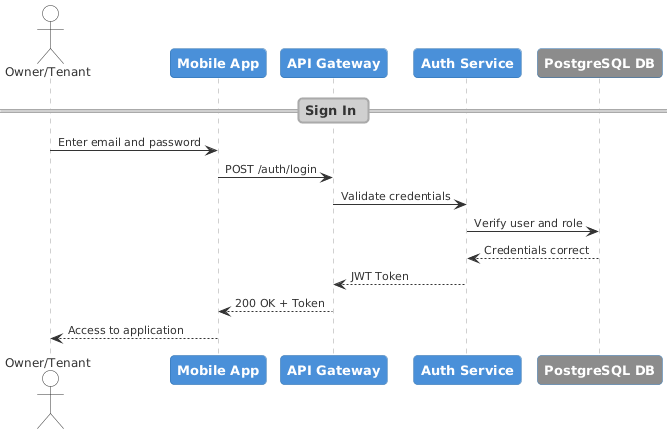

*Figura. A diferencia del administrador, el residente no se autorregistra: es Residential Management quien crea el vínculo residente–unidad; IAM solo valida credenciales y emite el token.*

**Publicación de comunicados (Command: PublicarComunicado → Event: ComunicadoPublicado → Policy: notificar residentes)**

*Figura. Communication guarda el comunicado y emite el evento ComunicadoPublicado; una policy reacciona enviando las notificaciones push a través de Notification (vía Firebase). Si el envío falla, una acción compensatoria marca la notificación como pendiente de reintento sin afectar el comunicado ya guardado.*

**Registro y aprobación de pagos (Command: RegistrarPago / AprobarPago → Event: PagoAprobado)**

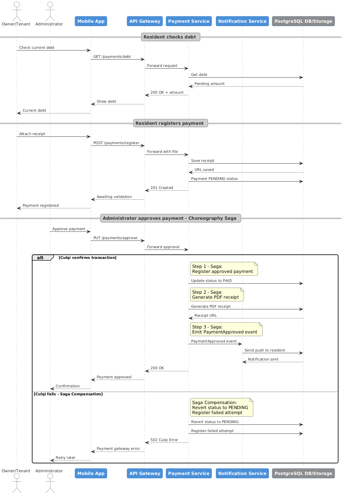

*Figura. Payment registra el pago en estado PENDIENTE; al aprobarlo, emite el evento PagoAprobado que dispara la policy de notificación al residente. Si la pasarela Culqi falla, la compensación revierte la deuda a PENDIENTE.*

**Reserva y aprobación de áreas comunes (Command: CrearReserva / AprobarReserva → Event: ReservaAprobada)**

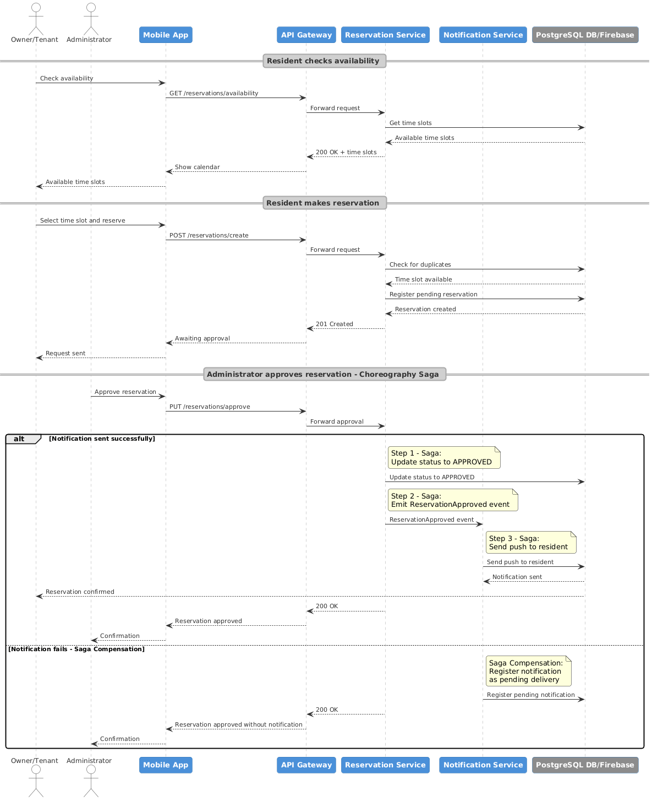

*Figura. Reservation valida disponibilidad antes de crear la reserva; al aprobarla, emite ReservaAprobada, que dispara la notificación al residente vía Notification.*

**Generación de reportes financieros (Query, sin Command/Event — solo lectura)**

*Figura. Report consulta datos de Payment vía REST para consolidar y exportar reportes; al ser de solo lectura, no participa del flujo de eventos/compensaciones de los demás contextos.*

#### 4.1.1.3. Bounded Context Canvases

> 📋 **Guía (Statement):** En esta sección el equipo diseña sus candidate bounded contexts, detallando los criterios de diseño. El equipo debe ir seleccionando cada bounded context, por orden de importancia, para elaborar su Bounded Context Canvas. La elaboración del Bounded Context Canvas debe seguir un proceso iterativo con los pasos de *Context Overview Definition, Business Rules Distillation & Ubiquitous Language Capture, Capability Analysis, Capability Layering* (si aplica), *Dependencies Capture*, y *Design Critique*.
>
> Al momento de la organización o refinamiento de bounded contexts es importante tomar en cuenta que en una plataforma SaaS orientada a negocios de servicio, es común encontrar los siguientes sub-dominios: *Subscriptions and Payment Management*, *Identity and Access Management*, *Profiles and Preferences Management*, *Service Design and Planning*, *Resource and Asset Management*, *Service Execution and Monitoring*, *Dashboard and Analytics*, *Loyalty and Engagement*. Estos posibles sub-dominios pueden identificarse bajo otros nombres según la naturaleza o términos en el ubiquitous language del dominio en el que se enmarca la solución a realizar. Es posible que existan otros sub-dominios core o de soporte que se requiere considerar en el negocio objeto de estudio.

_(pendiente — Edifika no elaboró Bounded Context Canvases; no hay contenido de origen que migrar)_

### 4.1.2. Context Mapping

> 📋 **Guía (Statement):** En esta sección el equipo explica y evidencia el proceso de elaboración de un conjunto de context maps (visualizaciones de las relaciones estructurales entre bounded contexts). Para ello el equipo revisa información recolectada y la utiliza para producir los diseños candidatos. Se recomienda en el proceso incluir preguntas como: "¿qué pasaría si movemos este capability a otro bounded context?", "¿qué pasaría si descomponemos este capability y movemos uno de los sub-capabilities a otro bounded context?", "¿qué pasaría si partimos el bounded context en múltiples bounded contexts?", "¿qué pasaría si tomamos este capability de estos 3 contexts y lo usamos para formar un nuevo context?", "¿qué pasaría si duplicamos una funcionalidad para romper la dependencia?", "¿qué pasaría si creamos un shared service para reducir la duplicación entre múltiples bounded contexts?", "¿qué pasaría si aislamos los core capabilities y movemos los otros a un context aparte?". Debe finalizar este proceso discutiendo cada alternativa de context mapping a fin de llegar a la mejor aproximación. Es importante que el equipo considere los patrones de relaciones entre Bounded Contexts establecidos en Domain-Driven Design, como *Anti-corruption Layer, Conformist, Customer/Supplier ó Shared Kernel*.

> ⚠️ **Migrado desde Edifika-report — parcial.** No existe un Context Map formal (con discusión de alternativas y patrones DDD de relación). Sí es posible inferir las relaciones reales entre contextos a partir de los diagramas de secuencia de 4.1.1.2, listadas aquí como punto de partida; falta el análisis de alternativas y la clasificación explícita según los patrones de relación de DDD.

| Contexto origen | Contexto destino | Relación observada | Patrón DDD más cercano (a validar) |
|---|---|---|---|
| Communication | Notification | Emite evento al publicar un comunicado para que se notifique a los residentes. | Customer/Supplier (Communication es upstream) |
| Payment | Notification | Emite evento al aprobar un pago. | Customer/Supplier |
| Reservation | Notification | Emite evento al aprobar una reserva. | Customer/Supplier |
| Payment | Culqi (sistema externo) | Integración vía Adapter/ACL (pasarela de pagos). | Anti-corruption Layer |
| Report | Payment | Consulta síncrona vía REST para consolidar reportes financieros. | Customer/Supplier (Report es downstream, solo lectura) |
| Residential Management | IAM | Provee el vínculo residente–unidad que IAM usa para autorizar el acceso. | Customer/Supplier |
| API Gateway | Todos los contextos | Enrutamiento y validación de JWT (infraestructura transversal, no bounded context de dominio). | — |

### 4.1.3. Software Architecture

> 📋 **Guía (Statement):** En esta sección el equipo presenta y explica la representación, aplicando C4 Model y utilizando la herramienta indicada (Structurizr), de la Arquitectura de Software para la solución. Aquí se realiza una introducción y se incluye como secciones internas *Software Architecture Context Level Diagram* y *Software Architecture Container Level Diagrams*.

> ⚠️ **Migrado desde Edifika-report.**

La arquitectura se modeló con **C4 Model** (Structurizr) y se apoya en los siguientes estilos y patrones: **Microservices Architecture** (escalabilidad y disponibilidad independientes: un fallo en Comunicados no interrumpe Pagos), **Layered Architecture** dentro de cada microservicio (API/Application/Domain/Infrastructure), **API Gateway Pattern** (punto único de entrada, autenticación JWT y enrutamiento), **Saga Pattern coreografiado** (consistencia entre contextos sin locks distribuidos, ver 4.1.1.2) y **CQRS parcial** (Report separa lectura de reportes de las operaciones de escritura de los demás contextos).

| Categoría | Herramienta / Tecnología |
|---|---|
| IDE | Visual Studio Code / IntelliJ IDEA |
| Lenguaje / Framework Backend | Java / Spring Boot |
| Framework Frontend | Angular |
| Base de Datos | PostgreSQL (una instancia independiente por microservicio) |
| Testing | JUnit / Mockito |
| CI / CD | GitHub Actions |

#### 4.1.3.1. Software Architecture System Landscape Diagram

_(pendiente — Edifika solo elaboró un diagrama de Context, no un System Landscape más amplio que ubique el sistema entre otros sistemas del ecosistema)_

#### 4.1.3.2. Software Architecture Context Level Diagrams

> 📋 **Guía (Statement):** En esta sección el equipo realiza una introducción, presenta en imagen el context diagram, el cual debe mostrar el sistema como un recuadro en el centro, rodeado por sus usuarios y otros sistemas con los que interactúa. Se incluye en esta sección una explicación del diagrama.

> ⚠️ **Migrado desde Edifika-report.**

El diagrama de contexto presenta al sistema como componente central e identifica los actores externos (administradores, residentes) y sistemas con los que se integra (Culqi para pagos, Firebase para notificaciones push).

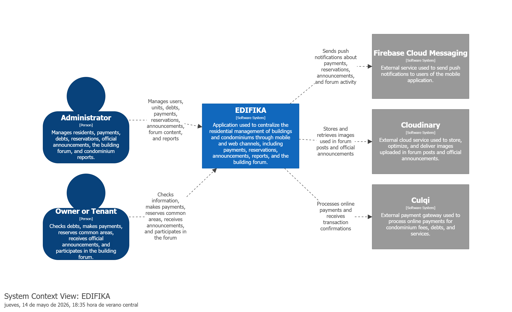

*Figura. Context Diagram. Elaborado por el equipo utilizando Structurizr (Structurizr, s.f.).*

##### 4.1.3.2.1. Software Architecture Container Level Diagrams

> 📋 **Guía (Statement):** En esta sección, el equipo realiza una introducción, presenta y explica el Container Diagram. Dicho diagrama debe mostrar los elementos de alto nivel de la arquitectura de software y cómo se distribuyen las responsabilidades entre ellos. Aquí se debe mostrar también las principales decisiones de tecnología y cómo los containers se comunican entre sí. Recuerde que para C4 Model, cada container representa una unidad de despliegue independiente.

> ⚠️ **Migrado desde Edifika-report.**

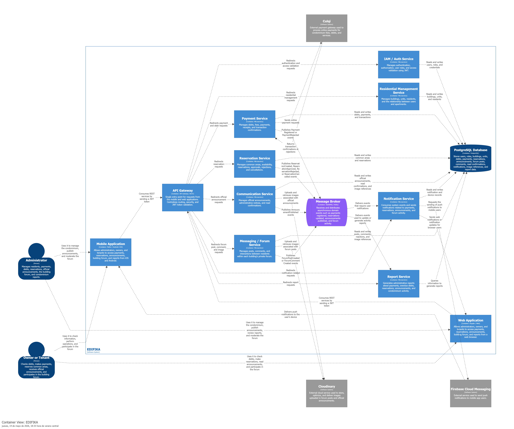

*Figura. Diagrama de Contenedores. Elaborado por el equipo utilizando Structurizr (Structurizr, s.f.). Cada microservicio (contenedor) es una unidad de despliegue independiente, enrutada a través del API Gateway.*

#### 4.1.3.3. Software Architecture Deployment Diagrams

> 📋 **Guía (Statement):** Diagrama de despliegue (Deployment Diagram) de C4 Model, mostrando cómo se distribuyen los containers en la infraestructura de despliegue.

> ⚠️ **Migrado desde Edifika-report** (traído desde la sección de despliegue del capítulo de implementación, donde vivía originalmente).

El sistema se despliega de forma distribuida: **Render** aloja el frontend y los 8 microservicios backend, **Supabase** aloja una base de datos PostgreSQL independiente por microservicio, el **API Gateway** centraliza el enrutamiento y la validación JWT, **Culqi** procesa pagos y **Firebase Cloud Messaging** envía las notificaciones push.

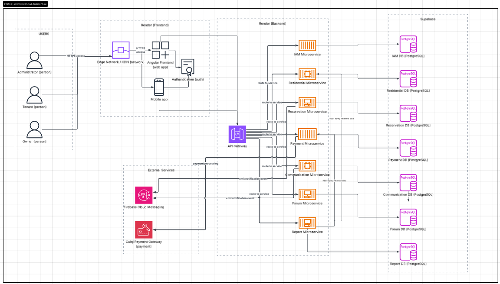

*Figura. Diagrama de despliegue (arquitectura cloud). Elaborado por el equipo utilizando Lucidchart (Lucidchart, s.f.).*

## 4.2. Tactical-Level Domain-Driven Design

> 📋 **Guía (Statement):** En este capítulo el equipo explica y presenta su propuesta para la perspectiva táctica del diseño de la solución de software. Aquí se incluye una sección interna por cada bounded context.
>
> ⚠️ Duplicar la sub-sección `4.2.X` a continuación por cada Bounded Context identificado (4.2.1, 4.2.2, ...).

> 📋 **Guía (Statement):** En esta sección, el equipo presenta las clases identificadas y las detalla a manera de diccionario, explicando para cada una su nombre, propósito y la documentación de atributos y métodos considerados, junto con las relaciones entre ellas. **4.2.X.1. Domain Layer:** *Entities*, *Value Objects*, *Aggregates*, *Factories*, *Domain Services*, o interfaces de *Repositories*. **4.2.X.2. Interface Layer:** clases *Controllers* o *Consumers*. **4.2.X.3. Application Layer:** *Command Handlers* e *Event Handlers*. **4.2.X.4. Infrastructure Layer:** implementación de *Repositories*, acceso a *databases*/*messaging systems*/*email services*. **4.2.X.5. Component Level Diagrams:** descomposición C4 de cada container. **4.2.X.6. Code Level Diagrams:** *.6.1 Domain Layer Class Diagrams* (UML con atributos, métodos, scope, multiplicidad) y *.6.2 Database Design Diagram* (tablas, columnas, constraints).

> ⚠️ **Migrado desde Edifika-report — retrofit, no elaboración DDD original.** Edifika no documentó explícitamente cada bounded context en capas DDD con diccionario de clases; el código se organizó como Arquitectura en Capas + CQRS por microservicio. El contenido de cada 4.2.X siguiente reconstruye esa separación a partir de los diagramas de componentes/clases y las convenciones de código (`*CommandServiceImpl`, `*QueryServiceImpl`) documentadas en el capítulo de implementación. Falta el diccionario de clases con atributos/métodos/multiplicidad exacto que pide el statement — las clases se listan por nombre e intención, no en detalle UML completo.

### 4.2.1. Bounded Context: IAM / Auth

#### 4.2.1.1. Domain Layer

`User` (Entity: email, password, fullName, phone, documentType, documentNumber, status), `Role` (Entity/Value Object: ADMIN, RESIDENT), interfaz `UserRepository` / `RoleRepository`.

#### 4.2.1.2. Interface Layer

`AuthenticationController` (sign-up, sign-in), `UserController` (CRUD de usuarios), `RolesController` (consulta de roles).

#### 4.2.1.3. Application Layer

`UserCommandServiceImpl` / `UserQueryServiceImpl`, `RoleCommandServiceImpl` — generación y validación del token JWT tras autenticar.

#### 4.2.1.4. Infrastructure Layer

Implementación JPA de `UserRepository` sobre PostgreSQL; proveedor de tokens JWT.

#### 4.2.1.5. Bounded Context Software Architecture Component Level Diagrams

*Figura. Diagrama de Componentes — Auth Service. Elaborado utilizando Structurizr (Structurizr, s.f.).*

#### 4.2.1.6. Bounded Context Software Architecture Code Level Diagrams

##### 4.2.1.6.1. Bounded Context Domain Layer Class Diagrams

Este contexto es el único del que Edifika dejó el class diagram ya separado por capa:

*Figura. Diagrama de Clases IAM — vista general. Elaborado utilizando PlantUML Editor (PlantUML, s.f.).*

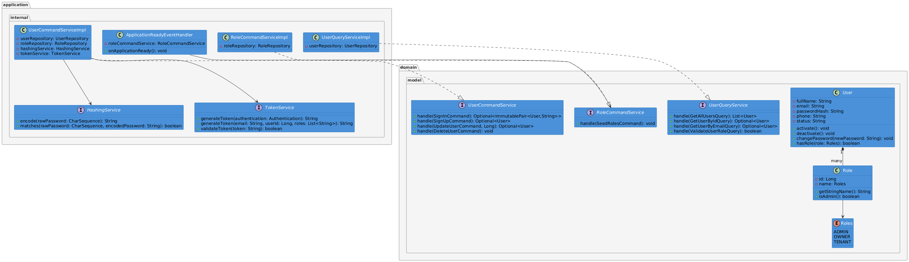

*Figura. Diagrama de Clases IAM — capas de Aplicación y Dominio. Elaborado utilizando PlantUML Editor (PlantUML, s.f.).*

*Figura. Diagrama de Clases IAM — capas de Infraestructura e Interfaces. Elaborado utilizando PlantUML Editor (PlantUML, s.f.).*

##### 4.2.1.6.2. Bounded Context Database Design Diagram

> ⚠️ Edifika no separó el ERD por bounded context; existe un único diagrama consolidado, referenciado en su totalidad en cada contexto.

*Figura. Diagrama Entidad-Relación consolidado (incluye las tablas de IAM). Elaborado utilizando LucidChart (LucidChart, s.f.).*

### 4.2.2. Bounded Context: Residential Management

#### 4.2.2.1. Domain Layer

`Building` (Entity: dirección, nombre), `Unit` (Entity: número, torre, vínculo a residente), relación Residente–Unidad.

#### 4.2.2.2. Interface Layer

`ResidentialController` (registro de edificios/unidades, vinculación de residentes).

#### 4.2.2.3. Application Layer

`ResidentialCommandServiceImpl` / `ResidentialQueryServiceImpl`.

#### 4.2.2.4. Infrastructure Layer

Implementación JPA sobre PostgreSQL, base de datos independiente del microservicio.

#### 4.2.2.5. Bounded Context Software Architecture Component Level Diagrams

*Figura. Diagrama de Componentes — Residential Management Service. Elaborado utilizando Structurizr (Structurizr, s.f.).*

#### 4.2.2.6. Bounded Context Software Architecture Code Level Diagrams

##### 4.2.2.6.1. Bounded Context Domain Layer Class Diagrams

*Figura. Diagrama de Clases — Residential Management. Elaborado utilizando PlantUML Editor (PlantUML, s.f.).*

##### 4.2.2.6.2. Bounded Context Database Design Diagram

> ⚠️ Ver nota de ERD consolidado en 4.2.1.6.2.

*Figura. Diagrama Entidad-Relación consolidado (incluye las tablas de Residential Management).*

### 4.2.3. Bounded Context: Reservation

#### 4.2.3.1. Domain Layer

`CommonArea` (Entity: nombre, reglas de uso, horarios, habilitada/deshabilitada), `Reservation` (Entity/Aggregate: estado PENDIENTE/APROBADO, fecha, horario).

#### 4.2.3.2. Interface Layer

`ReservationController`, `CommonAreaController`.

#### 4.2.3.3. Application Layer

`ReservationCommandServiceImpl` / `ReservationQueryServiceImpl`, `CommonAreaCommandServiceImpl` — valida disponibilidad y evita duplicados antes de crear una reserva; emite el evento de aprobación (ver 4.1.1.2).

#### 4.2.3.4. Infrastructure Layer

Implementación JPA sobre PostgreSQL propia del microservicio.

#### 4.2.3.5. Bounded Context Software Architecture Component Level Diagrams

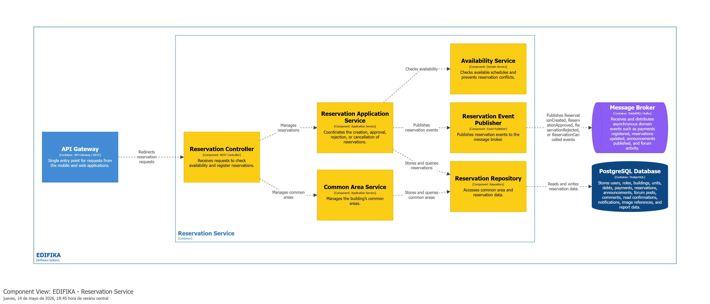

*Figura. Diagrama de Componentes — Reservation Service. Elaborado utilizando Structurizr (Structurizr, s.f.).*

#### 4.2.3.6. Bounded Context Software Architecture Code Level Diagrams

##### 4.2.3.6.1. Bounded Context Domain Layer Class Diagrams

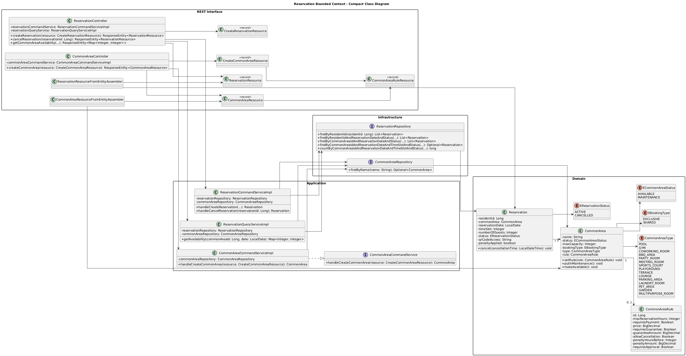

*Figura. Diagrama de Clases — Reservation. Elaborado utilizando PlantUML Editor (PlantUML, s.f.).*

##### 4.2.3.6.2. Bounded Context Database Design Diagram

> ⚠️ Ver nota de ERD consolidado en 4.2.1.6.2.

*Figura. Diagrama Entidad-Relación consolidado (incluye las tablas de Reservation).*

### 4.2.4. Bounded Context: Payment

#### 4.2.4.1. Domain Layer

`Debt` (Entity: monto, periodo, unidad), `Payment` (Aggregate: estado PENDIENTE/PAGADO, comprobante). Repository Pattern aplicado para desacoplar estas reglas de la persistencia.

#### 4.2.4.2. Interface Layer

`PaymentController` (registro de pagos, consulta de deuda, aprobación).

#### 4.2.4.3. Application Layer

`PaymentCommandServiceImpl` / `PaymentQueryServiceImpl` — orquesta la Saga de aprobación (actualiza estado → genera constancia PDF → emite evento `PagoAprobado`) y su compensación si Culqi falla.

#### 4.2.4.4. Infrastructure Layer

Implementación JPA sobre PostgreSQL; **Adapter Pattern (Anti-Corruption Layer)** hacia la pasarela de pagos **Culqi**, traduciendo su API externa a la interfaz propia del sistema.

#### 4.2.4.5. Bounded Context Software Architecture Component Level Diagrams

*Figura. Diagrama de Componentes — Payment Service. Elaborado utilizando Structurizr (Structurizr, s.f.).*

#### 4.2.4.6. Bounded Context Software Architecture Code Level Diagrams

##### 4.2.4.6.1. Bounded Context Domain Layer Class Diagrams

*Figura. Diagrama de Clases — Payment. Elaborado utilizando PlantUML Editor (PlantUML, s.f.).*

##### 4.2.4.6.2. Bounded Context Database Design Diagram

> ⚠️ Ver nota de ERD consolidado en 4.2.1.6.2.

*Figura. Diagrama Entidad-Relación consolidado (incluye las tablas de Payment).*

### 4.2.5. Bounded Context: Communication

#### 4.2.5.1. Domain Layer

`Announcement`/Comunicado (Entity: título, contenido, alcance, trazabilidad de lectura), `Poll`/Encuesta (Entity: opciones, votos).

#### 4.2.5.2. Interface Layer

`CommunicationController` (publicación de comunicados y encuestas).

#### 4.2.5.3. Application Layer

`CommunicationCommandServiceImpl` / `CommunicationQueryServiceImpl` — guarda el comunicado y emite el evento `ComunicadoPublicado` (Saga coreografiada, ver 4.1.1.2); valida el límite de un mensaje diario por residente (HTTP 429 si se excede) y el voto único por encuesta (HTTP 409 si se duplica).

#### 4.2.5.4. Infrastructure Layer

Implementación JPA sobre PostgreSQL propia del microservicio.

#### 4.2.5.5. Bounded Context Software Architecture Component Level Diagrams

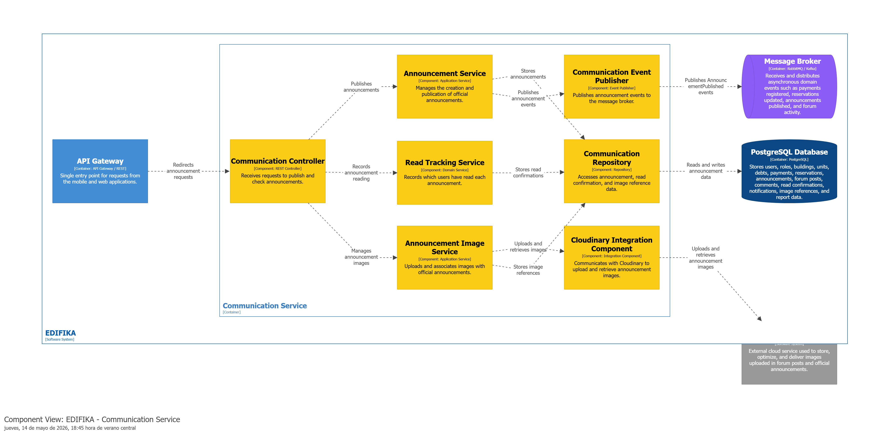

*Figura. Diagrama de Componentes — Communication Service. Elaborado utilizando Structurizr (Structurizr, s.f.).*

#### 4.2.5.6. Bounded Context Software Architecture Code Level Diagrams

##### 4.2.5.6.1. Bounded Context Domain Layer Class Diagrams

*Figura. Diagrama de Clases — Communication. Elaborado utilizando PlantUML Editor (PlantUML, s.f.).*

##### 4.2.5.6.2. Bounded Context Database Design Diagram

> ⚠️ Ver nota de ERD consolidado en 4.2.1.6.2.

*Figura. Diagrama Entidad-Relación consolidado (incluye las tablas de Communication).*

### 4.2.6. Bounded Context: Notification

#### 4.2.6.1. Domain Layer

`Notification` (Entity: tipo, destinatario, estado de envío), `DeviceToken` (Entity: token del dispositivo del residente).

#### 4.2.6.2. Interface Layer

`NotificationController`, `DeviceTokenController`.

#### 4.2.6.3. Application Layer

`NotificationCommandServiceImpl` / `NotificationQueryServiceImpl`, `DeviceTokenCommandServiceImpl` / `DeviceTokenQueryServiceImpl`. **Factory Pattern** para crear el tipo de notificación (Push/Email/SMS) según el evento de origen (comunicado, pago o reserva aprobados — ver 4.1.1.2), sin acoplar la creación a la lógica de envío. Reacciona a eventos emitidos por Communication, Payment y Reservation.

#### 4.2.6.4. Infrastructure Layer

Implementación JPA sobre PostgreSQL; cliente de **Firebase Cloud Messaging** para el envío de notificaciones push; compensación que marca una notificación como pendiente de reintento si el envío falla.

#### 4.2.6.5. Bounded Context Software Architecture Component Level Diagrams

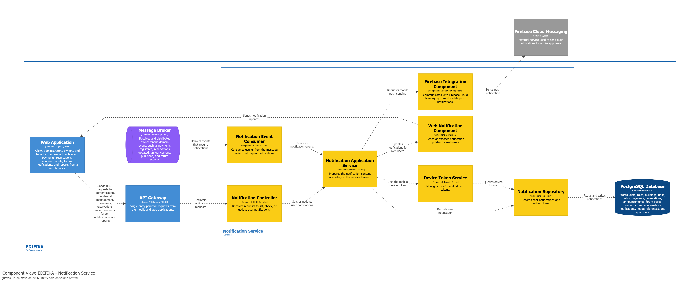

*Figura. Diagrama de Componentes — Notification Service. Elaborado utilizando Structurizr (Structurizr, s.f.).*

#### 4.2.6.6. Bounded Context Software Architecture Code Level Diagrams

##### 4.2.6.6.1. Bounded Context Domain Layer Class Diagrams

*Figura. Diagrama de Clases — Notification. Elaborado utilizando PlantUML Editor (PlantUML, s.f.).*

##### 4.2.6.6.2. Bounded Context Database Design Diagram

> ⚠️ Ver nota de ERD consolidado en 4.2.1.6.2.

*Figura. Diagrama Entidad-Relación consolidado (incluye las tablas de Notification).*

### 4.2.7. Bounded Context: Report

#### 4.2.7.1. Domain Layer

Modelo de lectura `FinancialReport` (consolidado de ingresos, egresos y deudas por periodo) — este contexto es mayormente de solo lectura (CQRS), sin agregados transaccionales propios.

#### 4.2.7.2. Interface Layer

`ReportController` (generación y exportación de reportes, consulta de morosos).

#### 4.2.7.3. Application Layer

`ReportCommandServiceImpl` / `ReportQueryServiceImpl` — consulta datos de Payment vía REST y consolida el reporte. **Factory Pattern** para generar el archivo de salida en el formato solicitado (PDF o Excel) sin acoplar la lógica de creación a la de exportación.

#### 4.2.7.4. Infrastructure Layer

Cliente REST hacia Payment Service; generador de archivos PDF/Excel.

#### 4.2.7.5. Bounded Context Software Architecture Component Level Diagrams

*Figura. Diagrama de Componentes — Report Service. Elaborado utilizando Structurizr (Structurizr, s.f.).*

#### 4.2.7.6. Bounded Context Software Architecture Code Level Diagrams

##### 4.2.7.6.1. Bounded Context Domain Layer Class Diagrams

*Figura. Diagrama de Clases — Report. Elaborado utilizando PlantUML Editor (PlantUML, s.f.).*

##### 4.2.7.6.2. Bounded Context Database Design Diagram

> ⚠️ Ver nota de ERD consolidado en 4.2.1.6.2. Al ser un contexto mayormente de solo lectura, gran parte de su "persistencia" es en realidad la de Payment consultada vía REST.

*Figura. Diagrama Entidad-Relación consolidado.*

### 4.2.8. Bounded Context: Forum

#### 4.2.8.1. Domain Layer

`Post` (Entity: mensaje del muro comunitario, autor, fecha), regla de límite diario de publicaciones por residente.

#### 4.2.8.2. Interface Layer

`PostController` (publicación y consulta de mensajes del muro).

#### 4.2.8.3. Application Layer

`PostCommandServiceImpl` / `PostQueryServiceImpl` — valida el límite diario de publicaciones (HTTP 429 si se excede).

#### 4.2.8.4. Infrastructure Layer

Implementación JPA sobre PostgreSQL propia del microservicio.

#### 4.2.8.5. Bounded Context Software Architecture Component Level Diagrams

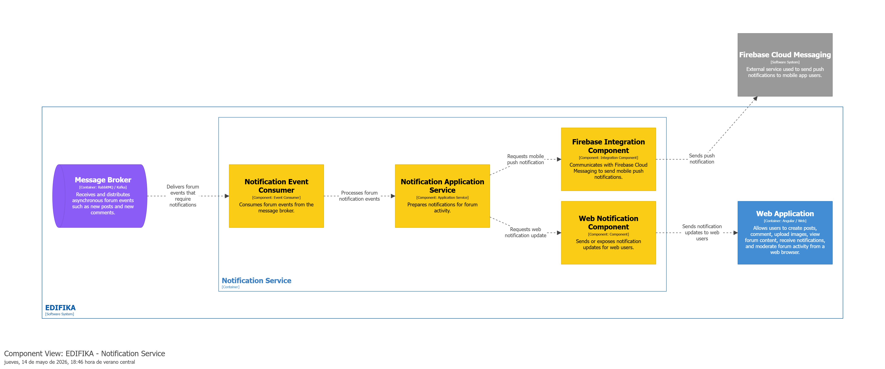

*Figura. Diagrama de Componentes — Forum Service. Elaborado utilizando Structurizr (Structurizr, s.f.).*

#### 4.2.8.6. Bounded Context Software Architecture Code Level Diagrams

##### 4.2.8.6.1. Bounded Context Domain Layer Class Diagrams

*Figura. Diagrama de Clases — Forum. Elaborado utilizando PlantUML Editor (PlantUML, s.f.).*

##### 4.2.8.6.2. Bounded Context Database Design Diagram

> ⚠️ Ver nota de ERD consolidado en 4.2.1.6.2.

*Figura. Diagrama Entidad-Relación consolidado (incluye las tablas de Forum).*
