# Capítulo V: Solution UI/UX Design

> 📋 **Guía (Statement):** En esta sección se abarca el planteamiento de la propuesta de UX/UI Design para la experiencia de usuario a través de todos los productos digitales con los que estos interactúan. Para ello se tomará como base el conjunto de User Stories identificados así como el Impact Map.

**Estado:** ⬜ Pendiente

## 5.1. Style Guidelines

> 📋 **Guía (Statement):** En esta sección, el equipo sienta las bases para contar con un repositorio central y organizado de uso común para todo el equipo, que incluye assets, fonts, etc. Esto con el fin de mantener una presentación consistente y enfocada. Se incluye secciones para General Style Guidelines, Web Style Guidelines, Mobile Style Guidelines y IoT Style Guidelines.

### 5.1.1. General Style Guidelines

> 📋 **Guía (Statement):** Aquí se explica las decisiones y referencias visuales sobre conceptos generales básicos como Branding, Typography, Colors y Spacing, así como las dimensiones a adoptar para el tono de comunicación y lenguaje aplicado (Divertido/Serio, Formal/Casual, Respetuoso/Irreverente, Entusiasta/Sereno). Puede tomarse como referencia un Design System existente, sobre el cual se puede realizar adaptaciones. Esta sección debe incluir el sustento de principios y elementos de diseño considerados para las decisiones.

### 5.1.2. Web, Mobile and IoT Style Guidelines

> 📋 **Guía (Statement):** En esta sección se explica e ilustra las decisiones sobre los estándares visuales y de interacción para responsive web interfaces y las interfaces en mobile application interfaces y IoT application user interface. En esta sección debe también considerarse la explicación de las decisiones sobre los estándares para interacción con la interfaz física de los dispositivos IoT.

## 5.2. Information Architecture

> 📋 **Guía (Statement):** En esta sección el equipo plantea las decisiones y sustento que dirigen la manera como se organizará el contenido en las experiencias web y móvil, incluyendo el Landing Page y las Aplicaciones. Dichas propuestas deben estar orientadas a que los visitantes y usuarios se adapten con facilidad a la funcionalidad de cada producto y puedan encontrar todo aquello que necesiten sin esfuerzo. Se incluyen las decisiones sobre los Organization Systems, Labeling Systems, Navigation Systems y Searching Systems.

### 5.2.1. Organization Systems

> 📋 **Guía (Statement):** En esta sección el equipo explica en qué grupos de información aplicará cuáles sistemas de organización. Aquí se incluye la explicación de en qué casos se aplicará la organización visual del contenido: de forma jerárquica (visual hierarchy), organización secuencial (step-by-step to accomplish) o matricial. Por otro lado, también se debe explicar en qué casos se utilizará qué esquemas de categorización de contenido: alfabético, cronológico, por tópicos, según audiencia (grupos de usuarios).

### 5.2.2. Labeling Systems

> 📋 **Guía (Statement):** Aquí el equipo explica de qué maneras se representarán los datos, considerando simplicidad y buscando evitar la confusión para los visitantes y usuarios. En esta sección se especifica las etiquetas (con el mínimo número de palabras) a utilizar para representar los conjuntos de información y las asociaciones entre las mismas.

### 5.2.3. SEO Tags and Meta Tags

> 📋 **Guía (Statement):** En esta sección se debe incluir los SEO Tags y Meta Tags junto con los valores que asignará en las principales páginas de la experiencia tanto a nivel del sitio web estático (Landing Page) como Web Application. Se debe incluir Title, Description, Keywords, Author como mínimo. Del mismo modo, para las aplicaciones móviles u otros productos digitales que se exponen vía un app store, debe incluir los ASO (App Store Optimization) elements como App Title, App keywords, App subtitle, App description.

### 5.2.4. Searching Systems

> 📋 **Guía (Statement):** En esta sección el equipo explica qué medios de ayuda se brindará al usuario para la búsqueda de datos dentro del producto digital. Dichas decisiones sobre los sistemas de búsqueda tratan de evitar que los usuarios se sientan perdidos entre el volumen de información. Aquí se deben especificar qué opciones de búsqueda ofrecerán las aplicaciones, con qué filtros contará el usuario en cada caso y cómo lucirán los datos después de la búsqueda.

### 5.2.5. Navigation Systems

> 📋 **Guía (Statement):** Aquí el equipo explica cuáles serán las acciones y técnicas que guiarán a los usuarios a través del Landing Page y las aplicaciones, permitiéndoles cumplir sus metas e interactuar de forma satisfactoria con el producto. Aquí se debe incluir de qué maneras los usuarios irán recorriendo el contenido.

## 5.3. Landing Page UI Design

> 📋 **Guía (Statement):** En esta sección el equipo elabora la propuesta de UI para el Landing Page. La sección inicia con una introducción en la que el equipo explica cómo traduce las decisiones de diseño y arquitectura de información.

### 5.3.1. Landing Page Wireframe

> 📋 **Guía (Statement):** Esta sección incluye una sección interna donde se presenta y explica los Wireframes del Landing Page para Desktop Web Browser y Mobile Web Browser. En la propuesta y la explicación debe evidenciarse la aplicación de los principios, elementos de diseño, diseño inclusivo y arquitectura de información.

### 5.3.2. Landing Page Mock-up

> 📋 **Guía (Statement):** Esta sección presenta y explica los Mock-ups del Landing Page, tanto en su versión para Desktop Web Browser como Mobile Web Browser. En la propuesta y la explicación debe evidenciarse la aplicación de los principios, elementos de diseño, diseño inclusivo y arquitectura de información, así como el Design System establecido para los productos digitales.

## 5.4. Applications UX/UI Design

> 📋 **Guía (Statement):** Esta sección incluye secciones internas donde se presenta y explica la propuesta visual y de interacción para las aplicaciones que constituyen la experiencia de usuario con los productos digitales.

### 5.4.1. Applications Wireframes

> 📋 **Guía (Statement):** Esta sección incluye una sección interna donde se presenta y explica los Wireframes de las aplicaciones móviles. En la propuesta y la explicación debe evidenciarse la aplicación de los principios, elementos de diseño, diseño inclusivo y arquitectura de información.

### 5.4.2. Applications Wireflow Diagrams

> 📋 **Guía (Statement):** Esta sección presenta la propuesta de Wireflows. Debe considerarse un Wireflow para cada User goal, considerando los User Persona para cada aplicación que forma parte del alcance. Es recomendable que el equipo elabore previamente los correspondientes Task Flows, para establecer un consenso sobre las rutas típicas de steps para cada User goal. Es importante recordar que la forma como se refleja un cambio en una pantalla (Wireframe) como resultado de la interacción en un flujo es agregar un paso con un Wireframe con la representación del nuevo estado. Cada Wireflow diagram requiere que se redacte el User goal y se complemente con una explicación del flujo especificado.

#### 5.4.2.1. Applications Mock-ups

> 📋 **Guía (Statement):** Esta sección presenta y explica los Mock-ups de las aplicaciones. En la propuesta y la explicación debe evidenciarse la aplicación de los principios, elementos de diseño, diseño inclusivo y arquitectura de información, así como el Design System establecido para los productos digitales.

> ⚠️ **Migrado desde Edifika-report — parcial.** Edifika elaboró mock-ups de alta fidelidad en Figma para su aplicación web, pero no los Wireframes (5.4.1) ni los Wireflow/User Flow Diagrams (5.4.2/5.4.3) que preceden a un mock-up según el statement — esos quedan pendientes. Se muestran aquí directamente los mock-ups como el artefacto de mayor fidelidad disponible.

| Mock-up | Imagen |
|---|---|
| Inicio de sesión | 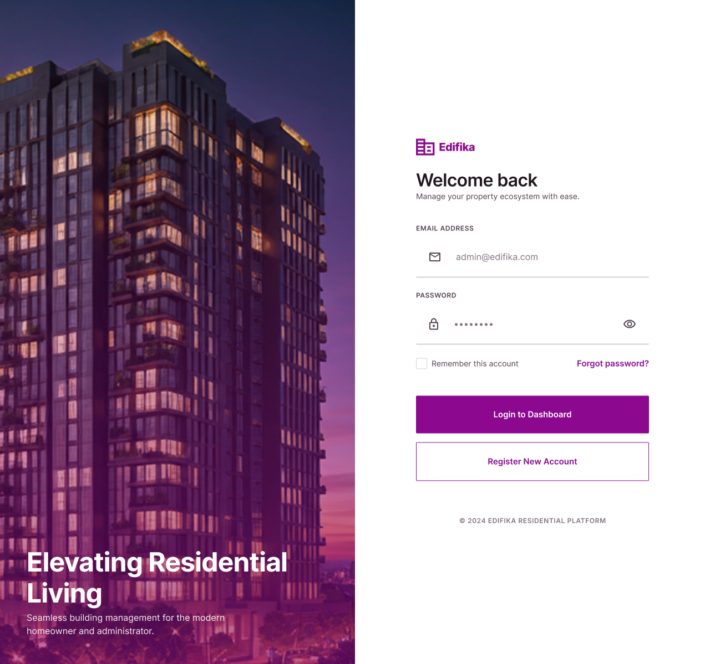 |
| Creación de cuenta | 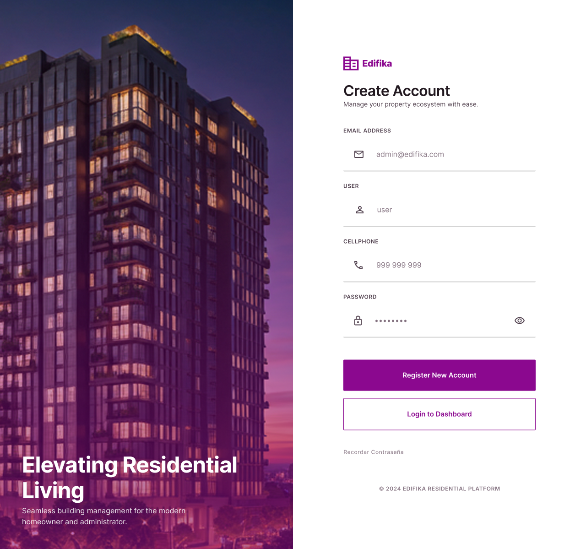 |
| Dashboard principal | 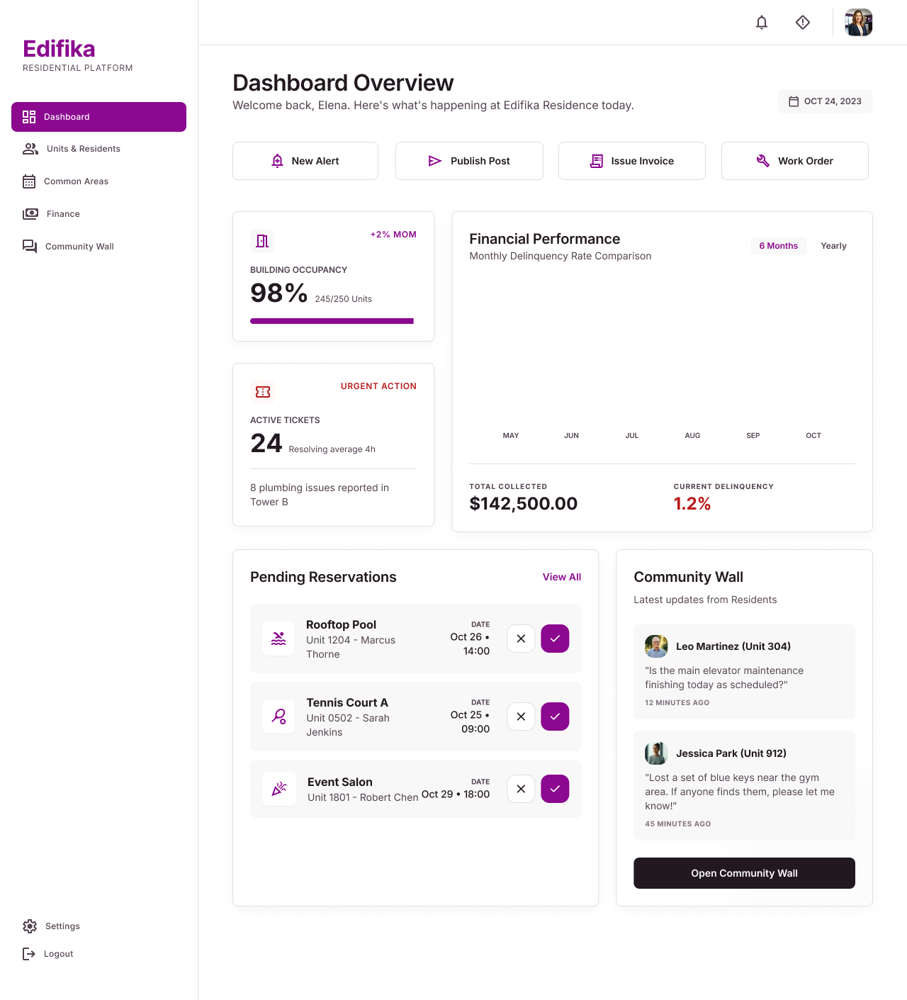 |
| Módulo de unidades | 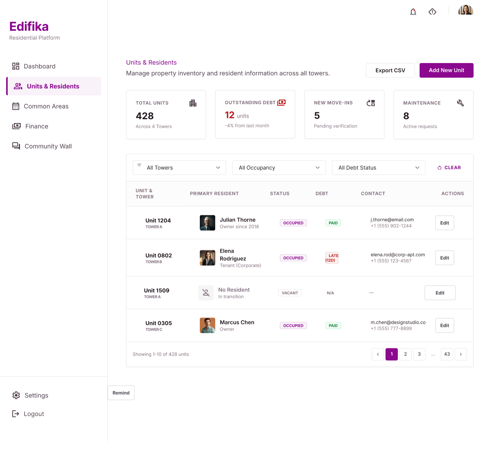 |
| Calendario de reservas | 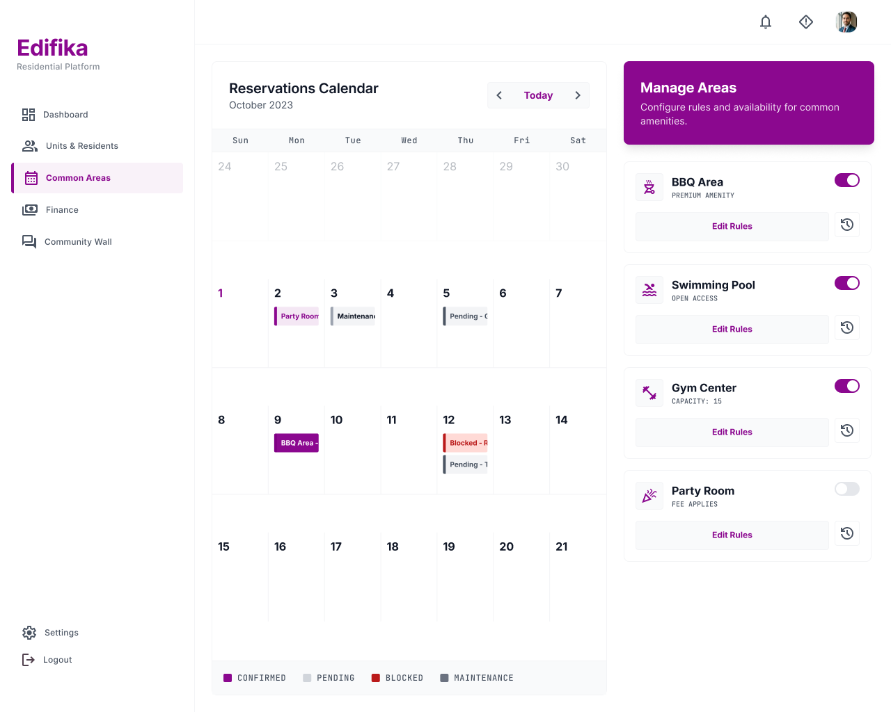 |
| Detalle de reserva | 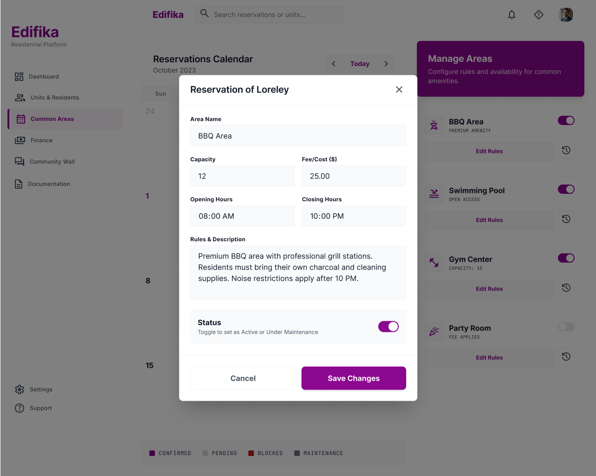 |
| Detalle de reserva (alternativo) | 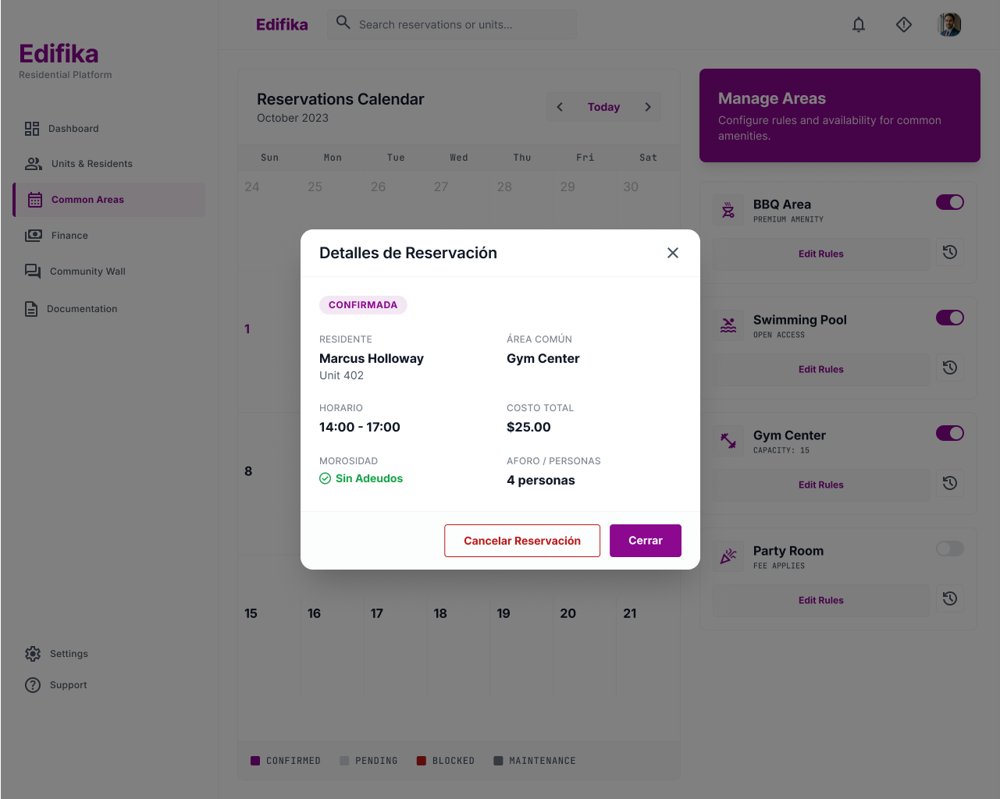 |
| Módulo de reportes | 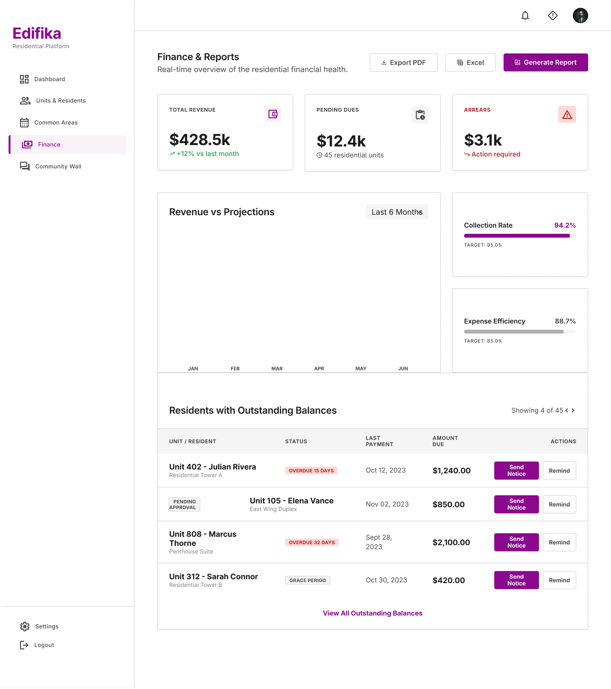 |
| Módulo de residentes | 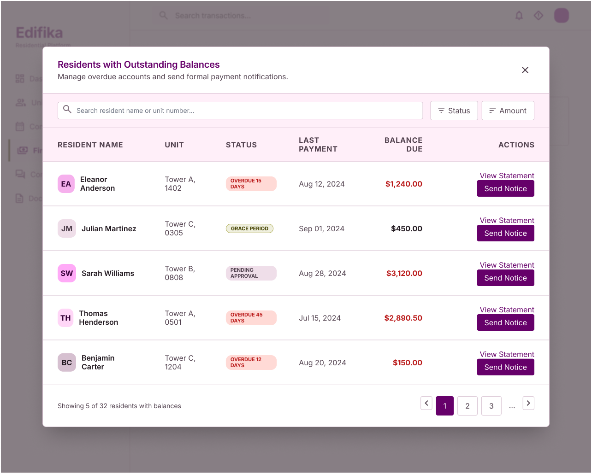 |
| Módulo de comunidad | 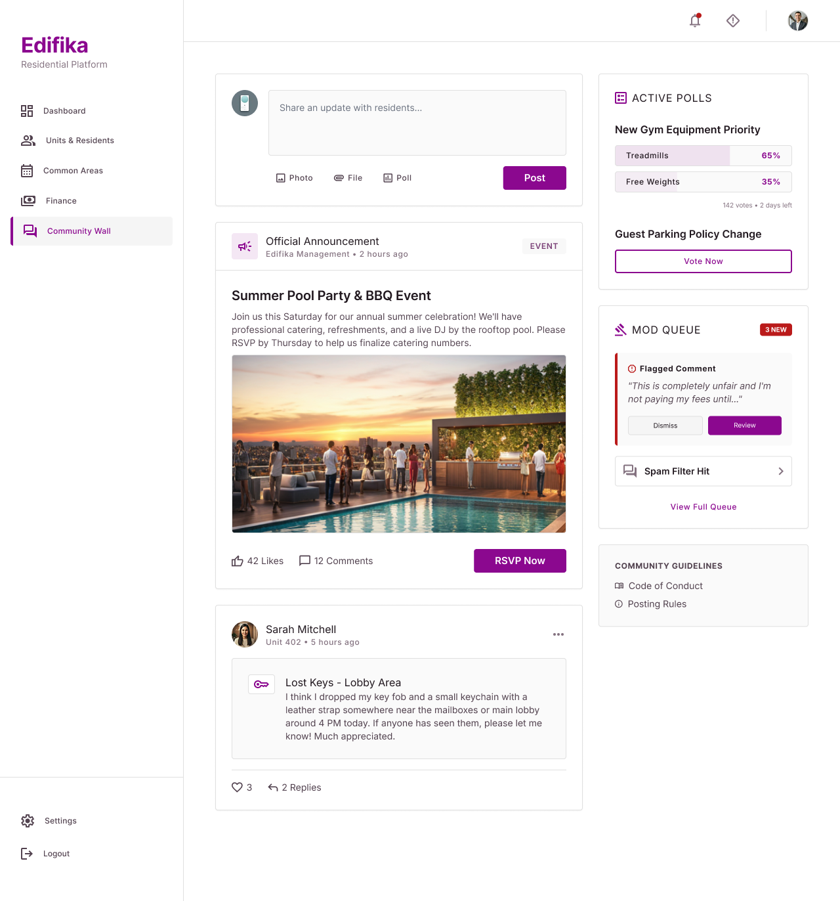 |
| Módulo de configuración | 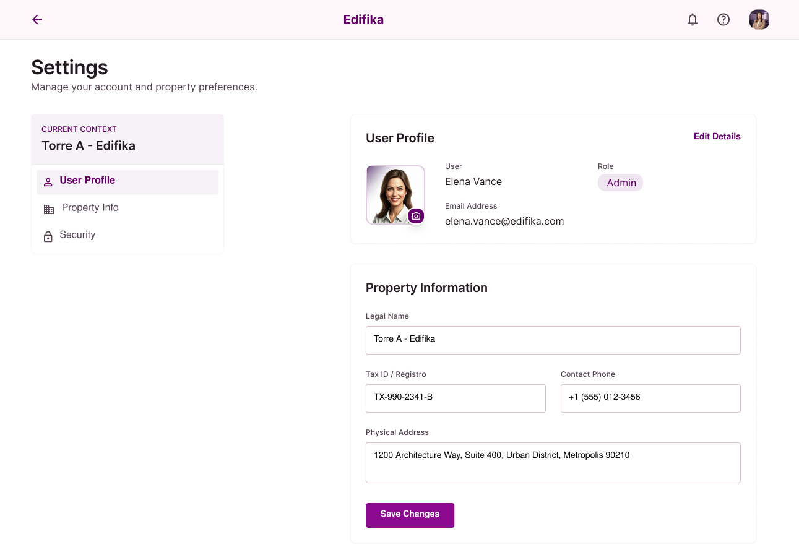 |

*Figuras. Mock-ups de alta fidelidad. Elaborados por el equipo utilizando Figma (Figma, s.f.).*

### 5.4.3. Applications User Flow Diagrams

> 📋 **Guía (Statement):** Esta sección presenta la propuesta de User Flows. Debe considerarse un User Flow para cada *User goal*, considerando los User Persona para cada aplicación que forma parte del alcance. Estos User Flows deben ser consistentes con los Wireflows de los cuales se derivan. Debe recordarse que en el User Flow se incluyen los Mock-ups de las vistas o pantallas de las aplicaciones, junto con los flujos que constituyen la ruta esperada (happy path) y las rutas alternativas (unhappy paths). Cada User Flow diagram requiere que se redacte el User goal y se complemente con una explicación de los flujos y condiciones especificados.

## 5.5. Applications Prototyping

> 📋 **Guía (Statement):** Esta sección incluye Prototipos de UI para Desktop y Mobile Web Browser con simulación de interacción y navegación, acorde con la propuesta de paths de User Flow Diagrams. Esta sección inicia con una introducción en la que se explica los principales criterios para las decisiones de interacción. Es importante evidenciar la relación con las decisiones de arquitectura de información, en particular sobre el sistema de navegación y los tipos de interacciones seleccionadas. Para cada caso debe incluirse 1 screenshot de video y un enlace a un video subido a Microsoft Stream/Clipchamp para cada aplicación, en el que se demuestre y explique los principales flujos de interacción que cubren los prototipos.

> ⚠️ **Migrado desde Edifika-report — parcial.** Edifika enlazó un prototipo navegable en Figma (sin video de evidencia en Stream/Clipchamp, que el statement sí exige).

Enlace del prototipo (Figma): `https://www.figma.com/proto/1ksaEJeKckW1WPlgeNyTbH/Untitled?node-id=3015-106&viewport=351%2C196%2C0.16&t=U3A6YtXgGNGnrgnD-1&scaling=scale-down&content-scaling=fixed&starting-point-node-id=3015%3A106&page-id=3012%3A2`

_(pendiente: screenshot + video de evidencia del prototipo en Stream/Clipchamp)_

## 5.6. IoT Device Design

> 📋 **Guía (Statement):** Esta sección incluye la propuesta de diseño físico y diseño de circuito de los dispositivos IoT que forman parte de la solución. Esta sección inicia con una introducción en la que se explica los principales criterios para las decisiones de diseño. Es importante evidenciar la relación con las decisiones de arquitectura de información y la guía de estilos para IoT Device Physical Interfaces. Para cada caso debe explicarse e incluirse diagramas elaborados en las herramientas indicadas (Cirkit Designer o Wokwi), en el que se demuestre y explique los principales flujos de interacción que cubren los prototipos.
