# Capítulo VI: Product Implementation, Validation & Deployment

> 📋 **Guía (Statement):** En esta sección el equipo explica y evidencia el proceso de implementar, comprobar, desplegar y validar la solución compuesta en este caso por los productos digitales que forman parte del alcance. El Landing Page permite presentar el modelo de negocio y las aplicaciones web. Los procesos del negocio digital que dirigen la operación del negocio, tanto procesos core del negocio como procesos de soporte (por ejemplo Authentication & Authorization, Subscriptions, entre otros) están distribuidos entre los productos digitales que forman parte del alcance como por ejemplo RESTful Web Services, Native Mobile Applications, Web Applications, Edge Web Services, Embedded Applications u otros. Este capítulo abarca secciones para la organización del proceso de trabajo en Sprints, la descripción y prácticas asociadas a Software Configuration Management, las evidencias de Implementation, Testing, Despliegue y Validaciones para cada uno de los productos que forman parte de la solución, en términos del producto en sí y la colaboración por Sprint.

**Estado:** ⬜ Pendiente

## 6.1. Software Configuration Management

> 📋 **Guía (Statement):** En esta sección el equipo establece las decisiones y convenciones que permitirán mantener la consistencia durante el ciclo de vida. Se incluyen secciones internas para Source Code Management, Development Environment Configuration y Deployment Configuration.

### 6.1.1. Software Development Environment Configuration

> 📋 **Guía (Statement):** En esta sección el equipo específica, describe e indica los nombres de productos, el propósito de uso en el proyecto, la ruta de referencia (para software basado en modelos SaaS) o ruta de descarga (para productos que se ejecutan en el computador del miembro del equipo) de cada uno de los productos de software que deben utilizar los miembros del equipo para colaborar en el ciclo de vida de los productos digitales que forman la solución con IoT, considerando todos los tipos de actividades como Project Management, Requirements Management, Product UX/UI Design, Software Development, Software Testing, Software Deployment, Software Documentation, respetando las restricciones indicadas sobre productos de software y herramientas que se pueden utilizar.

| Actividad | Producto/Herramienta | Propósito de uso | Ruta de referencia/descarga |
|---|---|---|---|
| Project Management | Trello | Gestión de tareas del equipo, seguimiento de actividades y control del avance de las funcionalidades. | Trello (SaaS) |
| Team Communication | Discord | Comunicación interna del equipo, coordinación de reuniones y organización de acuerdos. | Discord (SaaS / app de escritorio) |
| Product UX/UI Design | Figma | Diseño de interfaces, wireframes, prototipos navegables y flujos visuales. | Figma (SaaS) |
| Software Development | GitHub + GitFlow | Control de versiones, colaboración entre desarrolladores y organización mediante ramas. | GitHub (SaaS) |
| Software Development | IntelliJ IDEA | Entorno de desarrollo para los microservicios backend (Java/Spring Boot/Maven). | IntelliJ IDEA (app de escritorio) |
| Software Development | Visual Studio Code | Editor para frontend, documentación técnica y archivos Markdown. | Visual Studio Code (app de escritorio) |
| Software Development | Angular | Framework para la aplicación web frontend (vistas, componentes, rutas, servicios). | Angular Framework |
| Software Development | Spring Boot | Framework backend para exponer los microservicios como Web Services REST. | Spring Boot Framework |
| Software Testing | Postman | Pruebas de APIs: peticiones, respuestas y funcionamiento de endpoints. | Postman (SaaS / app de escritorio) |
| Software Testing | Swagger UI | Documentación y prueba visual de los endpoints expuestos por cada microservicio. | Swagger UI integrado en cada microservicio |
| Software Deployment | GitHub Pages | Despliegue público de la Landing Page. | GitHub Pages (SaaS) |
| Software Deployment | Render | Despliegue en la nube de los microservicios backend (Spring Boot). | Render (PaaS) |
| Software Documentation | GitHub | Almacenamiento, versionado y colaboración en documentación técnica y código fuente. | GitHub (SaaS) |
| Software Documentation | Visual Studio Code | Edición de archivos Markdown y documentación técnica. | Visual Studio Code (app de escritorio) |

### 6.1.2. Source Code Management

> 📋 **Guía (Statement):** En esta sección el equipo establece los medios y esquema de organización que aplicará para el seguimiento de modificaciones. Para ello utilizará GitHub como plataforma y sistema de control de versiones. Debe incluirse el URL del repositorio de GitHub para cada producto: Landing Page, Web Services, Frontend Web Applications. Tomar en cuenta que en el caso de Web Services, se incluye en el repositorio el proyecto y los archivos de pruebas, tanto unitarias como de integración/aceptación.
>
> En esta sección debe también explicarse de qué forma implementará GitFlow como Workflow de control de versiones, es decir qué branches (ramas) creará además de main branch (rama principal), por ejemplo, develop branch. Para GitFlow cada Feature requiere su propio branch, por ello debe especificar qué convenciones se aplicará para nombrar los feature branches. Igualmente debe incluir las convenciones para Release branches y Hotfix branches. Aplique semantic versioning para nombrar sus Releases.
>
> Aplique Conventional Commits para los textos de mensajes en sus commits.

> ⚠️ **Pendiente:** completar con las URLs de los repositorios del proyecto en GitHub.

| Producto | URL del repositorio |
|---|---|
| Landing Page | _(pendiente)_ |
| Web Services | _(pendiente)_ |
| Frontend Web Applications | _(pendiente)_ |

**Implementación de GitFlow**

- **Main branch:** versión estable, lista para producción/despliegue.
- **Develop branch:** código en desarrollo; se integran ahí las funcionalidades terminadas antes de preparar una versión estable.
- **Feature branches:** una por funcionalidad nueva, creada desde `develop`. Convención: `feature/nombre-corto-descriptivo` (ej. `feature/iam-authentication`, `feature/angular-login`).
- **Release branches:** creadas desde `develop` cuando el proyecto está listo para producción. Convención: `release/x.y.z` (ej. `release/1.0.0`).
- **Hotfix branches:** creadas desde `main` para corregir errores críticos en producción. Convención: `hotfix/x.y.z` (ej. `hotfix/1.0.1`).

**Versionado semántico (Semantic Versioning):** esquema `MAJOR.MINOR.PATCH` — MAJOR para cambios que rompen compatibilidad, MINOR para funcionalidades nuevas compatibles, PATCH para corrección de errores (ej. `1.0.0` → `1.1.0` → `1.1.1`).

**Conventional Commits:** plantilla `<tipo>(<alcance opcional>): <mensaje>`, con tipos `feat`, `fix`, `docs`, `style`, `refactor`, `test`, `chore` (ej. `feat(iam): add sign in endpoint`, `fix(iam): fix token validation`).

### 6.1.3. Source Code Style Guide & Conventions

> 📋 **Guía (Statement):** Aquí el equipo explica e indica las referencias que adoptará para nombrar elementos y programar en los lenguajes que se utilizan en la solución (HTML, CSS, JavaScript, TypeScript, Java, C#, Kotlin, Swift, C++, Python u otros según los constraints del proyecto; así como Gherkin para los archivos .feature). Para todos los lenguajes debe aplicar la nomenclatura en inglés. Adicionalmente, adopte convenciones estándares para coding (por ejemplo HTML Style Guide and Coding Conventions, Google HTML/CSS Style Guide, Gherkin Conventions for Readable Specifications, Angular coding style guide, Google Java Style Guide, Google TypeScript Style Guide y Spring Boot Features).

| Lenguaje/Tecnología | Style Guide adoptado |
|---|---|
| HTML | W3C HTML Style Guide — minúsculas en etiquetas/atributos, indentación de 2 espacios, atributos entre comillas dobles, uso semántico de etiquetas (`<header>`, `<section>`, `<footer>`). |
| CSS | Google HTML/CSS Style Guide — `kebab-case` para clases/IDs, agrupación de estilos por componente, evitar `!important`, indentación de 2 espacios. |
| JavaScript | Google JavaScript Style Guide — `camelCase` para variables/funciones, `PascalCase` para clases, `const`/`let` en vez de `var`. |
| TypeScript | Google TypeScript Style Guide — `camelCase` para variables/funciones/propiedades, `PascalCase` para clases/interfaces/enums, tipado estricto, interfaces con sufijo `Dto`/`Request`/`Response`/`Props`. |
| Java | Google Java Style Guide — `PascalCase` para clases, `camelCase` para variables/métodos, constantes en `UPPER_SNAKE_CASE`, comentarios Javadoc, paquetes en minúsculas (`com.edifika.iam.authentication`). |
| Gherkin (.feature) | Gherkin Syntax and Conventions — estructura Given/When/Then, uso de tablas de datos para escenarios. |
| Angular | Angular Style Guide — estructura de carpetas por feature (`authentication/`, `shared/`, `core/`), componentes Standalone, `trackBy` en listas grandes, servicios con métodos en `camelCase`. |
| Spring Boot | Spring Boot Features — paquete raíz por bounded context (`com.edifika.iam`), subpaquetes por capa DDD (`interfaces.rest`, `application.internal.commandservices`/`queryservices`, `domain.model.aggregates`, `infrastructure.persistence.jpa.repositories`), configuración vía `application.properties`/variables de entorno. |

**Patrones de diseño aplicados en el backend** (ejemplo documentado sobre el microservicio IAM, generalizable al resto de bounded contexts del Cap. IV):

- **Arquitectura en Capas:** paquetes `interfaces.rest` / `application` / `domain` / `infrastructure` / `shared`; los Controllers solo manejan HTTP/JSON, la lógica de negocio vive en `application.commandservices`/`queryservices`.
- **Repository Pattern:** interfaces como `UserRepository`/`RoleRepository` sobre Spring Data JPA, abstrayendo el acceso a datos sin SQL directo en los servicios.
- **MVC adaptado a REST:** Controllers ligeros que delegan a Services; entidades de dominio representan la persistencia.
- **Singleton:** servicios y repositories gestionados por Spring (`TokenServiceImpl`, `HashingServiceImpl`, `UserDetailsServiceImpl`) son instancia única durante la ejecución.
- **Assembler Pattern:** clases del paquete `transform` convierten entidades internas en Resources de la API, evitando exponer entidades JPA directamente.
- **Dependency Injection:** Controllers reciben Services, Services reciben Repositories — facilita reemplazar dependencias por mocks en pruebas.
- **CQRS:** comandos (`SignUpCommand`, `UpdateUserCommand`, `DeleteUserCommand`) separados de queries (`GetUserByIdQuery`, `GetAllUsersQuery`, `GetUserByEmailQuery`), manejados por `UserCommandServiceImpl` / `UserQueryServiceImpl` respectivamente.

**Librerías principales:** Lombok (`@Getter`/`@Setter`/`@Builder`/`@NoArgsConstructor` para reducir código repetitivo), Spring Boot (integración con Security/JPA/JWT/Testing/DI), Spring Data JPA (persistencia orientada a objetos), JWT (autenticación stateless mediante tokens firmados), Mockito (mocks de repositories/servicios en pruebas unitarias), JUnit (pruebas automatizadas de Controllers/Queries/Servicios), Spring Security (filtros JWT + `UserDetailsService` por roles).

### 6.1.4. Software Deployment Configuration

> 📋 **Guía (Statement):** En esta sección el equipo especifica la configuración del despliegue de la solución, incluyendo los pasos necesarios para que, a partir de los repositorios de código fuente, se pueda lograr el despliegue o publicación satisfactorio de cada uno de los productos digitales en la solución (Landing Page, Web Services, Web Applications, Mobile Applications, Embedded Applications u otros productos incluidos). Adicionalmente a la explicación, el equipo incluye aquí el Deployment Diagram de C4 Model.

> ⚠️ **Pendiente:** los pasos describen el procedimiento de despliegue del Landing Page (GitHub Pages) y de los microservicios (Render). Falta completar con las URLs y los nombres de servicio definitivos.

**Despliegue de un sitio estático en GitHub Pages**

1. Preparar el repositorio: verificar que contenga todos los archivos estáticos (HTML, CSS, JavaScript, imágenes, assets) en la rama de despliegue.
2. Configurar GitHub Pages: en **Settings → Pages**, elegir la rama a desplegar (`main` o `gh-pages`) y la carpeta fuente (`root` o `docs`).
3. Desplegar: GitHub genera la URL automáticamente y redespliega en cada commit a la rama seleccionada.
4. Verificar: acceder a la URL pública y validar que imágenes, estilos, botones y secciones se muestren correctamente.

**Despliegue de un Web Service (Java/Spring Boot) en Render**

Consideraciones previas: proyecto Spring Boot correctamente estructurado con `pom.xml`, verificado localmente; no subir archivos sensibles ni el `.jar` generado (Render lo construye); configurar los secretos como variables de entorno en Render, no en `application.properties`.

1. Preparar el repositorio de GitHub con `pom.xml`, `src/`, `README.md`, `.gitignore` y los archivos `.feature` si aplica.
2. Crear cuenta en Render e iniciar sesión con GitHub para facilitar la integración.
3. Crear un **Web Service** nuevo desde el dashboard de Render.
4. Vincular el repositorio del microservicio correspondiente.
5. Configurar el servicio: Name (nombre representativo), Environment `Java`, Branch a desplegar, Build Command `mvn clean install`, Start Command `java -jar target/*.jar`.
6. Configurar variables de entorno (`PORT`, `DATABASE_URL`, `JWT_SECRET`, `SPRING_PROFILES_ACTIVE`, etc.) — nunca credenciales en el código fuente.
7. Desplegar: Render construye con Maven y ejecuta el `.jar`; revisar logs en tiempo real.
8. Verificar el despliegue accediendo a la URL pública asignada y probando los endpoints vía Swagger UI o Postman.

**Deployment Diagram (C4 Model)**


*Figura. Deployment View de EDIFIKA — entorno Production. **Render** aloja el API Gateway y los dos clusters de microservicios (gestión e IoT), **Supabase** aloja la instancia PostgreSQL de negocio y la instancia TimescaleDB de telemetría, el **Message Broker Cloud** aloja el broker AMQP/MQTT, y el **Condominium Site** aloja on-premise el Edge Server y los dispositivos embebidos ESP32 de acceso e iluminación. Elaborado por el equipo aplicando C4 Model con Structurizr DSL (Structurizr, s.f.). (Ver también 4.1.3.3.)*

## 6.2. Landing Page, Services & Applications Implementation

> 📋 **Guía (Statement):** En esta sección se explica y evidencia el proceso de implementación, pruebas, documentación y despliegue del Landing Page, Web Services, Web Applications, Mobile Applications y Embedded Applications. En esta sección se incluye, una vez que se cuenta con el Product Backlog, una sección interna cada Sprint (Sprint 1, Sprint 2, etc.).
>
> ⚠️ Duplicar la sub-sección `6.2.X. Sprint n` a continuación por cada Sprint del proyecto (6.2.1 Sprint 1, 6.2.2 Sprint 2, 6.2.3 Sprint 3, ...).

> 📋 **Guía (Statement):** Cada Sprint n incluye 9 secciones internas — **.1 Sprint Planning n** (cuadro Background/Date/Time/Location/Prepared By/Review/Retrospective/Goal/Velocity/Story Points, con el Sprint Goal en formato *Our focus is on / We believe it delivers / This will be confirmed when*), **.2 Aspect Leaders and Collaborators** (matriz LACX: líder/colaborador por aspecto), **.3 Sprint Backlog n** (screenshot + URL del Board, tabla User Story → Task), **.4 Development Evidence** (tabla de commits de implementación), **.5 Testing Suite Evidence** (Unit/Integration/Acceptance Tests, archivos `.feature` en Gherkin, commits), **.6 Execution Evidence** (screenshots de vistas + video), **.7 Services Documentation Evidence** (tabla de endpoints OpenAPI/Swagger), **.8 Software Deployment Evidence** (capturas y explicación del despliegue), **.9 Team Collaboration Insights** (analíticos de colaboración de GitHub).

> ⚠️ **Pendiente por sprint:** cada sprint documenta Sprint Backlog (Trello), evidencia de desarrollo (commits), testing BDD, ejecución (Postman/Swagger), documentación de servicios y despliegue. Falta completar el Sprint Planning Meeting (fecha, hora, lugar y velocity), la matriz LACX de aspect leaders y collaborators, y el URL público del board.

### 6.2.1. Sprint 1

#### 6.2.1.1. Sprint Planning 1

**Sprint Goal:** *Our focus is on* implementar el microservicio de IAM (registro, login, gestión de usuarios/roles con JWT), desarrollar la Landing Page y elaborar los mock-ups de los módulos principales. *We believe it delivers* una base de autenticación funcional y un primer punto de contacto público con el producto. *This will be confirmed when* el Sprint Backlog se complete y el microservicio IAM quede desplegado y documentado.

_(pendiente: Date, Time, Location, Prepared By, Velocity, Sum of Story Points — no documentados en la fuente)_

#### 6.2.1.2. Aspect Leaders and Collaborators

> ⚠️ **Pendiente:** matriz inferida a partir de la columna "Assigned To" del Sprint Backlog — falta elaborar y validar la matriz LACX formal con el equipo.

| Aspecto | Leader (inferido) | Collaborators |
|---|---|---|
| Microservicio IAM (backend) | Antuanete Ortiz | Renato Zegarra |
| Landing Page (frontend) | Alessandra Becerra | Loreley Sarmiento, Alvaro Bejarano |

#### 6.2.1.3. Sprint Backlog 1

Objetivo: implementar el microservicio IAM, la Landing Page y los mock-ups de los módulos principales.

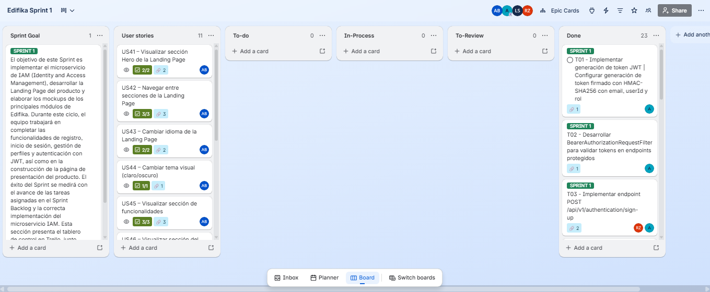

*Figura. Sprint Backlog 1. Elaborado utilizando Trello (Trello, s.f.).*

**URL público del Board:** _(pendiente — publicar el board con acceso público y documentar su URL)_

| Story Id | Story Title | Task Id | Task Title | Horas | Asignado |
|---|---|---|---|---|---|
| TS01 | Autenticación y autorización con JWT | T01 | Generación de token JWT (HMAC-SHA256, email/userId/rol) | 4 | Antuanete Ortiz |
| TS01 | Autenticación y autorización con JWT | T02 | Filtro `BearerAuthorizationRequestFilter` | 3 | Antuanete Ortiz |
| TS02 | Endpoints de registro e inicio de sesión | T03 | `POST /api/v1/authentication/sign-up` | 4 | Antuanete Ortiz |
| TS02 | Endpoints de registro e inicio de sesión | T04 | `POST /api/v1/authentication/sign-in` | 3 | Renato Zegarra |
| TS03 | Endpoints de gestión de usuarios | T05 | `GET /api/v1/users/{id}` | 2 | Antuanete Ortiz |
| TS03 | Endpoints de gestión de usuarios | T06 | `PUT /api/v1/users/{id}` | 3 | Renato Zegarra |
| TS03 | Endpoints de gestión de usuarios | T07 | `DELETE /api/v1/users/{id}` | 2 | Renato Zegarra |
| TS03 | Endpoints de gestión de usuarios | T08 | `GET /api/v1/users` | 2 | Renato Zegarra |
| TS03 | Endpoints de gestión de usuarios | T09 | `GET /api/v1/roles` | 2 | Renato Zegarra |
| TS05 | Base de datos PostgreSQL independiente | T10 | Configurar PostgreSQL para IAM (users/roles/user_roles) | 3 | Antuanete Ortiz |
| TS14 | Documentación de API con Swagger | T11 | Swagger + Bearer token en IAM | 2 | Antuanete Ortiz |
| US41 | Sección Hero de la Landing Page | T12 | Hero responsive (título, CTAs, mockup) | 4 | Alessandra Becerra |
| US41 | Sección Hero de la Landing Page | T13 | Scroll suave hacia funcionalidades | 2 | Alessandra Becerra |
| US42 | Navegar entre secciones | T14 | Navbar con scroll automático | 3 | Alessandra Becerra |
| US42 | Navegar entre secciones | T15 | Resaltado de sección activa | 2 | Alessandra Becerra |
| US42 | Navegar entre secciones | T16 | Navbar sticky | 2 | Alessandra Becerra |
| US43 | Cambiar idioma | T17 | Selector de idioma ES/EN | 4 | Alessandra Becerra |
| US43 | Cambiar idioma | T18 | Idioma por defecto (español) | 2 | Alessandra Becerra |
| US44 | Cambiar tema visual | T19 | Alternancia claro/oscuro | 3 | Alessandra Becerra |
| US45 | Sección de funcionalidades | T20 | Tarjetas de funcionalidades | 4 | Loreley Sarmiento |
| US45 | Sección de funcionalidades | T21 | Lista de características | 3 | Loreley Sarmiento |
| US45 | Sección de funcionalidades | T22 | Etiqueta "Más popular" | 1 | Alvaro Bejarano |
| US46 | Sección del equipo | T23 | Tarjetas de integrantes | 3 | Alvaro Bejarano |

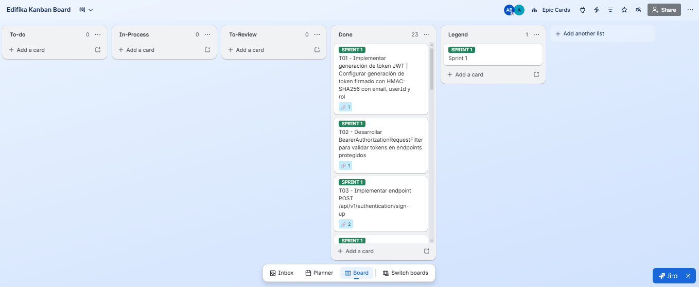

*Figura. Kanban Board del Sprint 1 (columnas To Do / In Progress / To Review / Done). Elaborado utilizando Trello (Trello, s.f.).*

#### 6.2.1.4. Development Evidence for Sprint Review

| Repository | Branch | Commit Id | Commit Message | Fecha |
|---|---|---|---|---|
| Microservicio IAM | main | 4b20746 | feat(IAM): first commit | 12/05/2026 |
| Microservicio IAM | develop | 9a187d4 | feat(IAM): Add IAM auth module and security | 12/05/2026 |
| Microservicio IAM | develop | ebcde37 | fix(IAM): fixing error handling to controllers | 12/05/2026 |
| Microservicio IAM | develop | c28c544 | feat: Add validations | 14/05/2026 |
| Landing Page | main | c202af4 | feat: added Landing Page | 14/05/2026 |
| Landing Page | main | 5fa5544 | feat: added i18n | 14/05/2026 |
| Landing Page | main | 126e37c | improve mobile hero responsive | 15/05/2026 |
| Landing Page | main | 05cf8e0 | fix: fixing responsive hero layout on mobile | 15/05/2026 |
| Landing Page | main | 823afc8 | fix: fixing mobile navbar hamburger visibility | 15/05/2026 |

#### 6.2.1.5. Testing Suite Evidence for Sprint Review

Se aplicó BDD con Gherkin (Cucumber) para la Landing Page: un archivo `.feature` por User Story (US41–US46), cubriendo la sección Hero, navegación, idioma, tema visual, funcionalidades y equipo.

| User Story | Feature File | Descripción |
|---|---|---|
| US41 | US41.feature | Visualización de la sección Hero, responsividad y CTA. |
| US42 | US42.feature | Navegación por navbar, resaltado de sección activa, navbar sticky. |
| US43 | US43.feature | Cambio de idioma ES/EN y persistencia. |
| US44 | US44.feature | Cambio de tema claro/oscuro y persistencia. |
| US45 | US45.feature | Sección de funcionalidades y etiqueta destacada. |
| US46 | US46.feature | Sección del equipo, carga de imágenes y fallback. |

Ejemplo (US42):

```gherkin
Feature: US42 Navegar entre secciones de la Landing Page

Scenario: Navegación exitosa desde el navbar
Given el visitante se encuentra en cualquier sección de la landing page
And visualiza el navbar con las opciones disponibles
When hace clic en una opción del navbar
Then la página realiza scroll automático hasta la sección correspondiente

Scenario: Navbar fijo al hacer scroll
Given el visitante se encuentra en la parte superior de la landing page
When supera los primeros 100px de la página
Then el navbar permanece visible y fijo en la parte superior de la pantalla
```

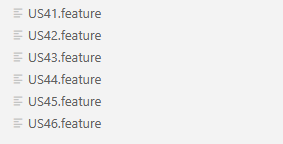

*Figura. Archivos `.feature` de las pruebas BDD. Elaborado utilizando Cucumber y Visual Studio Code.*

| Repository | Branch | Commit Id | Commit Message | Fecha |
|---|---|---|---|---|
| Acceptance-tests | main | 6778c81 | first commit — feature files US41 a US46 | (no especificado) |

#### 6.2.1.6. Execution Evidence for Sprint Review

Se verificaron mediante Postman los 6 endpoints del microservicio IAM: `POST /sign-up`, `POST /sign-in`, `GET /users/{id}`, `PUT /users/{id}`, `DELETE /users/{id}`, `GET /users`, `GET /roles` — confirmando tokens JWT, códigos 200/201 y datos correctos en cada respuesta. Los mock-ups de alta fidelidad producidos en este sprint se documentan en el [Capítulo V, 5.4.2.1](../08-capitulo-5-solution-ui-ux-design/capitulo-5-solution-ui-ux-design.md#5421-applications-mock-ups).

_(pendiente: enlace a video de ejecución en Stream/Clipchamp)_

#### 6.2.1.7. Services Documentation Evidence for Sprint Review

**Authentication Controller** (público)

| Método | Endpoint | Descripción |
|---|---|---|
| POST | /api/v1/authentication/sign-up | Registra un nuevo administrador. |
| POST | /api/v1/authentication/sign-in | Autentica y retorna un token JWT. |

**Users Controller** (protegido con JWT)

| Método | Endpoint | Descripción |
|---|---|---|
| GET | /api/v1/users/{id} | Datos completos de un usuario. |
| PUT | /api/v1/users/{id} | Modifica un usuario existente. |
| DELETE | /api/v1/users/{id} | Elimina un usuario. |
| GET | /api/v1/users | Lista todos los usuarios con sus roles. |

**Roles Controller**

| Método | Endpoint | Descripción |
|---|---|---|
| GET | /api/v1/roles | Lista los roles configurados (ADMIN, OWNER, TENANT). |

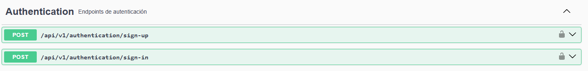

*Figura. Endpoints documentados en Swagger UI (Swagger, s.f.).*

#### 6.2.1.8. Software Deployment Evidence for Sprint Review

**Landing Page:** desplegada en GitHub Pages a partir del repositorio estático (HTML/CSS/JS), con la rama `main` como fuente.

**Microservicio IAM:** desplegado en Render como contenedor Docker (Dockerfile con build Maven), con redespliegue automático en cada push a la rama principal.

**Base de datos:** PostgreSQL gestionado en Supabase; credenciales configuradas como variables de entorno en Render; Hibernate crea las tablas (`users`, `roles`, `user_roles`) vía `ddl-auto=update`.

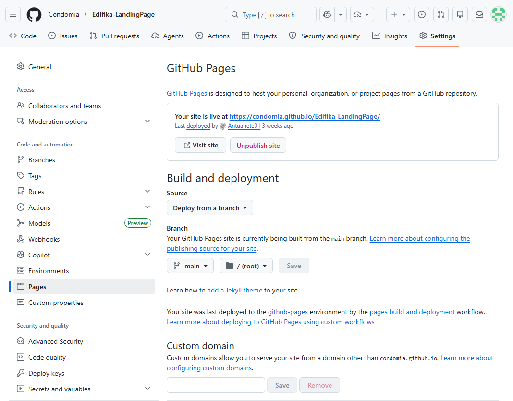

*Figura. Despliegue de la Landing Page en GitHub Pages.*

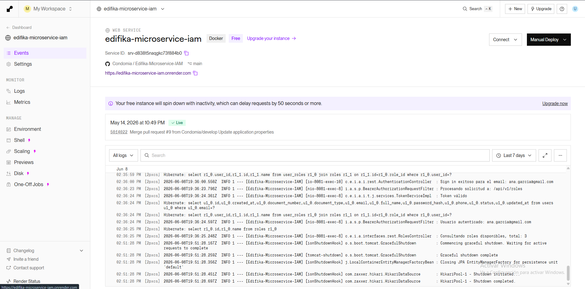

*Figura. Despliegue del microservicio IAM en Render.*

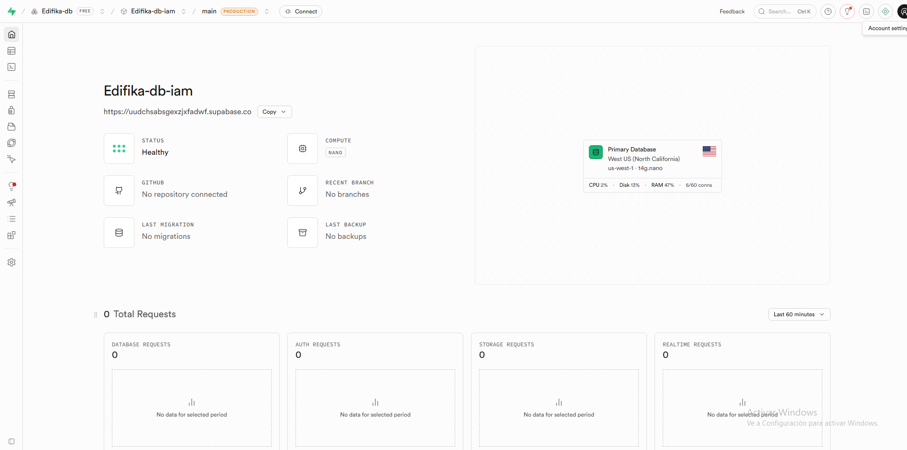

*Figura. Base de datos PostgreSQL en Supabase.*

#### 6.2.1.9. Team Collaboration Insights during Sprint

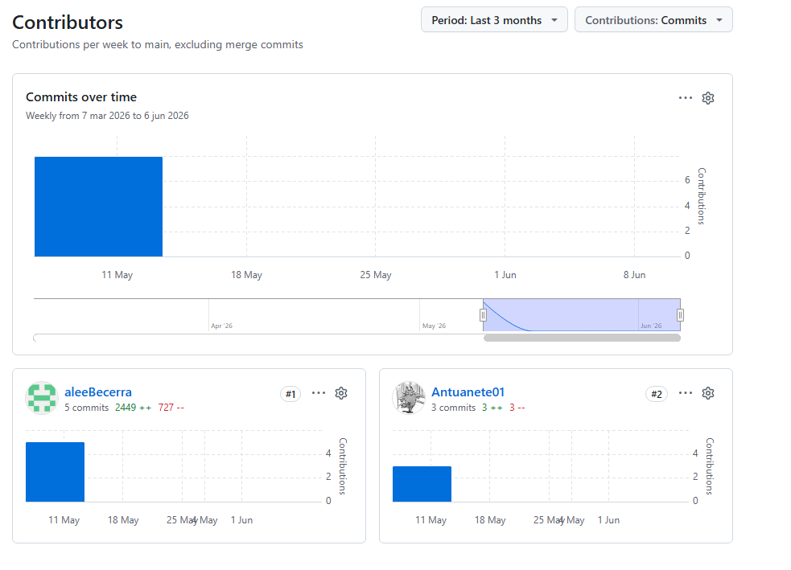

*Figura. Analíticos de colaboración — repositorio Landing Page (GitHub, s.f.).*

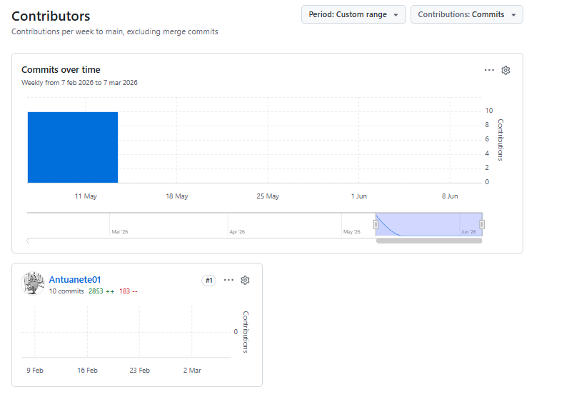

*Figura. Analíticos de colaboración — repositorio microservicio IAM (GitHub, s.f.).*

### 6.2.2. Sprint 2

#### 6.2.2.1. Sprint Planning 2

**Sprint Goal:** *Our focus is on* la arquitectura backend distribuida: API Gateway, políticas CORS, y los microservicios de Residential Management y Reservation. *We believe it delivers* enrutamiento centralizado y las bases de gestión residencial y de áreas comunes. *This will be confirmed when* las peticiones a través del Gateway lleguen correctamente a ambos microservicios y el primer frontend Angular se integre con ellos.

_(pendiente: Date, Time, Location, Prepared By, Velocity, Sum of Story Points)_

#### 6.2.2.2. Aspect Leaders and Collaborators

> ⚠️ Inferido de la columna "Asignado a" del backlog.

| Aspecto | Leader (inferido) | Collaborators |
|---|---|---|
| API Gateway / CORS | Johanna Ortiz | Renato Zegarra |
| Residential Management | Alvaro Bejarano | — |
| Reservation Service | Loreley Sarmiento | Alessandra Becerra |

#### 6.2.2.3. Sprint Backlog 2

Objetivo: API Gateway, políticas CORS, microservicios de Gestión Residencial y Reservas, y funcionalidades administrativas de áreas comunes/reportes.

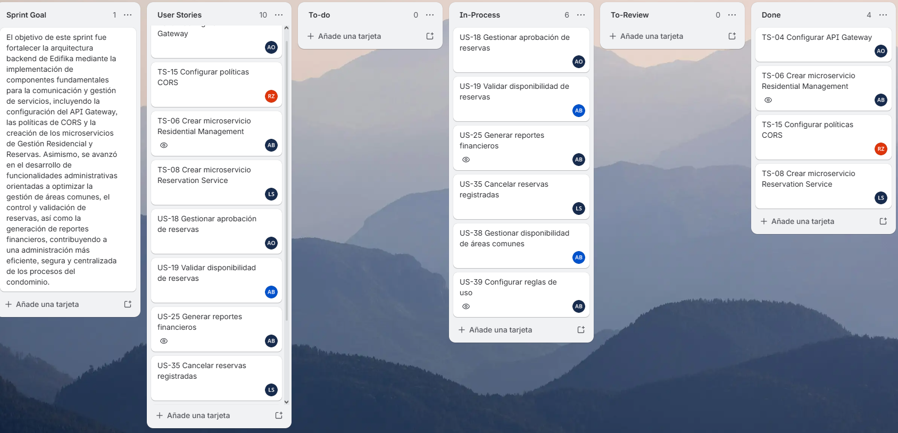

*Figura. Sprint Backlog 2. Elaborado utilizando Trello (Trello, s.f.).*

**URL público del Board:** _(pendiente)_

| Story Id | Título | Task Id | Tarea | Horas | Asignado | Estado |
|---|---|---|---|---|---|---|
| TS04 | API Gateway como entrada centralizada | T24 | Configurar API Gateway | 4 | Johanna Ortiz | Done |
| TS15 | CORS en el API Gateway | T25 | Configurar políticas CORS | 3 | Renato Zegarra | Done |
| TS06 | Microservicio Residential Management | T26 | Crear microservicio base | 4 | Alvaro Bejarano | Done |
| TS08 | Microservicio Reservation Service | T27 | Crear microservicio base | 4 | Loreley Sarmiento | Done |
| US18 | Aprobar/rechazar reservas | T28 | Gestionar aprobación | 3 | Johanna Ortiz | In-Process |
| US19 | Evitar reservas duplicadas | T29 | Validar disponibilidad | 3 | Alessandra Becerra | In-Process |
| US25 | Generar reportes financieros | T30 | Reportes consolidados | 4 | Alvaro Bejarano | In-Process |
| US35 | Cancelar reserva (Admin) | T31 | Anular reservas | 3 | Loreley Sarmiento | In-Process |
| US38 | Habilitar/deshabilitar área común | T32 | Disponibilidad de áreas | 3 | Alessandra Becerra | In-Process |
| US39 | Configurar reglas de área común | T33 | Horarios y restricciones | 3 | Alvaro Bejarano | In-Process |

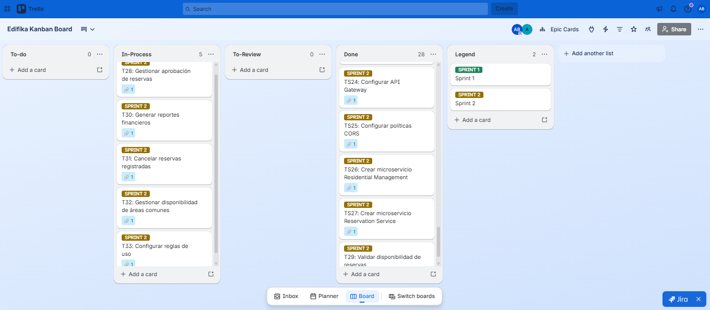

*Figura. Kanban Board Sprint 2: 4 tarjetas Done (Gateway, Residential, CORS, Reservation), 6 In Progress, 0 en To-do.*

#### 6.2.2.4. Development Evidence for Sprint Review

| Repository | Commits destacados |
|---|---|
| Microservicio IAM | `feat: Add document fields, validations and configs`; `fix: Use env vars for datasource config`; `feat: create Dockerfile`; `feat: signup roles via RoleRepository`. |
| Frontend (Angular) | `Estructura base`; `base services`; `Login`; `Register`; `feat: update dashboard view`; `Common Area` (×2). |
| Microservicio Residential Management | `feat(): Add shared`; `feat() domain model`; `feat() Repositories`; `feat() ResidentialCommandServiceImpl`; `feat() Assembler and Controller`; `fix() Unit`; `feat() Dockerfile`. |
| Microservicio Reservation | `feat: add reservation microservice`; `feat: implement booking type enum and dynamic capacity availability`; `chore: configure properties and Dockerfile`; `feat: add common area rules, types support and fix outbound mapping`. |
| API Gateway | `feat: first commit`; `feat: Add routes, CORS, security, and filter`; `feat: Add Dockerfile; add common-areas gateway route`. |

*(Se omiten los commits de tipo "Merge pull request" por ser ruido de integración, no avance funcional.)*

#### 6.2.2.5. Testing Suite Evidence for Sprint Review

Suite de pruebas unitarias con **JUnit 5** y **Mockito**, enfocada en Command/Query Services y Controllers, simulando repositorios para no depender de una base de datos real.

| Microservicio | Clase de prueba | Descripción |
|---|---|---|
| IAM | `UserCommandServiceImplTest`, `UserControllerTest` | Registro, autenticación, actualización y eliminación de usuarios. |
| IAM | `RoleCommandServiceImplTest`, `RolesControllerTest` | Gestión de roles y permisos. |
| Residential | `ResidentialCommandServiceImplTest`, `ResidentialQueryServiceImplTest`, `ResidentialControllerTest` | Creación de edificios/unidades, asignación y mudanza de residentes. |
| Reservation | `CommonAreaCommandServiceImplTest`, `CommonAreaControllerTest` | Creación y configuración de áreas comunes. |
| Reservation | `ReservationCommandServiceImplTest`, `ReservationQueryServiceImplTest`, `ReservationControllerTest` | Creación, cancelación y disponibilidad de reservas. |

Ejemplo (creación exitosa de reserva en área exclusiva):

```java
@Test
void handleCreateReservationSuccessfullyForExclusiveArea() {
    when(commonAreaRepository.findById(commonAreaId)).thenReturn(Optional.of(commonArea));
    when(commonArea.getBookingType()).thenReturn(EBookingType.EXCLUSIVE);
    when(reservationRepository.save(any(Reservation.class))).thenReturn(savedReservation);

    var result = reservationCommandService.handleCreateReservation(
            residentId, commonAreaId, reservationDate, timeSlot);

    assertNotNull(result);
    verify(reservationRepository, times(1)).save(any(Reservation.class));
}
```

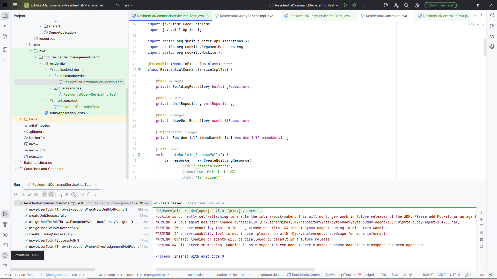

*Figura. Evidencia de pruebas unitarias — Residential Management (JUnit 5 / Mockito).*

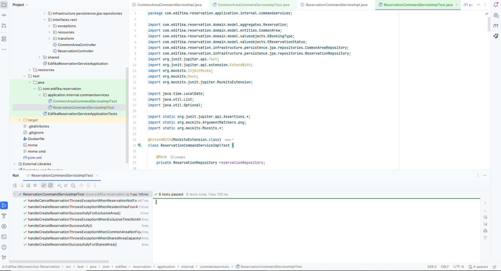

*Figura. Evidencia de pruebas unitarias — Reservation (JUnit 5 / Mockito).*

| Repository | Commit | Descripción |
|---|---|---|
| Microservicio IAM | `Testing` | Pruebas de autenticación, usuarios y roles. |
| Microservicio Residential | `Testing` | Pruebas de servicios, queries y controllers residenciales. |
| Microservicio Reservation | `Testing` | Pruebas de reservas, áreas comunes y disponibilidad. |

#### 6.2.2.6. Execution Evidence for Sprint Review

Todas las solicitudes se probaron con Postman a través del **API Gateway** (puerto 8080), validando enrutamiento y verificación centralizada del Bearer Token: `POST /residential/buildings`, `POST /residential/user-units`, `GET /residential/buildings/{id}/residents`, `POST /common-areas`, `POST /reservations`, `GET /reservations/availability`. En paralelo se desplegó la primera versión funcional del frontend Angular (pantallas de Registro, Login, Dashboard y gestión de Áreas Comunes), validando la integración inicial UI–backend.

_(pendiente: enlace a video de ejecución en Stream/Clipchamp)_

#### 6.2.2.7. Services Documentation Evidence for Sprint Review

**Residential Controller**

| Método | Endpoint | Descripción |
|---|---|---|
| POST | /api/v1/residential/buildings | Registra un nuevo edificio. |
| GET | /api/v1/residential/buildings | Lista los edificios registrados. |
| GET | /api/v1/residential/buildings/{idBuilding}/units | Consulta las unidades de un edificio. |
| GET | /api/v1/residential/buildings/{idBuilding}/residents | Lista los residentes de un edificio. |
| POST | /api/v1/residential/units | Registra una nueva unidad. |
| POST | /api/v1/residential/user-units | Vincula un residente a una unidad. |
| PUT | /api/v1/residential/user-units/move | Gestiona la mudanza de un residente. |

**Reservations Controller**

| Método | Endpoint | Descripción |
|---|---|---|
| POST | /api/v1/reservations | Crea una reserva. |
| GET | /api/v1/reservations/availability | Consulta disponibilidad de horarios. |
| POST | /api/v1/reservations/{reservationId}/cancelations | Cancela una reserva. |

**Common Areas Controller**

| Método | Endpoint | Descripción |
|---|---|---|
| POST | /api/v1/common-areas | Registra una nueva área común. |

*(El API Gateway no expone endpoints propios: enruta, valida JWT y aplica CORS hacia estos tres controladores, documentados en Swagger UI.)*

#### 6.2.2.8. Software Deployment Evidence for Sprint Review

**Backend:** Residential, Reservation y API Gateway desplegados en Render (build automático vía Maven/`pom.xml`), vinculados a sus repositorios de GitHub.

**Base de datos:** una instancia PostgreSQL en Supabase por microservicio, con credenciales configuradas como variables de entorno en Render.

**Frontend:** primera versión de la app Angular desplegada en Render, con despliegue continuo en cada push a la rama principal.

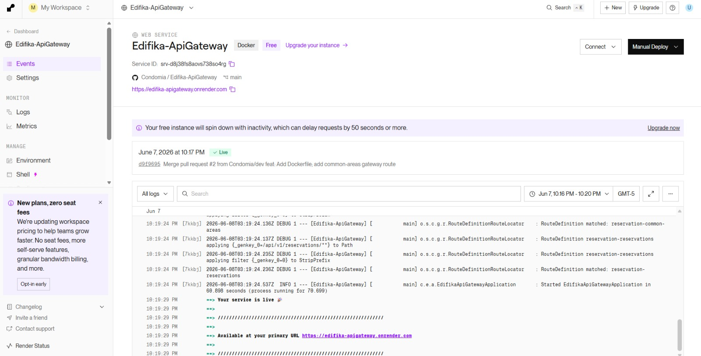

*Figura. Despliegue del API Gateway en Render.*

#### 6.2.2.9. Team Collaboration Insights during Sprint

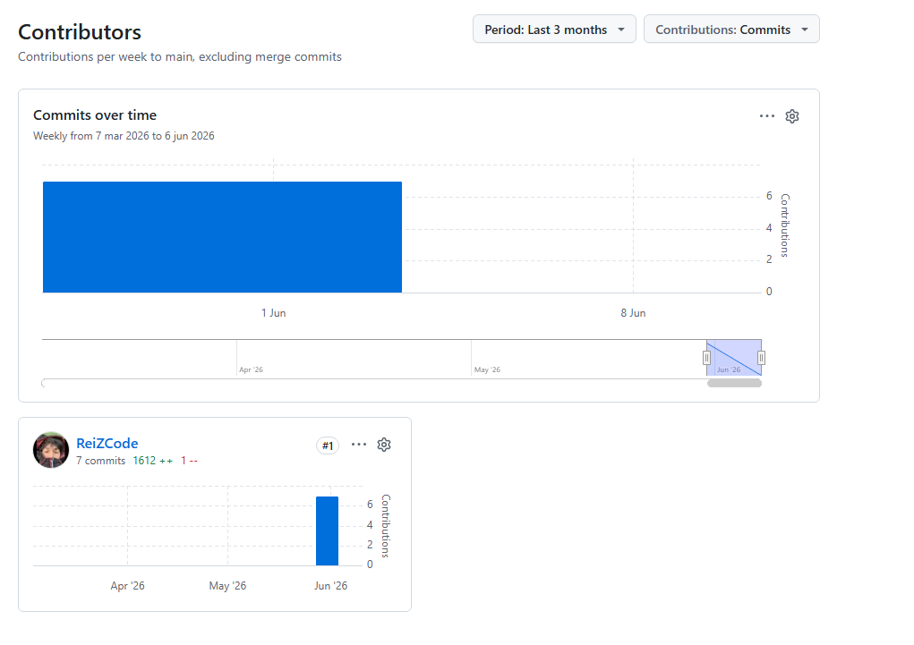

*Figura. Analíticos de colaboración — Residential Management: creación de edificios/unidades, asignación y mudanza de residentes, persistencia y documentación Swagger.*

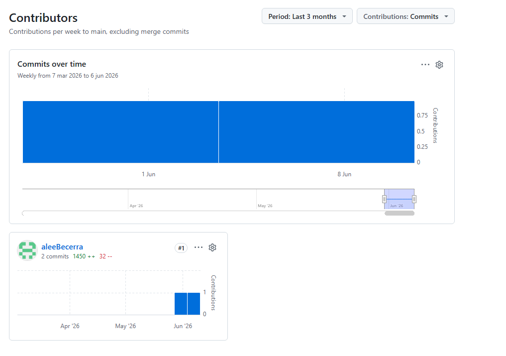

*Figura. Analíticos de colaboración — Reservation: disponibilidad en tiempo real (áreas exclusivas vs. por aforo), integración PostgreSQL.*

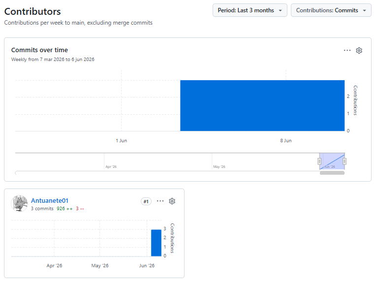

*Figura. Analíticos de colaboración — API Gateway: enrutamiento a IAM/Residential/Reservation, Spring Cloud Gateway, propagación de JWT, CORS, despliegue Docker.*

### 6.2.3. Sprint 3

#### 6.2.3.1. Sprint Planning 3

**Sprint Goal:** *Our focus is on* flujos funcionales de autenticación, gestión de usuarios y reservas, junto con la configuración base de Payment (con Culqi), Communication y Forum. *We believe it delivers* las capacidades financieras, comunicacionales y comunitarias necesarias para completar la plataforma. *This will be confirmed when* los tres microservicios nuevos respondan correctamente a través del API Gateway.

_(pendiente: Date, Time, Location, Prepared By, Velocity, Sum of Story Points)_

#### 6.2.3.2. Aspect Leaders and Collaborators

> ⚠️ Inferido del backlog.

| Aspecto | Leader (inferido) | Collaborators |
|---|---|---|
| Login / gestión de usuarios | Johanna Ortiz | Alvaro Bejarano |
| Reservas (aprobación, disponibilidad global) | Johanna Ortiz | Alessandra Becerra |
| Payment Service (Culqi) | Renato Zegarra | — |
| Communication Service | Alessandra Becerra | — |
| Forum Service | Loreley Sarmiento | — |

#### 6.2.3.3. Sprint Backlog 3

Objetivo: flujos de login/perfil/reservas, y configuración base de Payment (Culqi), Communication y Forum.

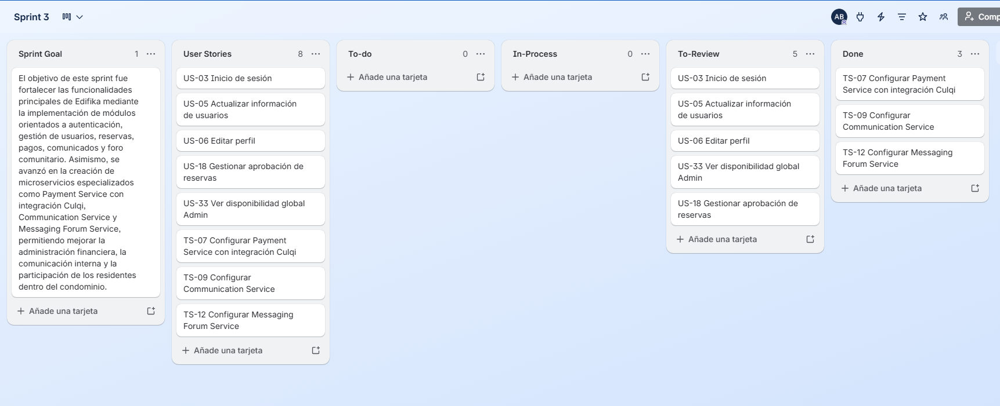

*Figura. Sprint Backlog 3. Elaborado utilizando Trello (Trello, s.f.).*

**URL público del Board:** _(pendiente)_

| Story Id | Título | Horas | Asignado | Estado |
|---|---|---|---|---|
| US03 | Inicio de sesión (login + redirección por rol) | 4 | Johanna Ortiz | In-Process |
| US05 | Actualizar información de usuarios (admin) | 4 | Alvaro Bejarano | In-Process |
| US06 | Editar perfil (residente) | 3 | Loreley Sarmiento | In-Process |
| US18 | Aprobar/rechazar reservas | 4 | Johanna Ortiz | In-Process |
| US33 | Ver disponibilidad global de áreas comunes (admin) | 4 | Alessandra Becerra | In-Process |
| TS07 | Payment Service con integración Culqi | 5 | Renato Zegarra | Done |
| TS09 | Communication Service | 4 | Alessandra Becerra | Done |
| TS12 | Messaging Forum Service (límite 1 post/día) | 4 | Loreley Sarmiento | Done |

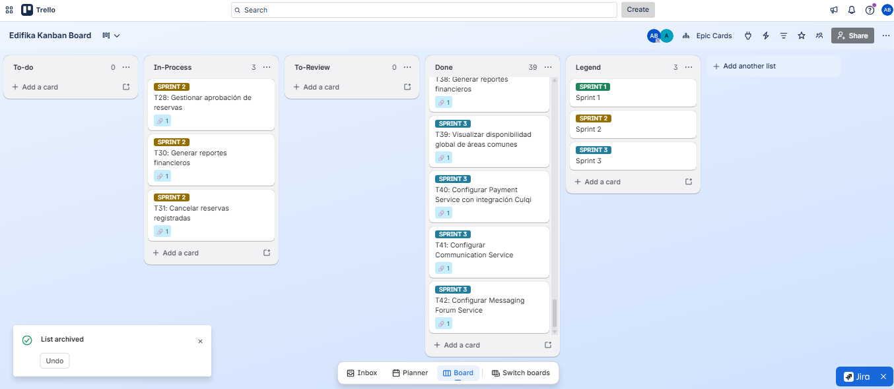

*Figura. Kanban Board Sprint 3: 3 tarjetas Done (Payment/Communication/Forum base), 6 In-Process, 0 en To-do.*

#### 6.2.3.4. Development Evidence for Sprint Review

| Repository | Commits destacados |
|---|---|
| Microservicio Forum | `feat(security): implement jwt authentication filter and security config`. |
| Microservicio Communications | `feat() security`, `feat() security JWT`, `feat() and Controller`, `feat() services`, `feat() Communication model domain services`, `feat() propierties`, `feat() Shared`, `Primer commit`. |
| Microservicio Payment | `feat: first commit`, `feat: Add payment domain, services & JWT security`. |
| Frontend (Angular) | `Dashboard consumiendo db.json`, `Common Area`, `token Mock` (×2), `Actualizar dashboard por roles y asociaciones de unidades`, `options diseño y funcion`. |

*(Se omiten los commits "Merge pull request"/"Merge remote-tracking branch" por ser ruido de integración.)*

#### 6.2.3.5. Testing Suite Evidence for Sprint Review

Nueva suite JUnit 5 + Mockito para **Payment**, **Communication** y **Forum** (command/query services y controllers, con repositorios simulados).

| Microservicio | Clase de prueba | Descripción |
|---|---|---|
| Payment | `PaymentCommandServiceImplTest` | Creación de deudas, registro y confirmación manual de pagos. |
| Payment | `PaymentQueryServiceImplTest` | Consulta de deudas por unidad, pagos por usuario e historial por año. |
| Payment | `PaymentControllerTest` | Endpoints REST de deudas, pagos, confirmaciones e historial. |
| Communication | `CommunicationCommandServiceImplTest` | Creación de anuncios, marcado como leído, archivado. |
| Communication | `CommunicationQueryServiceImplTest` | Consulta por edificio, por id, métricas de lectura. |
| Communication | `CommunicationControllerTest` | Endpoints REST de anuncios, lectura, archivado y métricas. |
| Forum | `PostCommandServiceImplTest` | Creación de publicaciones y regla de 1 publicación diaria por residente. |
| Forum | `PostControllerTest` | Endpoint de creación y manejo de error al incumplir la restricción diaria. |

Ejemplo (regla de negocio — un post diario por residente):

```java
@Test
void shouldThrowExceptionWhenResidentAlreadyPostedToday() {
    CreatePostResource resource = mock(CreatePostResource.class);
    when(resource.residentId()).thenReturn(1L);
    Post lastPost = mock(Post.class);
    when(lastPost.getCreatedAt()).thenReturn(LocalDate.now().atStartOfDay());
    when(postRepository.findFirstByResidentIdOrderByCreatedAtDesc(1L))
            .thenReturn(Optional.of(lastPost));

    IllegalArgumentException exception = assertThrows(IllegalArgumentException.class,
            () -> postCommandService.handle(resource, "https://storage.com/image.png"));

    assertEquals("Restricción del mini foro: Cada usuario solo podrá realizar una publicación diaria.",
            exception.getMessage());
    verify(postRepository, never()).save(any(Post.class));
}
```

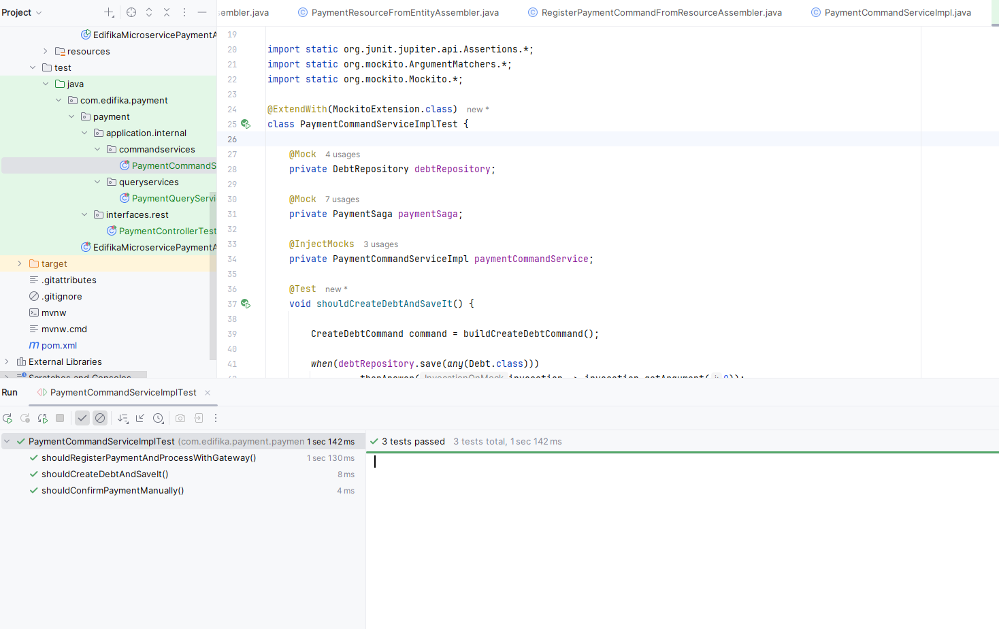

*Figura. Evidencia de pruebas unitarias — Payment (JUnit 5 / Mockito).*

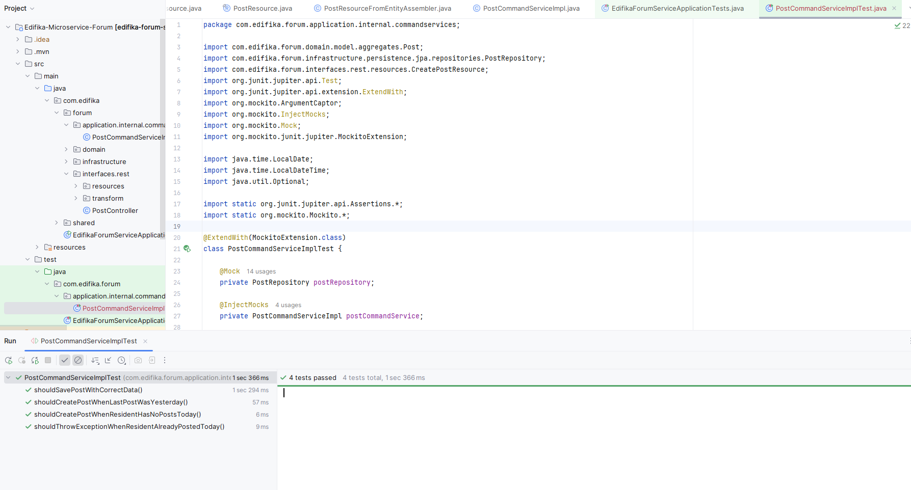

*Figura. Evidencia de pruebas unitarias — Forum (JUnit 5 / Mockito).*

| Repository | Commit | Descripción |
|---|---|---|
| Microservicio Payment | `Testing` | Pruebas de command/query services y controller de pagos. |
| Microservicio Communication | (integrado junto con otros cambios) | Pruebas de command/query services y controller de comunicados. |
| Microservicio Forum | `Testing` | Pruebas de creación de posts, restricción diaria y controller. |

#### 6.2.3.6. Execution Evidence for Sprint Review

Probado vía Postman a través del API Gateway: `POST /payments/debts`, `GET /payments/debts/unit/{unitId}`, `POST /payments` (integración Culqi), `PUT /payments/{id}/confirm`, `GET /payments/user/{userId}`, `POST /announcements`, `GET /announcements?buildingId={id}`, `GET /announcements/{id}/metrics`, `POST /posts` (con validación de límite diario).

_(pendiente: enlace a video de ejecución en Stream/Clipchamp)_

#### 6.2.3.7. Services Documentation Evidence for Sprint Review

**Payment Controller**

| Método | Endpoint | Descripción |
|---|---|---|
| POST | /api/v1/payments/debts | Registra una deuda asociada a una unidad. |
| GET | /api/v1/payments/debts/unit/{unitId} | Consulta deudas pendientes de una unidad. |
| POST | /api/v1/payments | Registra y procesa un pago vía Culqi. |
| PUT | /api/v1/payments/{paymentId}/confirm | Confirma/rechaza un pago manualmente. |
| GET | /api/v1/payments/user/{userId} | Historial completo de pagos de un residente. |
| GET | /api/v1/payments/user/{userId}/year/{year} | Historial de pagos filtrado por año. |

**Communication Controller**

| Método | Endpoint | Descripción |
|---|---|---|
| POST | /api/v1/announcements | Publica un comunicado oficial. |
| GET | /api/v1/announcements?buildingId={id} | Comunicados de un edificio. |
| GET | /api/v1/announcements/{id} | Detalle de un comunicado. |
| POST | /api/v1/announcements/{id}/read | Registra la lectura por un residente. |
| PUT | /api/v1/announcements/{id}/archive | Archiva un comunicado. |
| GET | /api/v1/announcements/{id}/metrics | Métricas de lectura y alcance. |

**Post Controller (Forum)**

| Método | Endpoint | Descripción |
|---|---|---|
| GET | /api/v1/posts | Lista publicaciones del foro (paginado). |
| POST | /api/v1/posts | Crea una publicación (máx. 1/día por residente). |
| GET | /api/v1/posts/{id} | Detalle de una publicación. |

#### 6.2.3.8. Software Deployment Evidence for Sprint Review

Los tres nuevos microservicios (Payment, Communication, Forum) se desplegaron en **Render** (build Maven vía `pom.xml`) con bases de datos PostgreSQL independientes en **Supabase**. El frontend Angular continuó desplegado en Render, integrando las nuevas funcionalidades con despliegue continuo por push a la rama principal.

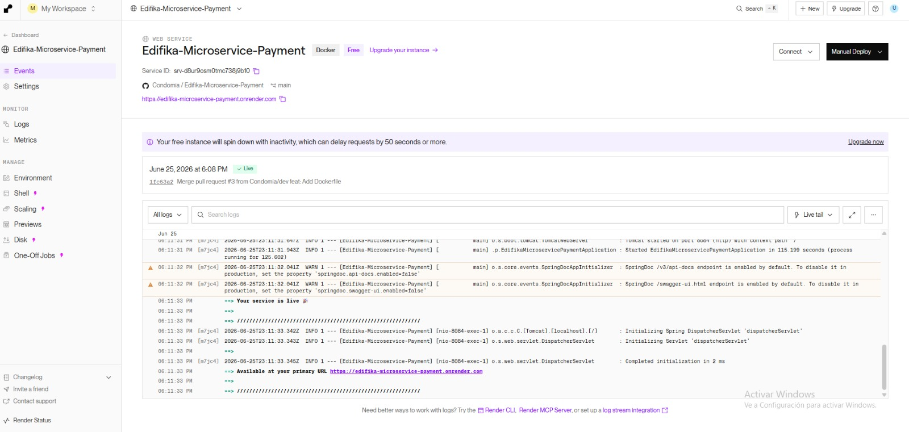

*Figura. Despliegue del microservicio Payment en Render.*

#### 6.2.3.9. Team Collaboration Insights during Sprint

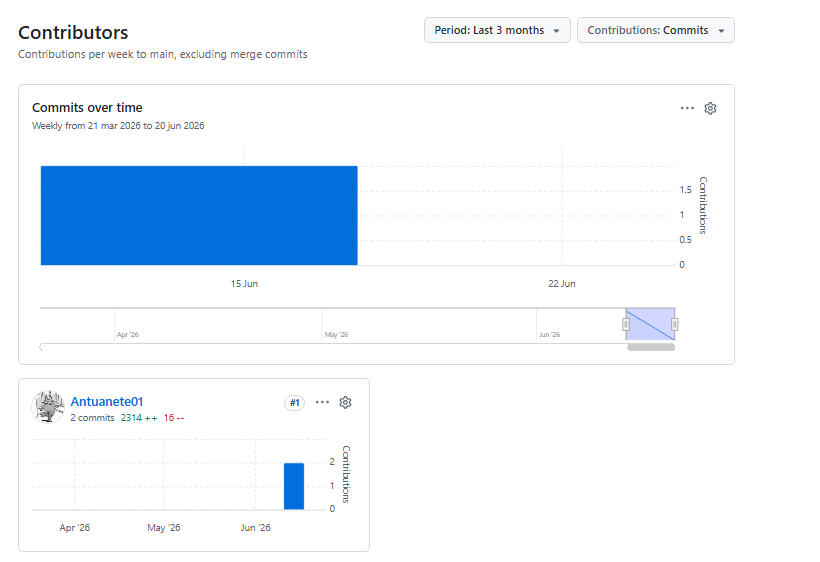

*Figura. Analíticos de colaboración — Payment: control de deudas/cuotas e integración Culqi.*

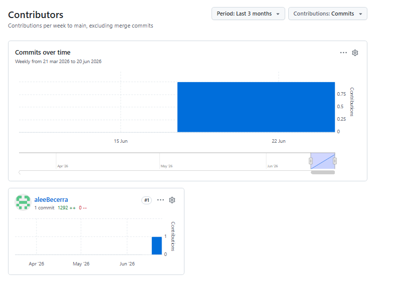

*Figura. Analíticos de colaboración — Forum: regla de 1 post/día, moderación, seguridad JWT.*

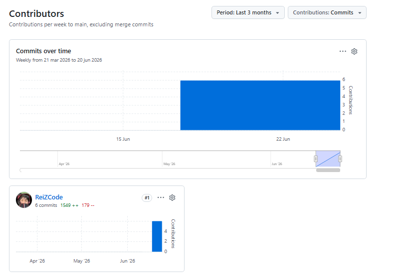

*Figura. Analíticos de colaboración — Communication: herramientas de publicación de avisos oficiales.*

### 6.2.4. Sprint 4

#### 6.2.4.1. Sprint Planning 4

**Sprint Goal:** *Our focus is on* consolidar las historias pendientes de usuarios, edificios/unidades, reservas, pagos y morosidad, y completar la plataforma con Notification Service (Firebase) y Report Service. *We believe it delivers* una plataforma con todos sus módulos principales implementados e integrados. *This will be confirmed when* los 8 microservicios respondan correctamente a través del API Gateway y el frontend consuma todos los módulos.

_(pendiente: Date, Time, Location, Prepared By, Velocity, Sum of Story Points)_

#### 6.2.4.2. Aspect Leaders and Collaborators

> ⚠️ Inferido del backlog.

| Aspecto | Leader (inferido) |
|---|---|
| Gestión de usuarios / comunicados | Johanna Ortiz |
| Reservas (aprobación, duplicados, cancelación) | Renato Zegarra / Alvaro Bejarano |
| Reportes financieros / documentación legal | Loreley Sarmiento |
| Disponibilidad global / edificios y unidades | Alessandra Becerra |
| Notification Service (Firebase) | Johanna Ortiz |
| Report Service | Loreley Sarmiento |

#### 6.2.4.3. Sprint Backlog 4

Objetivo: cerrar las historias pendientes de los módulos existentes y completar la plataforma con Notification Service (Firebase Cloud Messaging) y Report Service.

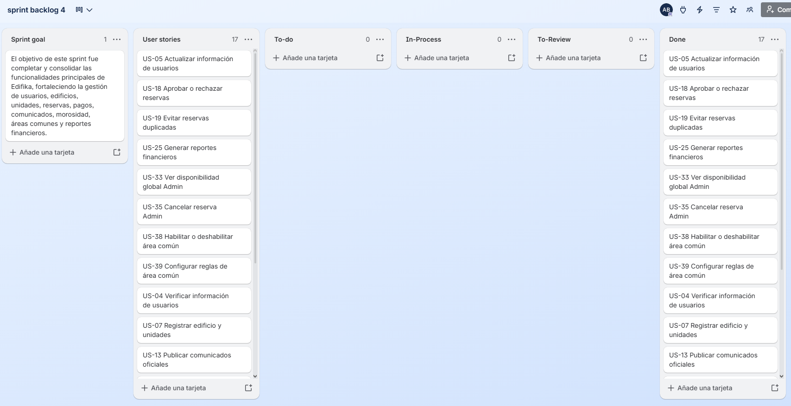

*Figura. Sprint Backlog 4. Elaborado utilizando Trello (Trello, s.f.).*

**URL público del Board:** _(pendiente)_

| Story Id | Título | Horas | Asignado | Estado |
|---|---|---|---|---|
| US05 | Actualizar información de usuarios | 4 | Johanna Ortiz | Done |
| US18 | Aprobar/rechazar reservas | 5 | Renato Zegarra | Done |
| US19 | Evitar reservas duplicadas | 4 | Alvaro Bejarano | Done |
| US25 | Generar reportes financieros | 6 | Loreley Sarmiento | Done |
| US33 | Ver disponibilidad global (admin) | 5 | Alessandra Becerra | Done |
| US35 | Cancelar reserva (admin) | 4 | Johanna Ortiz | Done |
| US38 | Habilitar/deshabilitar área común | 4 | Renato Zegarra | Done |
| US39 | Configurar reglas de área común | 6 | Alvaro Bejarano | Done |
| US04 | Verificar información de usuarios | 3 | Loreley Sarmiento | Done |
| US07 | Registrar edificio y unidades | 7 | Alessandra Becerra | Done |
| US13 | Publicar comunicados oficiales | 4 | Johanna Ortiz | Done |
| US23 | Registrar pagos en el sistema | 5 | Renato Zegarra | Done |
| US24 | Visualizar residentes morosos | 5 | Alvaro Bejarano | Done |
| US32 | Consultar leyes y manuales | 4 | Loreley Sarmiento | Done |
| US40 | Ver historial de uso de áreas comunes | 5 | Alessandra Becerra | Done |
| TS10 | Notification Service con Firebase | 7 | Johanna Ortiz | Done |
| TS11 | Report Service | 8 | Loreley Sarmiento | Done |

#### 6.2.4.4. Development Evidence for Sprint Review

| Repository | Commits destacados |
|---|---|
| Microservicio Report | `Primer commit`, `Testing`, `deploy`. |
| Microservicio Notification | `First commit`, `feat: added dockerfile`, `Switch database credentials to environment variables`, `docs: fixing firebase config`, `fix: fixing error route`. |
| Frontend (Angular) | `Finance and community wall`, `feat: agregar aceptación de reglamento en registro y muro comunitario`. |

#### 6.2.4.5. Testing Suite Evidence for Sprint Review

Suite JUnit 5 + Mockito + Spring Boot Test para **Notification** y **Financial Report**, con dependencias externas simuladas (repositorios JPA, gateway de Firebase, servicios de otros microservicios consultados vía REST).

| Microservicio | Componente | Casos de prueba (resumen) |
|---|---|---|
| Notification | `DeviceTokenCommandServiceImpl` | Registro de token, mapeo de entidad persistida, propagación de error de persistencia. |
| Notification | `DeviceTokenQueryServiceImpl` | Consulta por usuario (existente/inexistente) y por id (existente/inexistente). |
| Notification | `NotificationCommandServiceImpl` | Creación con/sin token registrado (invoca o no Firebase), marcar como leída, error si no existe. |
| Notification | `NotificationQueryServiceImpl` | Consulta por id y consulta paginada por usuario (con `PageImpl`). |
| Notification | `DeviceTokenController` / `NotificationController` | Códigos HTTP 201/200/404 según el caso (ver tabla de endpoints). |
| Financial Report | `ReportCommandServiceImpl` | Generación con datos simulados de Payment/Residential, cálculo de ingresos/deudas, manejo de dependencia externa fallida. |
| Financial Report | `ReportController` | 200 OK con reporte generado; manejo de información inexistente o error de generación. |

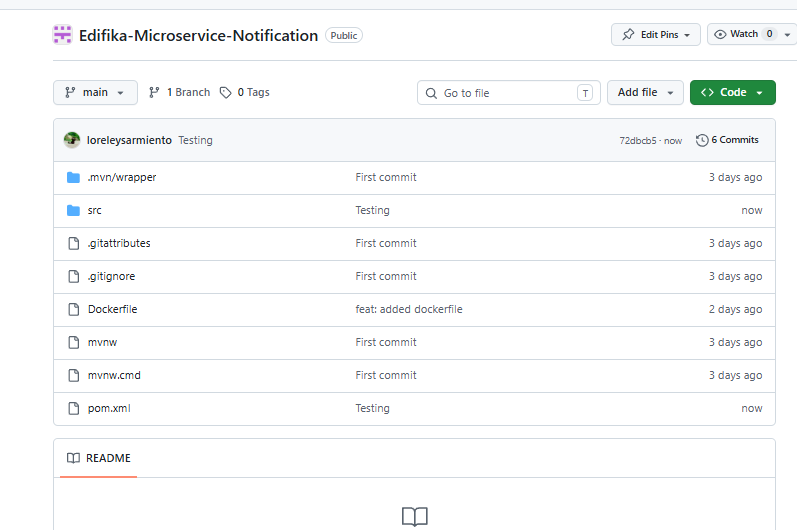

*Figura. Ejecución satisfactoria de la suite de pruebas — Notification (IntelliJ IDEA, JUnit 5, Mockito).*

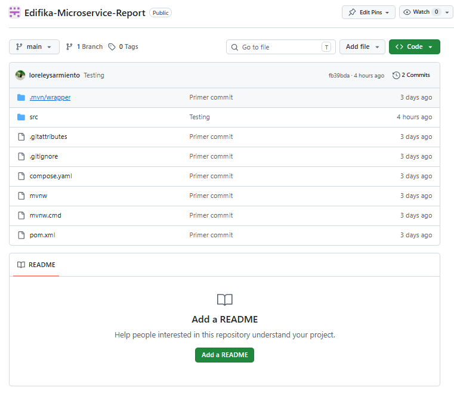

*Figura. Ejecución satisfactoria de la suite de pruebas — Financial Report.*

| Repository | Commit | Descripción |
|---|---|---|
| Microservicio Notification | `test: add notification unit tests` | Tests de device token y notification (command/query/controller). |
| Microservicio Financial Report | `test: add financial report unit tests` | Tests de application services y controllers de reportes. |

#### 6.2.4.6. Execution Evidence for Sprint Review

Probado vía Postman a través del API Gateway: `POST /device-tokens`, `POST /notifications`, `GET /notifications/user/{userId}`, `PATCH /notifications/{id}/read`, `GET /reports/financial/buildings/{buildingId}` (el Report Service consulta Payment y Residential Management vía REST). Se desplegaron además las pantallas de Dashboard, gestión de unidades/residentes, administración de áreas comunes (con modal de configuración de reglas), Community Wall, y configuración de perfil/propiedad.

_(pendiente: enlace a video de ejecución en Stream/Clipchamp)_

#### 6.2.4.7. Services Documentation Evidence for Sprint Review

**Device Token Controller**

| Método | Endpoint | Descripción |
|---|---|---|
| POST | /api/v1/device-tokens | Registra el token de un dispositivo. |
| GET | /api/v1/device-tokens/user/{userId} | Consulta el token de un usuario. |
| GET | /api/v1/device-tokens/{id} | Consulta un token por id. |

**Notification Controller**

| Método | Endpoint | Descripción |
|---|---|---|
| POST | /api/v1/notifications | Crea y envía una notificación. |
| GET | /api/v1/notifications/user/{userId} | Notificaciones de un usuario (paginado). |
| GET | /api/v1/notifications/{id} | Notificación por id. |
| PATCH | /api/v1/notifications/{id}/read | Marca como leída. |

**Financial Report Controller**

| Método | Endpoint | Descripción |
|---|---|---|
| GET | /api/v1/reports/financial/buildings/{buildingId} | Reporte financiero consolidado de un edificio (consulta Payment + Residential Management). |

#### 6.2.4.8. Software Deployment Evidence for Sprint Review

Notification y Report desplegados en **Render** con bases de datos PostgreSQL independientes en **Supabase**, completando el despliegue de los 8 microservicios. El frontend Angular integró las pantallas de Dashboard, gestión de unidades/residentes, áreas comunes, Community Wall y configuración de perfil/propiedad.

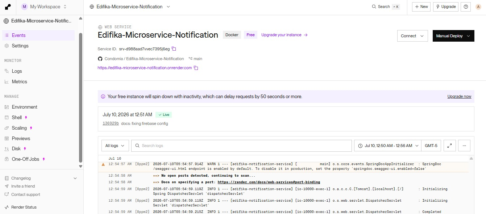

*Figura. Despliegue del microservicio Notification en Render.*

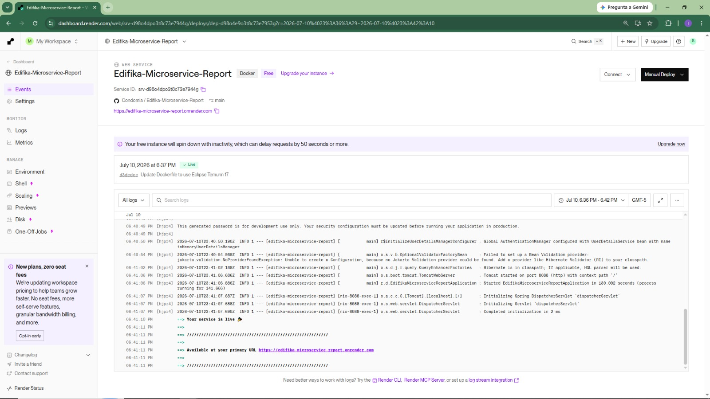

*Figura. Despliegue del microservicio Report en Render.*

#### 6.2.4.9. Team Collaboration Insights during Sprint

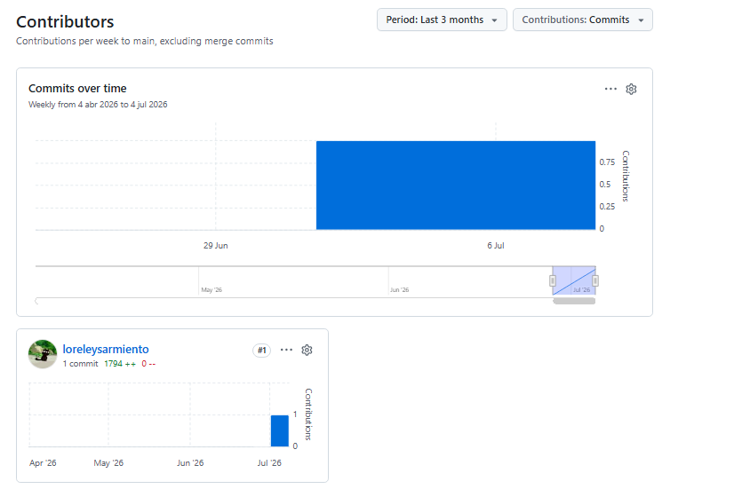

*Figura. Analíticos de colaboración — Report: reportes financieros vía Payment Service, exportación PDF/Excel, consulta de morosos.*

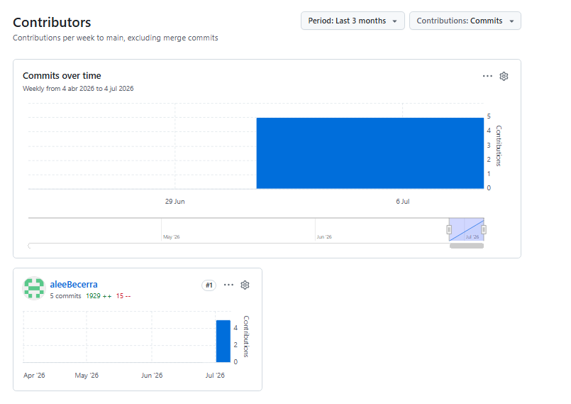

*Figura. Analíticos de colaboración — Notification: integración Firebase Cloud Messaging, manejo de fallos, gestión de tokens.*

## 6.3. Validation Interviews

> 📋 **Guía (Statement):** En esta sección, el equipo registra y explica las actividades de entrevistas de validación durante el proyecto. Se debe realizar entrevistas de validación en las que usuarios de los segmentos objetivo interactúen con el landing page y con las aplicaciones. Incluye secciones internas para Diseño de Entrevistas, Registro de Entrevistas, Evaluaciones según heurísticas. Para el proceso de validación debe aplicarse el formato de evaluación heurística indicado para el proyecto (ver [Anexo D](../12-anexos/anexo-d-evaluacion-ux-heuristicas.md)).

### 6.3.1. Diseño de Entrevistas

> 📋 **Guía (Statement):** En esta sección el equipo establece por cada segmento objetivo los elementos a incluir en la sesión de validación, incluyendo el Landing Page y las aplicaciones. Aquí se especifica también cuáles serán los user flows de las aplicaciones, que formarán parte del proceso de validación.

### 6.3.2. Registro de Entrevistas

> 📋 **Guía (Statement):** Para cada segmento se requiere de 3 a 5 entrevistas. Para cada una de las entrevistas se debe indicar la información de nombres, apellidos, edad, distrito, un screenshot de un cuadro de video y el URL del video subido en Microsoft Stream/Clipchamp incluyendo el timing donde inicia la entrevista y su duración. La entrevista debe ser registrada en video, que sirve de evidencia de entrevistas. Para cada entrevista debe redactarse en este informe un resumen, que explica de forma descriptiva las principales apreciaciones del entrevistado con respecto a las tareas asignadas. Ver [Anexo C. Indicaciones para secciones que incluyen Videos](../12-anexos/anexo-c-indicaciones-videos.md).

### 6.3.3. Evaluaciones según heurísticas

> 📋 **Guía (Statement):** Esta sección contiene el proceso de evaluación de las sesiones de validación basado en heurísticas, considerando heurísticas de usabilidad, arquitectura de información e inclusive design de la experiencia propuesta. Para esto la sección debe contener la estructura del formato para evaluaciones de heurísticas indicado en el [Anexo D](../12-anexos/anexo-d-evaluacion-ux-heuristicas.md).

## 6.4. Video About-the-Product

> 📋 **Guía (Statement):** En esta sección el equipo redacta una introducción y resumen del contenido incluido en el Video About-the-Product, el cual tiene como público objetivo los visitantes al Landing Page, quienes desean conocer sobre el modelo de negocio y las características principales de los productos de software, al igual que los usuarios de las Aplicaciones, quienes desean realizar tareas relacionadas con los procesos soportados por la solución. El tono que utilice en la comunicación debe ser consistente con el tono adoptado para el producto y debe incluirse al menos un testimonio positivo de un usuario que haya participado en las entrevistas de validación. Debe incluirse también en esta sección un screenshot del Video, el URL de la versión publicada en Microsoft Stream/Clipchamp (y además, el URL de la versión publicada en YouTube utilizada para incrustarse en el Landing Page), así como el timing (duración) del mismo. Ver [Anexo C](../12-anexos/anexo-c-indicaciones-videos.md).

**URL Stream/Clipchamp:** _(pendiente)_
**URL YouTube:** _(pendiente)_
**Duración:** _(pendiente)_
